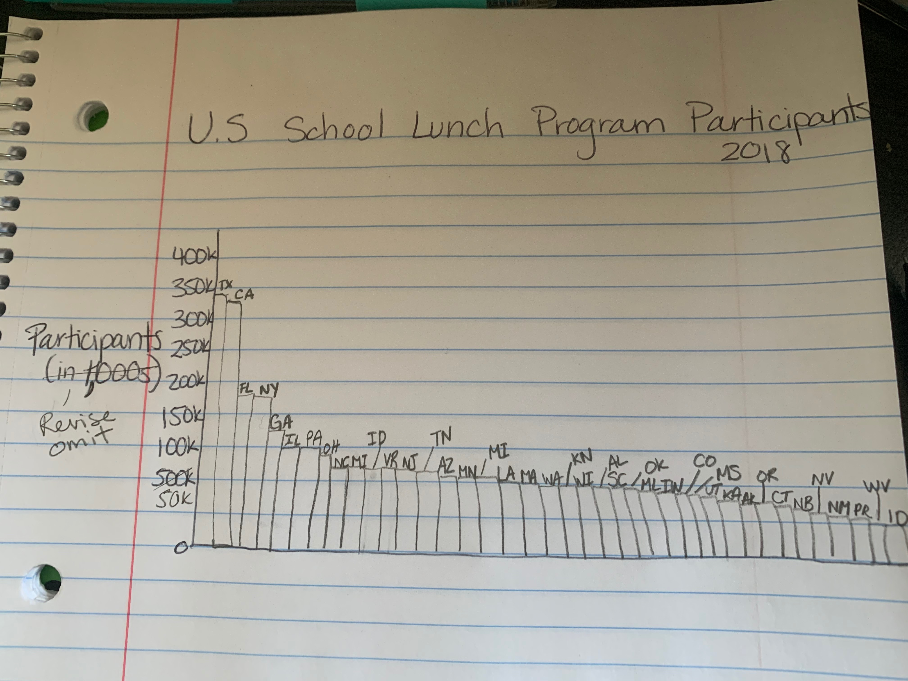

# lewis-portfolio

Link to site https://golewis14.github.io/lewis-portfolio/

This is my portfolio for Telling Stories with Data at CMU!

# About Me 
My name is Gina Lewis and I a first-year student in the Public Policy and Management program at Heinz! My preferred pronouns are she, her, hers and I am from the Bay Area. Go Raiders, A's, and Warriors! I went to undergrad at Bard College where I majored in Political Studies. Before coming to CMU, I lived in Anton, Panama for two years serving as a Teaching English, Leadership, and Life Skills Peace Corps Volunteer. 

During my time in Panama, I taught English in a high school, gave professional development seminars at a local university, and worked with the Ministry of Education to execute regional events and educational programs. While I wasn't working, I spent time playing sports and attempting to kill snakes and insects. I thoroughly enjoy individual and community development and hope to work for or with local government to generate opportunities and bring down barriers for those in need. 

# What I Hope to Learn 
By taking this course I hope to learn the different aspects of data visualization and be more creative in designing presentations using data. I would like to become more intentional about how I use data to relay information. From these skills, I would like my work to become clearer and more visually appealing. Additionally, I would like to learn about and how to use the different data visualization platforms being used today! 

# My Portfolio
Enjoy!

# Final Project Parts
[Final Project Part 1](/finalprojectpart1.md)

# Part 1: Visualization of OECD's Data

<iframe src="https://data.oecd.org/chart/5ONK" width="860" height="645" style="border: 0" mozallowfullscreen="true" webkitallowfullscreen="true" allowfullscreen="true"><a href="https://data.oecd.org/chart/5ONK" target="_blank">OECD Chart: General government debt, Total, % of GDP, Annual, 2015</a></iframe>

# Part 2 Beesworm Plot

<svg width="900" height="1500" xmlns="http://www.w3.org/2000/svg"><g id="swarm-AUS" transform="translate(25,0)"><text x="-25" y="23" style="font-size: 10px; font-family: Arial, Helvetica;">AUS</text><g id="circles" class="bees"><circle id="circle" r="5.498843785419133" cx="1.9999999999999976" cy="6.140961713764019" fill="rgb(0, 0, 0)"></circle><circle id="circle" r="5.367016686594734" cx="38.08695652173907" cy="6.143045994622405" fill="rgb(0, 0, 0)"></circle><circle id="circle" r="5.30969178341082" cx="74.17391304347814" cy="6.136614749828615" fill="rgb(0, 0, 0)"></circle><circle id="circle" r="5.157856182925415" cx="110.26086956521725" cy="6.1452030218887055" fill="rgb(0, 0, 0)"></circle><circle id="circle" r="4.628867167470339" cx="146.34782608695627" cy="6.139886808297173" fill="rgb(0, 0, 0)"></circle><circle id="circle" r="4.380992970354422" cx="182.4347826086954" cy="6.137258520108821" fill="rgb(0, 0, 0)"></circle><circle id="circle" r="4.3322169783416165" cx="218.5217391304345" cy="6.148260686855787" fill="rgb(0, 0, 0)"></circle><circle id="circle" r="4.213261273864729" cx="254.60869565217362" cy="6.133716865869997" fill="rgb(0, 0, 0)"></circle><circle id="circle" r="3.997341664208456" cx="290.6956521739126" cy="6.143955530078068" fill="rgb(0, 0, 0)"></circle><circle id="circle" r="3.7593286717172028" cx="326.7826086956517" cy="6.144493684801953" fill="rgb(0, 0, 0)"></circle><circle id="circle" r="3.6111182905353005" cx="362.8695652173908" cy="6.132124040763502" fill="rgb(0, 0, 0)"></circle><circle id="circle" r="3.5596133639000156" cx="398.95652173912987" cy="6.150726360836251" fill="rgb(0, 0, 0)"></circle><circle id="circle" r="3.4750233010478366" cx="435.043478260869" cy="6.135602283232737" fill="rgb(0, 0, 0)"></circle><circle id="circle" r="3.6099552626878366" cx="471.13043478260806" cy="6.138572911804568" fill="rgb(0, 0, 0)"></circle><circle id="circle" r="4.209596665026286" cx="507.21739130434725" cy="6.150406401260101" fill="rgb(0, 0, 0)"></circle><circle id="circle" r="4.43237627316252" cx="543.304347826086" cy="6.129110396427516" fill="rgb(0, 0, 0)"></circle><circle id="circle" r="4.735196798387503" cx="579.3913043478251" cy="6.1489156904359605" fill="rgb(0, 0, 0)"></circle><circle id="circle" r="5.628427062840851" cx="615.4782608695641" cy="6.141487366648546" fill="rgb(0, 0, 0)"></circle><circle id="circle" r="5.38769135512737" cx="651.5652173913033" cy="6.131727573121663" fill="rgb(0, 0, 0)"></circle><circle id="circle" r="5.791544655386682" cx="687.6521739130425" cy="6.154397098770466" fill="rgb(0, 0, 0)"></circle><circle id="circle" r="5.975066027031872" cx="723.7391304347815" cy="6.1303669566312236" fill="rgb(0, 0, 0)"></circle><circle id="circle" r="6.258433650351857" cx="759.8260869565207" cy="6.142194596149695" fill="rgb(0, 0, 0)"></circle><circle id="circle" r="6.0746496818070606" cx="795.9130434782597" cy="6.149917142073823" fill="rgb(0, 0, 0)"></circle><circle id="circle" r="6.108694678796461" cx="831.9999999999989" cy="6.126524603724518" fill="rgb(0, 0, 0)"></circle></g><g id="labels" class="label"><text x="1.9999999999999976" y="6.140961713764019" text-anchor="middle" fill="#000"></text><text x="38.08695652173907" y="6.143045994622405" text-anchor="middle" fill="#000"></text><text x="74.17391304347814" y="6.136614749828615" text-anchor="middle" fill="#000"></text><text x="110.26086956521725" y="6.1452030218887055" text-anchor="middle" fill="#000"></text><text x="146.34782608695627" y="6.139886808297173" text-anchor="middle" fill="#000"></text><text x="182.4347826086954" y="6.137258520108821" text-anchor="middle" fill="#000"></text><text x="218.5217391304345" y="6.148260686855787" text-anchor="middle" fill="#000"></text><text x="254.60869565217362" y="6.133716865869997" text-anchor="middle" fill="#000"></text><text x="290.6956521739126" y="6.143955530078068" text-anchor="middle" fill="#000"></text><text x="326.7826086956517" y="6.144493684801953" text-anchor="middle" fill="#000"></text><text x="362.8695652173908" y="6.132124040763502" text-anchor="middle" fill="#000"></text><text x="398.95652173912987" y="6.150726360836251" text-anchor="middle" fill="#000"></text><text x="435.043478260869" y="6.135602283232737" text-anchor="middle" fill="#000"></text><text x="471.13043478260806" y="6.138572911804568" text-anchor="middle" fill="#000"></text><text x="507.21739130434725" y="6.150406401260101" text-anchor="middle" fill="#000"></text><text x="543.304347826086" y="6.129110396427516" text-anchor="middle" fill="#000"></text><text x="579.3913043478251" y="6.1489156904359605" text-anchor="middle" fill="#000"></text><text x="615.4782608695641" y="6.141487366648546" text-anchor="middle" fill="#000"></text><text x="651.5652173913033" y="6.131727573121663" text-anchor="middle" fill="#000"></text><text x="687.6521739130425" y="6.154397098770466" text-anchor="middle" fill="#000"></text><text x="723.7391304347815" y="6.1303669566312236" text-anchor="middle" fill="#000"></text><text x="759.8260869565207" y="6.142194596149695" text-anchor="middle" fill="#000"></text><text x="795.9130434782597" y="6.149917142073823" text-anchor="middle" fill="#000"></text><text x="831.9999999999989" y="6.126524603724518" text-anchor="middle" fill="#000"></text></g></g><g id="swarm-AUT" transform="translate(25,42.285714285714285)"><text x="-25" y="23" style="font-size: 10px; font-family: Arial, Helvetica;">AUT</text><g id="circles" class="bees"><circle id="circle" r="6.320770008051403" cx="1.9999999999999976" cy="6.140961713764019" fill="rgb(0, 0, 0)"></circle><circle id="circle" r="6.3579171036785125" cx="38.08695652173907" cy="6.143045994622405" fill="rgb(0, 0, 0)"></circle><circle id="circle" r="6.058032826417804" cx="74.17391304347814" cy="6.136614749828615" fill="rgb(0, 0, 0)"></circle><circle id="circle" r="6.1786207779390825" cx="110.26086956521725" cy="6.1452030218887055" fill="rgb(0, 0, 0)"></circle><circle id="circle" r="6.4279689729151555" cx="146.34782608695627" cy="6.139886808297173" fill="rgb(0, 0, 0)"></circle><circle id="circle" r="6.4504016585862045" cx="182.4347826086954" cy="6.137258520108821" fill="rgb(0, 0, 0)"></circle><circle id="circle" r="6.524480935009431" cx="218.5217391304345" cy="6.148260686855787" fill="rgb(0, 0, 0)"></circle><circle id="circle" r="6.655967348908816" cx="254.60869565217362" cy="6.133716865869997" fill="rgb(0, 0, 0)"></circle><circle id="circle" r="6.552831034499752" cx="290.6956521739126" cy="6.143955530078068" fill="rgb(0, 0, 0)"></circle><circle id="circle" r="6.499838289114859" cx="326.7826086956517" cy="6.144493684801953" fill="rgb(0, 0, 0)"></circle><circle id="circle" r="6.809876773856633" cx="362.8695652173908" cy="6.132124040763502" fill="rgb(0, 0, 0)"></circle><circle id="circle" r="6.563487631312432" cx="398.95652173912987" cy="6.150726360836251" fill="rgb(0, 0, 0)"></circle><circle id="circle" r="6.306299536794186" cx="435.043478260869" cy="6.135602283232737" fill="rgb(0, 0, 0)"></circle><circle id="circle" r="6.667587952760839" cx="471.13043478260806" cy="6.138572911804568" fill="rgb(0, 0, 0)"></circle><circle id="circle" r="7.506354238147029" cx="507.21739130434725" cy="6.150406401260101" fill="rgb(0, 0, 0)"></circle><circle id="circle" r="7.797527899830029" cx="543.304347826086" cy="6.129110396427516" fill="rgb(0, 0, 0)"></circle><circle id="circle" r="7.861776377585387" cx="579.3913043478252" cy="6.150587958350283" fill="rgb(0, 0, 0)"></circle><circle id="circle" r="8.266995181722647" cx="615.4782608695641" cy="6.139966113748923" fill="rgb(0, 0, 0)"></circle><circle id="circle" r="8.061211812391154" cx="651.5652173913033" cy="6.131727573121663" fill="rgb(0, 0, 0)"></circle><circle id="circle" r="8.580151659125004" cx="687.6521739130425" cy="6.154397098770466" fill="rgb(0, 0, 0)"></circle><circle id="circle" r="8.53979466192245" cx="723.7391304347815" cy="6.1303669566312236" fill="rgb(0, 0, 0)"></circle><circle id="circle" r="8.551963955085753" cx="759.8260869565207" cy="6.138041511825493" fill="rgb(0, 0, 0)"></circle><circle id="circle" r="8.115711725770886" cx="795.9130434782597" cy="6.154532221069148" fill="rgb(0, 0, 0)"></circle><circle id="circle" r="7.747425793474216" cx="831.9999999999989" cy="6.126524603724518" fill="rgb(0, 0, 0)"></circle></g><g id="labels" class="label"><text x="1.9999999999999976" y="6.140961713764019" text-anchor="middle" fill="#000"></text><text x="38.08695652173907" y="6.143045994622405" text-anchor="middle" fill="#000"></text><text x="74.17391304347814" y="6.136614749828615" text-anchor="middle" fill="#000"></text><text x="110.26086956521725" y="6.1452030218887055" text-anchor="middle" fill="#000"></text><text x="146.34782608695627" y="6.139886808297173" text-anchor="middle" fill="#000"></text><text x="182.4347826086954" y="6.137258520108821" text-anchor="middle" fill="#000"></text><text x="218.5217391304345" y="6.148260686855787" text-anchor="middle" fill="#000"></text><text x="254.60869565217362" y="6.133716865869997" text-anchor="middle" fill="#000"></text><text x="290.6956521739126" y="6.143955530078068" text-anchor="middle" fill="#000"></text><text x="326.7826086956517" y="6.144493684801953" text-anchor="middle" fill="#000"></text><text x="362.8695652173908" y="6.132124040763502" text-anchor="middle" fill="#000"></text><text x="398.95652173912987" y="6.150726360836251" text-anchor="middle" fill="#000"></text><text x="435.043478260869" y="6.135602283232737" text-anchor="middle" fill="#000"></text><text x="471.13043478260806" y="6.138572911804568" text-anchor="middle" fill="#000"></text><text x="507.21739130434725" y="6.150406401260101" text-anchor="middle" fill="#000"></text><text x="543.304347826086" y="6.129110396427516" text-anchor="middle" fill="#000"></text><text x="579.3913043478252" y="6.150587958350283" text-anchor="middle" fill="#000"></text><text x="615.4782608695641" y="6.139966113748923" text-anchor="middle" fill="#000"></text><text x="651.5652173913033" y="6.131727573121663" text-anchor="middle" fill="#000"></text><text x="687.6521739130425" y="6.154397098770466" text-anchor="middle" fill="#000"></text><text x="723.7391304347815" y="6.1303669566312236" text-anchor="middle" fill="#000"></text><text x="759.8260869565207" y="6.138041511825493" text-anchor="middle" fill="#000"></text><text x="795.9130434782597" y="6.154532221069148" text-anchor="middle" fill="#000"></text><text x="831.9999999999989" y="6.126524603724518" text-anchor="middle" fill="#000"></text></g></g><g id="swarm-BEL" transform="translate(25,84.57142857142857)"><text x="-25" y="23" style="font-size: 10px; font-family: Arial, Helvetica;">BEL</text><g id="circles" class="bees"><circle id="circle" r="11.168285970304117" cx="1.9999999999999976" cy="6.140961713764019" fill="rgb(0, 0, 0)"></circle><circle id="circle" r="11.290939453754135" cx="38.08695652173907" cy="6.143045994622405" fill="rgb(0, 0, 0)"></circle><circle id="circle" r="10.900057058246398" cx="74.17391304347814" cy="6.136614749828615" fill="rgb(0, 0, 0)"></circle><circle id="circle" r="11.173489535183144" cx="110.26086956521725" cy="6.1452030218887055" fill="rgb(0, 0, 0)"></circle><circle id="circle" r="10.385539896137484" cx="146.34782608695627" cy="6.139886808297173" fill="rgb(0, 0, 0)"></circle><circle id="circle" r="9.947701028713421" cx="182.4347826086954" cy="6.137258520108821" fill="rgb(0, 0, 0)"></circle><circle id="circle" r="9.836277017943907" cx="218.5217391304345" cy="6.148260686855787" fill="rgb(0, 0, 0)"></circle><circle id="circle" r="9.8007366007157" cx="254.60869565217362" cy="6.133716865869997" fill="rgb(0, 0, 0)"></circle><circle id="circle" r="9.539044969369215" cx="290.6956521739126" cy="6.143721972330941" fill="rgb(0, 0, 0)"></circle><circle id="circle" r="9.236319117236986" cx="326.7826086956517" cy="6.144741992095871" fill="rgb(0, 0, 0)"></circle><circle id="circle" r="9.072037114754746" cx="362.8695652173908" cy="6.132124040763502" fill="rgb(0, 0, 0)"></circle><circle id="circle" r="8.524750623752936" cx="398.95652173912987" cy="6.150726360836251" fill="rgb(0, 0, 0)"></circle><circle id="circle" r="8.079922532532528" cx="435.043478260869" cy="6.135602283232737" fill="rgb(0, 0, 0)"></circle><circle id="circle" r="8.613722599606168" cx="471.13043478260806" cy="6.138572911804568" fill="rgb(0, 0, 0)"></circle><circle id="circle" r="9.191166271394266" cx="507.21739130434725" cy="6.150406401260101" fill="rgb(0, 0, 0)"></circle><circle id="circle" r="9.049502154501745" cx="543.304347826086" cy="6.129110396427516" fill="rgb(0, 0, 0)"></circle><circle id="circle" r="9.252696871238708" cx="579.3913043478252" cy="6.153760380788925" fill="rgb(0, 0, 0)"></circle><circle id="circle" r="9.899763273645938" cx="615.4782608695641" cy="6.1372267881746065" fill="rgb(0, 0, 0)"></circle><circle id="circle" r="9.738411299727716" cx="651.5652173913033" cy="6.131727573121663" fill="rgb(0, 0, 0)"></circle><circle id="circle" r="10.561196490639485" cx="687.6521739130425" cy="6.154397098770466" fill="rgb(0, 0, 0)"></circle><circle id="circle" r="10.259949473678718" cx="723.7391304347815" cy="6.1303669566312236" fill="rgb(0, 0, 0)"></circle><circle id="circle" r="10.353081537257282" cx="759.8260869565207" cy="6.1346011575361485" fill="rgb(0, 0, 0)"></circle><circle id="circle" r="9.871769062059029" cx="795.9130434782597" cy="6.158256676773299" fill="rgb(0, 0, 0)"></circle><circle id="circle" r="9.697418541610329" cx="831.9999999999989" cy="6.126524603724518" fill="rgb(0, 0, 0)"></circle></g><g id="labels" class="label"><text x="1.9999999999999976" y="6.140961713764019" text-anchor="middle" fill="#000"></text><text x="38.08695652173907" y="6.143045994622405" text-anchor="middle" fill="#000"></text><text x="74.17391304347814" y="6.136614749828615" text-anchor="middle" fill="#000"></text><text x="110.26086956521725" y="6.1452030218887055" text-anchor="middle" fill="#000"></text><text x="146.34782608695627" y="6.139886808297173" text-anchor="middle" fill="#000"></text><text x="182.4347826086954" y="6.137258520108821" text-anchor="middle" fill="#000"></text><text x="218.5217391304345" y="6.148260686855787" text-anchor="middle" fill="#000"></text><text x="254.60869565217362" y="6.133716865869997" text-anchor="middle" fill="#000"></text><text x="290.6956521739126" y="6.143721972330941" text-anchor="middle" fill="#000"></text><text x="326.7826086956517" y="6.144741992095871" text-anchor="middle" fill="#000"></text><text x="362.8695652173908" y="6.132124040763502" text-anchor="middle" fill="#000"></text><text x="398.95652173912987" y="6.150726360836251" text-anchor="middle" fill="#000"></text><text x="435.043478260869" y="6.135602283232737" text-anchor="middle" fill="#000"></text><text x="471.13043478260806" y="6.138572911804568" text-anchor="middle" fill="#000"></text><text x="507.21739130434725" y="6.150406401260101" text-anchor="middle" fill="#000"></text><text x="543.304347826086" y="6.129110396427516" text-anchor="middle" fill="#000"></text><text x="579.3913043478252" y="6.153760380788925" text-anchor="middle" fill="#000"></text><text x="615.4782608695641" y="6.1372267881746065" text-anchor="middle" fill="#000"></text><text x="651.5652173913033" y="6.131727573121663" text-anchor="middle" fill="#000"></text><text x="687.6521739130425" y="6.154397098770466" text-anchor="middle" fill="#000"></text><text x="723.7391304347815" y="6.1303669566312236" text-anchor="middle" fill="#000"></text><text x="759.8260869565207" y="6.1346011575361485" text-anchor="middle" fill="#000"></text><text x="795.9130434782597" y="6.158256676773299" text-anchor="middle" fill="#000"></text><text x="831.9999999999989" y="6.126524603724518" text-anchor="middle" fill="#000"></text></g></g><g id="swarm-CAN" transform="translate(25,126.85714285714286)"><text x="-25" y="23" style="font-size: 10px; font-family: Arial, Helvetica;">CAN</text><g id="circles" class="bees"><circle id="circle" r="10.106896943876983" cx="1.9999999999999976" cy="6.140961713764019" fill="rgb(0, 0, 0)"></circle><circle id="circle" r="10.527280027921998" cx="38.08695652173907" cy="6.143045994622405" fill="rgb(0, 0, 0)"></circle><circle id="circle" r="10.105570138489501" cx="74.17391304347814" cy="6.136614749828615" fill="rgb(0, 0, 0)"></circle><circle id="circle" r="10.072945928935862" cx="110.26086956521725" cy="6.1452030218887055" fill="rgb(0, 0, 0)"></circle><circle id="circle" r="9.409847294763235" cx="146.34782608695627" cy="6.139886808297173" fill="rgb(0, 0, 0)"></circle><circle id="circle" r="8.801368815708585" cx="182.4347826086954" cy="6.137258520108821" fill="rgb(0, 0, 0)"></circle><circle id="circle" r="8.781017555989147" cx="218.5217391304345" cy="6.148260686855787" fill="rgb(0, 0, 0)"></circle><circle id="circle" r="8.698036935713763" cx="254.60869565217362" cy="6.133716865869997" fill="rgb(0, 0, 0)"></circle><circle id="circle" r="8.398518220979083" cx="290.6956521739126" cy="6.143876041786599" fill="rgb(0, 0, 0)"></circle><circle id="circle" r="8.12771862348312" cx="326.7826086956517" cy="6.144578241225299" fill="rgb(0, 0, 0)"></circle><circle id="circle" r="8.027568312240358" cx="362.8695652173908" cy="6.132124040763502" fill="rgb(0, 0, 0)"></circle><circle id="circle" r="7.839302920290452" cx="398.95652173912987" cy="6.150726360836251" fill="rgb(0, 0, 0)"></circle><circle id="circle" r="7.5494215117713015" cx="435.043478260869" cy="6.135602283232737" fill="rgb(0, 0, 0)"></circle><circle id="circle" r="7.74298514169299" cx="471.13043478260806" cy="6.138572911804568" fill="rgb(0, 0, 0)"></circle><circle id="circle" r="8.638316872387655" cx="507.21739130434725" cy="6.150406401260101" fill="rgb(0, 0, 0)"></circle><circle id="circle" r="8.797706280003558" cx="543.304347826086" cy="6.129110396427516" fill="rgb(0, 0, 0)"></circle><circle id="circle" r="8.98030096101093" cx="579.3913043478252" cy="6.152644600981502" fill="rgb(0, 0, 0)"></circle><circle id="circle" r="9.232373253298174" cx="615.4782608695641" cy="6.1379491151339485" fill="rgb(0, 0, 0)"></circle><circle id="circle" r="8.954338420173602" cx="651.5652173913033" cy="6.131727573121663" fill="rgb(0, 0, 0)"></circle><circle id="circle" r="9.028100507183884" cx="687.6521739130425" cy="6.154397098770466" fill="rgb(0, 0, 0)"></circle><circle id="circle" r="9.462276838902921" cx="723.7391304347815" cy="6.1303669566312236" fill="rgb(0, 0, 0)"></circle><circle id="circle" r="9.42871971931121" cx="759.8260869565207" cy="6.136171448239812" fill="rgb(0, 0, 0)"></circle><circle id="circle" r="9.086742541132661" cx="795.9130434782597" cy="6.156388063559087" fill="rgb(0, 0, 0)"></circle><circle id="circle" r="9.03239189335902" cx="831.9999999999989" cy="6.126524603724518" fill="rgb(0, 0, 0)"></circle></g><g id="labels" class="label"><text x="1.9999999999999976" y="6.140961713764019" text-anchor="middle" fill="#000"></text><text x="38.08695652173907" y="6.143045994622405" text-anchor="middle" fill="#000"></text><text x="74.17391304347814" y="6.136614749828615" text-anchor="middle" fill="#000"></text><text x="110.26086956521725" y="6.1452030218887055" text-anchor="middle" fill="#000"></text><text x="146.34782608695627" y="6.139886808297173" text-anchor="middle" fill="#000"></text><text x="182.4347826086954" y="6.137258520108821" text-anchor="middle" fill="#000"></text><text x="218.5217391304345" y="6.148260686855787" text-anchor="middle" fill="#000"></text><text x="254.60869565217362" y="6.133716865869997" text-anchor="middle" fill="#000"></text><text x="290.6956521739126" y="6.143876041786599" text-anchor="middle" fill="#000"></text><text x="326.7826086956517" y="6.144578241225299" text-anchor="middle" fill="#000"></text><text x="362.8695652173908" y="6.132124040763502" text-anchor="middle" fill="#000"></text><text x="398.95652173912987" y="6.150726360836251" text-anchor="middle" fill="#000"></text><text x="435.043478260869" y="6.135602283232737" text-anchor="middle" fill="#000"></text><text x="471.13043478260806" y="6.138572911804568" text-anchor="middle" fill="#000"></text><text x="507.21739130434725" y="6.150406401260101" text-anchor="middle" fill="#000"></text><text x="543.304347826086" y="6.129110396427516" text-anchor="middle" fill="#000"></text><text x="579.3913043478252" y="6.152644600981502" text-anchor="middle" fill="#000"></text><text x="615.4782608695641" y="6.1379491151339485" text-anchor="middle" fill="#000"></text><text x="651.5652173913033" y="6.131727573121663" text-anchor="middle" fill="#000"></text><text x="687.6521739130425" y="6.154397098770466" text-anchor="middle" fill="#000"></text><text x="723.7391304347815" y="6.1303669566312236" text-anchor="middle" fill="#000"></text><text x="759.8260869565207" y="6.136171448239812" text-anchor="middle" fill="#000"></text><text x="795.9130434782597" y="6.156388063559087" text-anchor="middle" fill="#000"></text><text x="831.9999999999989" y="6.126524603724518" text-anchor="middle" fill="#000"></text></g></g><g id="swarm-CHE" transform="translate(25,169.14285714285714)"><text x="-25" y="23" style="font-size: 10px; font-family: Arial, Helvetica;">CHE</text><g id="circles" class="bees"><circle id="circle" r="5.32760987554207" cx="146.34782608695627" cy="6.140961713764019" fill="rgb(0, 0, 0)"></circle><circle id="circle" r="5.308777531573509" cx="182.43478260869537" cy="6.143045994622405" fill="rgb(0, 0, 0)"></circle><circle id="circle" r="5.246858564735442" cx="218.5217391304345" cy="6.136614749828615" fill="rgb(0, 0, 0)"></circle><circle id="circle" r="5.675257764663155" cx="254.60869565217365" cy="6.1452030218887055" fill="rgb(0, 0, 0)"></circle><circle id="circle" r="5.622053559669633" cx="290.69565217391255" cy="6.139886808297173" fill="rgb(0, 0, 0)"></circle><circle id="circle" r="5.671653967738304" cx="326.7826086956517" cy="6.137258520108821" fill="rgb(0, 0, 0)"></circle><circle id="circle" r="5.474479630447037" cx="362.8695652173908" cy="6.148260686855787" fill="rgb(0, 0, 0)"></circle><circle id="circle" r="5.032703882662307" cx="398.95652173912987" cy="6.133716865869997" fill="rgb(0, 0, 0)"></circle><circle id="circle" r="4.692456388798793" cx="435.043478260869" cy="6.143955530078068" fill="rgb(0, 0, 0)"></circle><circle id="circle" r="4.715263620574016" cx="471.13043478260806" cy="6.144493684801953" fill="rgb(0, 0, 0)"></circle><circle id="circle" r="4.595431671705813" cx="507.2173913043473" cy="6.132124040763502" fill="rgb(0, 0, 0)"></circle><circle id="circle" r="4.486771838826886" cx="543.3043478260861" cy="6.150726360836251" fill="rgb(0, 0, 0)"></circle><circle id="circle" r="4.513594730032658" cx="579.3913043478251" cy="6.135602283232737" fill="rgb(0, 0, 0)"></circle><circle id="circle" r="4.567825827112533" cx="615.4782608695641" cy="6.138572911804568" fill="rgb(0, 0, 0)"></circle><circle id="circle" r="4.517333280629675" cx="651.5652173913033" cy="6.150406401260101" fill="rgb(0, 0, 0)"></circle><circle id="circle" r="4.521484384776862" cx="687.6521739130425" cy="6.129110396427516" fill="rgb(0, 0, 0)"></circle><circle id="circle" r="4.522179575516345" cx="723.7391304347816" cy="6.1489156904359605" fill="rgb(0, 0, 0)"></circle><circle id="circle" r="4.439718620684389" cx="759.8260869565206" cy="6.141487366648546" fill="rgb(0, 0, 0)"></circle><circle id="circle" r="4.500097940437399" cx="795.9130434782597" cy="6.131727573121663" fill="rgb(0, 0, 0)"></circle><circle id="circle" r="4.380818827147314" cx="831.9999999999989" cy="6.154397098770466" fill="rgb(0, 0, 0)"></circle></g><g id="labels" class="label"><text x="146.34782608695627" y="6.140961713764019" text-anchor="middle" fill="#000"></text><text x="182.43478260869537" y="6.143045994622405" text-anchor="middle" fill="#000"></text><text x="218.5217391304345" y="6.136614749828615" text-anchor="middle" fill="#000"></text><text x="254.60869565217365" y="6.1452030218887055" text-anchor="middle" fill="#000"></text><text x="290.69565217391255" y="6.139886808297173" text-anchor="middle" fill="#000"></text><text x="326.7826086956517" y="6.137258520108821" text-anchor="middle" fill="#000"></text><text x="362.8695652173908" y="6.148260686855787" text-anchor="middle" fill="#000"></text><text x="398.95652173912987" y="6.133716865869997" text-anchor="middle" fill="#000"></text><text x="435.043478260869" y="6.143955530078068" text-anchor="middle" fill="#000"></text><text x="471.13043478260806" y="6.144493684801953" text-anchor="middle" fill="#000"></text><text x="507.2173913043473" y="6.132124040763502" text-anchor="middle" fill="#000"></text><text x="543.3043478260861" y="6.150726360836251" text-anchor="middle" fill="#000"></text><text x="579.3913043478251" y="6.135602283232737" text-anchor="middle" fill="#000"></text><text x="615.4782608695641" y="6.138572911804568" text-anchor="middle" fill="#000"></text><text x="651.5652173913033" y="6.150406401260101" text-anchor="middle" fill="#000"></text><text x="687.6521739130425" y="6.129110396427516" text-anchor="middle" fill="#000"></text><text x="723.7391304347816" y="6.1489156904359605" text-anchor="middle" fill="#000"></text><text x="759.8260869565206" y="6.141487366648546" text-anchor="middle" fill="#000"></text><text x="795.9130434782597" y="6.131727573121663" text-anchor="middle" fill="#000"></text><text x="831.9999999999989" y="6.154397098770466" text-anchor="middle" fill="#000"></text></g></g><g id="swarm-CHL" transform="translate(25,211.42857142857142)"><text x="-25" y="23" style="font-size: 10px; font-family: Arial, Helvetica;">CHL</text><g id="circles" class="bees"><circle id="circle" r="3.19244139529325" cx="290.69565217391255" cy="6.140961713764019" fill="rgb(0, 0, 0)"></circle><circle id="circle" r="2.962907518481369" cx="326.7826086956517" cy="6.143045994622405" fill="rgb(0, 0, 0)"></circle><circle id="circle" r="2.666729312727464" cx="362.8695652173908" cy="6.136614749828615" fill="rgb(0, 0, 0)"></circle><circle id="circle" r="2.4491484321589483" cx="398.95652173912987" cy="6.1452030218887055" fill="rgb(0, 0, 0)"></circle><circle id="circle" r="2.318799477461539" cx="435.043478260869" cy="6.139886808297173" fill="rgb(0, 0, 0)"></circle><circle id="circle" r="2.399416725640474" cx="471.13043478260806" cy="6.137258520108821" fill="rgb(0, 0, 0)"></circle><circle id="circle" r="2.460356482460801" cx="507.21739130434725" cy="6.148260686855787" fill="rgb(0, 0, 0)"></circle><circle id="circle" r="2.595777703587435" cx="543.304347826086" cy="6.133716865869997" fill="rgb(0, 0, 0)"></circle><circle id="circle" r="2.7743456684526957" cx="579.3913043478251" cy="6.143955530078068" fill="rgb(0, 0, 0)"></circle><circle id="circle" r="2.8097575514089903" cx="615.4782608695641" cy="6.144493684801953" fill="rgb(0, 0, 0)"></circle><circle id="circle" r="2.85274328178549" cx="651.5652173913033" cy="6.132124040763502" fill="rgb(0, 0, 0)"></circle><circle id="circle" r="3.0877281173976066" cx="687.6521739130425" cy="6.150726360836251" fill="rgb(0, 0, 0)"></circle><circle id="circle" r="3.2278373842266737" cx="723.7391304347815" cy="6.135602283232737" fill="rgb(0, 0, 0)"></circle><circle id="circle" r="3.4778393072738707" cx="759.8260869565207" cy="6.138572911804568" fill="rgb(0, 0, 0)"></circle><circle id="circle" r="3.5841599546128897" cx="795.9130434782597" cy="6.150406401260101" fill="rgb(0, 0, 0)"></circle><circle id="circle" r="3.7898866582976285" cx="831.9999999999989" cy="6.129110396427516" fill="rgb(0, 0, 0)"></circle></g><g id="labels" class="label"><text x="290.69565217391255" y="6.140961713764019" text-anchor="middle" fill="#000"></text><text x="326.7826086956517" y="6.143045994622405" text-anchor="middle" fill="#000"></text><text x="362.8695652173908" y="6.136614749828615" text-anchor="middle" fill="#000"></text><text x="398.95652173912987" y="6.1452030218887055" text-anchor="middle" fill="#000"></text><text x="435.043478260869" y="6.139886808297173" text-anchor="middle" fill="#000"></text><text x="471.13043478260806" y="6.137258520108821" text-anchor="middle" fill="#000"></text><text x="507.21739130434725" y="6.148260686855787" text-anchor="middle" fill="#000"></text><text x="543.304347826086" y="6.133716865869997" text-anchor="middle" fill="#000"></text><text x="579.3913043478251" y="6.143955530078068" text-anchor="middle" fill="#000"></text><text x="615.4782608695641" y="6.144493684801953" text-anchor="middle" fill="#000"></text><text x="651.5652173913033" y="6.132124040763502" text-anchor="middle" fill="#000"></text><text x="687.6521739130425" y="6.150726360836251" text-anchor="middle" fill="#000"></text><text x="723.7391304347815" y="6.135602283232737" text-anchor="middle" fill="#000"></text><text x="759.8260869565207" y="6.138572911804568" text-anchor="middle" fill="#000"></text><text x="795.9130434782597" y="6.150406401260101" text-anchor="middle" fill="#000"></text><text x="831.9999999999989" y="6.129110396427516" text-anchor="middle" fill="#000"></text></g></g><g id="swarm-COL" transform="translate(25,253.71428571428572)"><text x="-25" y="23" style="font-size: 10px; font-family: Arial, Helvetica;">COL</text><g id="circles" class="bees"><circle id="circle" r="6.276713849786773" cx="723.7391304347816" cy="6.140961713764019" fill="rgb(0, 0, 0)"></circle><circle id="circle" r="6.591480460810396" cx="759.8260869565206" cy="6.143045994622405" fill="rgb(0, 0, 0)"></circle><circle id="circle" r="6.737977051700134" cx="795.9130434782597" cy="6.136614749828615" fill="rgb(0, 0, 0)"></circle></g><g id="labels" class="label"><text x="723.7391304347816" y="6.140961713764019" text-anchor="middle" fill="#000"></text><text x="759.8260869565206" y="6.143045994622405" text-anchor="middle" fill="#000"></text><text x="795.9130434782597" y="6.136614749828615" text-anchor="middle" fill="#000"></text></g></g><g id="swarm-CZE" transform="translate(25,296)"><text x="-25" y="23" style="font-size: 10px; font-family: Arial, Helvetica;">CZE</text><g id="circles" class="bees"><circle id="circle" r="2.795757681437646" cx="1.9999999999999976" cy="6.140961713764019" fill="rgb(0, 0, 0)"></circle><circle id="circle" r="2.6982672003701027" cx="38.08695652173907" cy="6.143045994622405" fill="rgb(0, 0, 0)"></circle><circle id="circle" r="2.724304374010476" cx="74.17391304347814" cy="6.136614749828615" fill="rgb(0, 0, 0)"></circle><circle id="circle" r="2.783363798820732" cx="110.26086956521725" cy="6.1452030218887055" fill="rgb(0, 0, 0)"></circle><circle id="circle" r="3.1868149111969633" cx="146.34782608695627" cy="6.139886808297173" fill="rgb(0, 0, 0)"></circle><circle id="circle" r="3.225730389629575" cx="182.4347826086954" cy="6.137258520108821" fill="rgb(0, 0, 0)"></circle><circle id="circle" r="3.497515416543533" cx="218.5217391304345" cy="6.148260686855787" fill="rgb(0, 0, 0)"></circle><circle id="circle" r="3.6544136088355463" cx="254.60869565217362" cy="6.133716865869997" fill="rgb(0, 0, 0)"></circle><circle id="circle" r="3.847972401445926" cx="290.6956521739126" cy="6.143955530078068" fill="rgb(0, 0, 0)"></circle><circle id="circle" r="3.8109006296663344" cx="326.7826086956517" cy="6.144493684801953" fill="rgb(0, 0, 0)"></circle><circle id="circle" r="3.7790289675434074" cx="362.8695652173908" cy="6.132124040763502" fill="rgb(0, 0, 0)"></circle><circle id="circle" r="3.74777855440139" cx="398.95652173912987" cy="6.150726360836251" fill="rgb(0, 0, 0)"></circle><circle id="circle" r="3.650983955117802" cx="435.043478260869" cy="6.135602283232737" fill="rgb(0, 0, 0)"></circle><circle id="circle" r="3.911406137768034" cx="471.13043478260806" cy="6.138572911804568" fill="rgb(0, 0, 0)"></circle><circle id="circle" r="4.379205238303685" cx="507.21739130434725" cy="6.150406401260101" fill="rgb(0, 0, 0)"></circle><circle id="circle" r="4.690171104727751" cx="543.304347826086" cy="6.129110396427516" fill="rgb(0, 0, 0)"></circle><circle id="circle" r="4.881549652026932" cx="579.3913043478251" cy="6.1489156904359605" fill="rgb(0, 0, 0)"></circle><circle id="circle" r="5.540232512019347" cx="615.4782608695641" cy="6.141487366648546" fill="rgb(0, 0, 0)"></circle><circle id="circle" r="5.545807167780186" cx="651.5652173913033" cy="6.131727573121663" fill="rgb(0, 0, 0)"></circle><circle id="circle" r="5.358567976872158" cx="687.6521739130425" cy="6.154397098770466" fill="rgb(0, 0, 0)"></circle><circle id="circle" r="5.134868588542831" cx="723.7391304347815" cy="6.1303669566312236" fill="rgb(0, 0, 0)"></circle><circle id="circle" r="4.836042991414217" cx="759.8260869565207" cy="6.142847228729639" fill="rgb(0, 0, 0)"></circle><circle id="circle" r="4.5685058148736175" cx="795.9130434782597" cy="6.14922751290065" fill="rgb(0, 0, 0)"></circle><circle id="circle" r="4.311252071130468" cx="831.9999999999989" cy="6.126524603724518" fill="rgb(0, 0, 0)"></circle></g><g id="labels" class="label"><text x="1.9999999999999976" y="6.140961713764019" text-anchor="middle" fill="#000"></text><text x="38.08695652173907" y="6.143045994622405" text-anchor="middle" fill="#000"></text><text x="74.17391304347814" y="6.136614749828615" text-anchor="middle" fill="#000"></text><text x="110.26086956521725" y="6.1452030218887055" text-anchor="middle" fill="#000"></text><text x="146.34782608695627" y="6.139886808297173" text-anchor="middle" fill="#000"></text><text x="182.4347826086954" y="6.137258520108821" text-anchor="middle" fill="#000"></text><text x="218.5217391304345" y="6.148260686855787" text-anchor="middle" fill="#000"></text><text x="254.60869565217362" y="6.133716865869997" text-anchor="middle" fill="#000"></text><text x="290.6956521739126" y="6.143955530078068" text-anchor="middle" fill="#000"></text><text x="326.7826086956517" y="6.144493684801953" text-anchor="middle" fill="#000"></text><text x="362.8695652173908" y="6.132124040763502" text-anchor="middle" fill="#000"></text><text x="398.95652173912987" y="6.150726360836251" text-anchor="middle" fill="#000"></text><text x="435.043478260869" y="6.135602283232737" text-anchor="middle" fill="#000"></text><text x="471.13043478260806" y="6.138572911804568" text-anchor="middle" fill="#000"></text><text x="507.21739130434725" y="6.150406401260101" text-anchor="middle" fill="#000"></text><text x="543.304347826086" y="6.129110396427516" text-anchor="middle" fill="#000"></text><text x="579.3913043478251" y="6.1489156904359605" text-anchor="middle" fill="#000"></text><text x="615.4782608695641" y="6.141487366648546" text-anchor="middle" fill="#000"></text><text x="651.5652173913033" y="6.131727573121663" text-anchor="middle" fill="#000"></text><text x="687.6521739130425" y="6.154397098770466" text-anchor="middle" fill="#000"></text><text x="723.7391304347815" y="6.1303669566312236" text-anchor="middle" fill="#000"></text><text x="759.8260869565207" y="6.142847228729639" text-anchor="middle" fill="#000"></text><text x="795.9130434782597" y="6.14922751290065" text-anchor="middle" fill="#000"></text><text x="831.9999999999989" y="6.126524603724518" text-anchor="middle" fill="#000"></text></g></g><g id="swarm-DEU" transform="translate(25,338.2857142857143)"><text x="-25" y="23" style="font-size: 10px; font-family: Arial, Helvetica;">DEU</text><g id="circles" class="bees"><circle id="circle" r="5.289150486461405" cx="1.9999999999999976" cy="6.140961713764019" fill="rgb(0, 0, 0)"></circle><circle id="circle" r="5.503383947604421" cx="38.08695652173907" cy="6.143045994622405" fill="rgb(0, 0, 0)"></circle><circle id="circle" r="5.606548594836864" cx="74.17391304347814" cy="6.136614749828615" fill="rgb(0, 0, 0)"></circle><circle id="circle" r="5.732631732004627" cx="110.26086956521725" cy="6.1452030218887055" fill="rgb(0, 0, 0)"></circle><circle id="circle" r="5.730971152136856" cx="146.34782608695627" cy="6.139886808297173" fill="rgb(0, 0, 0)"></circle><circle id="circle" r="5.831851206342731" cx="182.4347826086954" cy="6.137258520108821" fill="rgb(0, 0, 0)"></circle><circle id="circle" r="5.765646381685311" cx="218.5217391304345" cy="6.148260686855787" fill="rgb(0, 0, 0)"></circle><circle id="circle" r="5.934204567364287" cx="254.60869565217362" cy="6.133716865869997" fill="rgb(0, 0, 0)"></circle><circle id="circle" r="6.137229287160978" cx="290.6956521739126" cy="6.143955530078068" fill="rgb(0, 0, 0)"></circle><circle id="circle" r="6.307510246710263" cx="326.7826086956517" cy="6.144493684801953" fill="rgb(0, 0, 0)"></circle><circle id="circle" r="6.485703665471348" cx="362.8695652173908" cy="6.132124040763502" fill="rgb(0, 0, 0)"></circle><circle id="circle" r="6.342002349473464" cx="398.95652173912987" cy="6.150726360836251" fill="rgb(0, 0, 0)"></circle><circle id="circle" r="6.138010167415069" cx="435.043478260869" cy="6.135602283232737" fill="rgb(0, 0, 0)"></circle><circle id="circle" r="6.415989025937357" cx="471.13043478260806" cy="6.138572911804568" fill="rgb(0, 0, 0)"></circle><circle id="circle" r="6.919527564509337" cx="507.21739130434725" cy="6.150406401260101" fill="rgb(0, 0, 0)"></circle><circle id="circle" r="7.61903871403465" cx="543.304347826086" cy="6.129110396427516" fill="rgb(0, 0, 0)"></circle><circle id="circle" r="7.577842788842305" cx="579.3913043478251" cy="6.149791927357982" fill="rgb(0, 0, 0)"></circle><circle id="circle" r="7.790022465812616" cx="615.4782608695641" cy="6.140655409557998" fill="rgb(0, 0, 0)"></circle><circle id="circle" r="7.451353317524626" cx="651.5652173913033" cy="6.131727573121663" fill="rgb(0, 0, 0)"></circle><circle id="circle" r="7.452261349961683" cx="687.6521739130425" cy="6.154397098770466" fill="rgb(0, 0, 0)"></circle><circle id="circle" r="7.165565656461433" cx="723.7391304347815" cy="6.1303669566312236" fill="rgb(0, 0, 0)"></circle><circle id="circle" r="6.965640271124561" cx="759.8260869565207" cy="6.140938252305002" fill="rgb(0, 0, 0)"></circle><circle id="circle" r="6.66971913391448" cx="795.9130434782597" cy="6.151297322508781" fill="rgb(0, 0, 0)"></circle><circle id="circle" r="6.404525980225097" cx="831.9999999999989" cy="6.126524603724518" fill="rgb(0, 0, 0)"></circle></g><g id="labels" class="label"><text x="1.9999999999999976" y="6.140961713764019" text-anchor="middle" fill="#000"></text><text x="38.08695652173907" y="6.143045994622405" text-anchor="middle" fill="#000"></text><text x="74.17391304347814" y="6.136614749828615" text-anchor="middle" fill="#000"></text><text x="110.26086956521725" y="6.1452030218887055" text-anchor="middle" fill="#000"></text><text x="146.34782608695627" y="6.139886808297173" text-anchor="middle" fill="#000"></text><text x="182.4347826086954" y="6.137258520108821" text-anchor="middle" fill="#000"></text><text x="218.5217391304345" y="6.148260686855787" text-anchor="middle" fill="#000"></text><text x="254.60869565217362" y="6.133716865869997" text-anchor="middle" fill="#000"></text><text x="290.6956521739126" y="6.143955530078068" text-anchor="middle" fill="#000"></text><text x="326.7826086956517" y="6.144493684801953" text-anchor="middle" fill="#000"></text><text x="362.8695652173908" y="6.132124040763502" text-anchor="middle" fill="#000"></text><text x="398.95652173912987" y="6.150726360836251" text-anchor="middle" fill="#000"></text><text x="435.043478260869" y="6.135602283232737" text-anchor="middle" fill="#000"></text><text x="471.13043478260806" y="6.138572911804568" text-anchor="middle" fill="#000"></text><text x="507.21739130434725" y="6.150406401260101" text-anchor="middle" fill="#000"></text><text x="543.304347826086" y="6.129110396427516" text-anchor="middle" fill="#000"></text><text x="579.3913043478251" y="6.149791927357982" text-anchor="middle" fill="#000"></text><text x="615.4782608695641" y="6.140655409557998" text-anchor="middle" fill="#000"></text><text x="651.5652173913033" y="6.131727573121663" text-anchor="middle" fill="#000"></text><text x="687.6521739130425" y="6.154397098770466" text-anchor="middle" fill="#000"></text><text x="723.7391304347815" y="6.1303669566312236" text-anchor="middle" fill="#000"></text><text x="759.8260869565207" y="6.140938252305002" text-anchor="middle" fill="#000"></text><text x="795.9130434782597" y="6.151297322508781" text-anchor="middle" fill="#000"></text><text x="831.9999999999989" y="6.126524603724518" text-anchor="middle" fill="#000"></text></g></g><g id="swarm-DNK" transform="translate(25,380.57142857142856)"><text x="-25" y="23" style="font-size: 10px; font-family: Arial, Helvetica;">DNK</text><g id="circles" class="bees"><circle id="circle" r="7.176434403927216" cx="1.9999999999999976" cy="6.140961713764019" fill="rgb(0, 0, 0)"></circle><circle id="circle" r="7.00864396865735" cx="38.08695652173907" cy="6.143045994622405" fill="rgb(0, 0, 0)"></circle><circle id="circle" r="6.723520401332371" cx="74.17391304347814" cy="6.136614749828615" fill="rgb(0, 0, 0)"></circle><circle id="circle" r="6.555707852639379" cx="110.26086956521725" cy="6.1452030218887055" fill="rgb(0, 0, 0)"></circle><circle id="circle" r="6.1771371054563105" cx="146.34782608695627" cy="6.139886808297173" fill="rgb(0, 0, 0)"></circle><circle id="circle" r="5.718301542775357" cx="182.4347826086954" cy="6.137258520108821" fill="rgb(0, 0, 0)"></circle><circle id="circle" r="5.567740228297512" cx="218.5217391304345" cy="6.148260686855787" fill="rgb(0, 0, 0)"></circle><circle id="circle" r="5.558786365065432" cx="254.60869565217362" cy="6.133716865869997" fill="rgb(0, 0, 0)"></circle><circle id="circle" r="5.415163137092957" cx="290.6956521739126" cy="6.143955530078068" fill="rgb(0, 0, 0)"></circle><circle id="circle" r="5.157180341431166" cx="326.7826086956517" cy="6.144493684801953" fill="rgb(0, 0, 0)"></circle><circle id="circle" r="4.658490170879275" cx="362.8695652173908" cy="6.132124040763502" fill="rgb(0, 0, 0)"></circle><circle id="circle" r="4.338759787408634" cx="398.95652173912987" cy="6.150726360836251" fill="rgb(0, 0, 0)"></circle><circle id="circle" r="3.931123709706055" cx="435.043478260869" cy="6.135602283232737" fill="rgb(0, 0, 0)"></circle><circle id="circle" r="4.438771889756863" cx="471.13043478260806" cy="6.138572911804568" fill="rgb(0, 0, 0)"></circle><circle id="circle" r="4.945138182310913" cx="507.21739130434725" cy="6.150406401260101" fill="rgb(0, 0, 0)"></circle><circle id="circle" r="5.233567706393033" cx="543.304347826086" cy="6.129110396427516" fill="rgb(0, 0, 0)"></circle><circle id="circle" r="5.694488841292433" cx="579.3913043478251" cy="6.1489156904359605" fill="rgb(0, 0, 0)"></circle><circle id="circle" r="5.729315409580396" cx="615.4782608695641" cy="6.141487366648546" fill="rgb(0, 0, 0)"></circle><circle id="circle" r="5.460983531896253" cx="651.5652173913033" cy="6.131727573121663" fill="rgb(0, 0, 0)"></circle><circle id="circle" r="5.627506591603286" cx="687.6521739130425" cy="6.154397098770466" fill="rgb(0, 0, 0)"></circle><circle id="circle" r="5.232672112756482" cx="723.7391304347815" cy="6.1303669566312236" fill="rgb(0, 0, 0)"></circle><circle id="circle" r="5.090576093068556" cx="759.8260869565207" cy="6.142847228729639" fill="rgb(0, 0, 0)"></circle><circle id="circle" r="4.936355007063575" cx="795.9130434782597" cy="6.14922751290065" fill="rgb(0, 0, 0)"></circle><circle id="circle" r="4.840495390951478" cx="831.9999999999989" cy="6.126524603724518" fill="rgb(0, 0, 0)"></circle></g><g id="labels" class="label"><text x="1.9999999999999976" y="6.140961713764019" text-anchor="middle" fill="#000"></text><text x="38.08695652173907" y="6.143045994622405" text-anchor="middle" fill="#000"></text><text x="74.17391304347814" y="6.136614749828615" text-anchor="middle" fill="#000"></text><text x="110.26086956521725" y="6.1452030218887055" text-anchor="middle" fill="#000"></text><text x="146.34782608695627" y="6.139886808297173" text-anchor="middle" fill="#000"></text><text x="182.4347826086954" y="6.137258520108821" text-anchor="middle" fill="#000"></text><text x="218.5217391304345" y="6.148260686855787" text-anchor="middle" fill="#000"></text><text x="254.60869565217362" y="6.133716865869997" text-anchor="middle" fill="#000"></text><text x="290.6956521739126" y="6.143955530078068" text-anchor="middle" fill="#000"></text><text x="326.7826086956517" y="6.144493684801953" text-anchor="middle" fill="#000"></text><text x="362.8695652173908" y="6.132124040763502" text-anchor="middle" fill="#000"></text><text x="398.95652173912987" y="6.150726360836251" text-anchor="middle" fill="#000"></text><text x="435.043478260869" y="6.135602283232737" text-anchor="middle" fill="#000"></text><text x="471.13043478260806" y="6.138572911804568" text-anchor="middle" fill="#000"></text><text x="507.21739130434725" y="6.150406401260101" text-anchor="middle" fill="#000"></text><text x="543.304347826086" y="6.129110396427516" text-anchor="middle" fill="#000"></text><text x="579.3913043478251" y="6.1489156904359605" text-anchor="middle" fill="#000"></text><text x="615.4782608695641" y="6.141487366648546" text-anchor="middle" fill="#000"></text><text x="651.5652173913033" y="6.131727573121663" text-anchor="middle" fill="#000"></text><text x="687.6521739130425" y="6.154397098770466" text-anchor="middle" fill="#000"></text><text x="723.7391304347815" y="6.1303669566312236" text-anchor="middle" fill="#000"></text><text x="759.8260869565207" y="6.142847228729639" text-anchor="middle" fill="#000"></text><text x="795.9130434782597" y="6.14922751290065" text-anchor="middle" fill="#000"></text><text x="831.9999999999989" y="6.126524603724518" text-anchor="middle" fill="#000"></text></g></g><g id="swarm-ESP" transform="translate(25,422.85714285714283)"><text x="-25" y="23" style="font-size: 10px; font-family: Arial, Helvetica;">ESP</text><g id="circles" class="bees"><circle id="circle" r="6.2547351803342535" cx="1.9999999999999976" cy="6.140961713764019" fill="rgb(0, 0, 0)"></circle><circle id="circle" r="6.698774098766901" cx="38.08695652173907" cy="6.143045994622405" fill="rgb(0, 0, 0)"></circle><circle id="circle" r="6.632596224843914" cx="74.17391304347814" cy="6.136614749828615" fill="rgb(0, 0, 0)"></circle><circle id="circle" r="6.629409818780541" cx="110.26086956521725" cy="6.1452030218887055" fill="rgb(0, 0, 0)"></circle><circle id="circle" r="6.256858068954223" cx="146.34782608695627" cy="6.139886808297173" fill="rgb(0, 0, 0)"></circle><circle id="circle" r="6.064399419144296" cx="182.4347826086954" cy="6.137258520108821" fill="rgb(0, 0, 0)"></circle><circle id="circle" r="5.7500453616708445" cx="218.5217391304345" cy="6.148260686855787" fill="rgb(0, 0, 0)"></circle><circle id="circle" r="5.657825476796176" cx="254.60869565217362" cy="6.133716865869997" fill="rgb(0, 0, 0)"></circle><circle id="circle" r="5.3375920129494485" cx="290.6956521739126" cy="6.143955530078068" fill="rgb(0, 0, 0)"></circle><circle id="circle" r="5.207554028264729" cx="326.7826086956517" cy="6.144493684801953" fill="rgb(0, 0, 0)"></circle><circle id="circle" r="5.028923178352459" cx="362.8695652173908" cy="6.132124040763502" fill="rgb(0, 0, 0)"></circle><circle id="circle" r="4.725946477076658" cx="398.95652173912987" cy="6.150726360836251" fill="rgb(0, 0, 0)"></circle><circle id="circle" r="4.4673044249879625" cx="435.043478260869" cy="6.135602283232737" fill="rgb(0, 0, 0)"></circle><circle id="circle" r="4.83577210198094" cx="471.13043478260806" cy="6.138572911804568" fill="rgb(0, 0, 0)"></circle><circle id="circle" r="5.870358277492009" cx="507.21739130434725" cy="6.150406401260101" fill="rgb(0, 0, 0)"></circle><circle id="circle" r="6.196573422293965" cx="543.304347826086" cy="6.129110396427516" fill="rgb(0, 0, 0)"></circle><circle id="circle" r="6.954134380654998" cx="579.3913043478251" cy="6.149423841404449" fill="rgb(0, 0, 0)"></circle><circle id="circle" r="7.998789765176999" cx="615.4782608695641" cy="6.1410964600325535" fill="rgb(0, 0, 0)"></circle><circle id="circle" r="8.902434069833127" cx="651.5652173913033" cy="6.131727573121663" fill="rgb(0, 0, 0)"></circle><circle id="circle" r="9.794904185366564" cx="687.6521739130425" cy="6.154397098770466" fill="rgb(0, 0, 0)"></circle><circle id="circle" r="9.632937181867689" cx="723.7391304347815" cy="6.1303669566312236" fill="rgb(0, 0, 0)"></circle><circle id="circle" r="9.649791756555537" cx="759.8260869565207" cy="6.135328045653744" fill="rgb(0, 0, 0)"></circle><circle id="circle" r="9.54279043041096" cx="795.9130434782597" cy="6.156907776442935" fill="rgb(0, 0, 0)"></circle><circle id="circle" r="9.470907984366278" cx="831.9999999999989" cy="6.126524603724518" fill="rgb(0, 0, 0)"></circle></g><g id="labels" class="label"><text x="1.9999999999999976" y="6.140961713764019" text-anchor="middle" fill="#000"></text><text x="38.08695652173907" y="6.143045994622405" text-anchor="middle" fill="#000"></text><text x="74.17391304347814" y="6.136614749828615" text-anchor="middle" fill="#000"></text><text x="110.26086956521725" y="6.1452030218887055" text-anchor="middle" fill="#000"></text><text x="146.34782608695627" y="6.139886808297173" text-anchor="middle" fill="#000"></text><text x="182.4347826086954" y="6.137258520108821" text-anchor="middle" fill="#000"></text><text x="218.5217391304345" y="6.148260686855787" text-anchor="middle" fill="#000"></text><text x="254.60869565217362" y="6.133716865869997" text-anchor="middle" fill="#000"></text><text x="290.6956521739126" y="6.143955530078068" text-anchor="middle" fill="#000"></text><text x="326.7826086956517" y="6.144493684801953" text-anchor="middle" fill="#000"></text><text x="362.8695652173908" y="6.132124040763502" text-anchor="middle" fill="#000"></text><text x="398.95652173912987" y="6.150726360836251" text-anchor="middle" fill="#000"></text><text x="435.043478260869" y="6.135602283232737" text-anchor="middle" fill="#000"></text><text x="471.13043478260806" y="6.138572911804568" text-anchor="middle" fill="#000"></text><text x="507.21739130434725" y="6.150406401260101" text-anchor="middle" fill="#000"></text><text x="543.304347826086" y="6.129110396427516" text-anchor="middle" fill="#000"></text><text x="579.3913043478251" y="6.149423841404449" text-anchor="middle" fill="#000"></text><text x="615.4782608695641" y="6.1410964600325535" text-anchor="middle" fill="#000"></text><text x="651.5652173913033" y="6.131727573121663" text-anchor="middle" fill="#000"></text><text x="687.6521739130425" y="6.154397098770466" text-anchor="middle" fill="#000"></text><text x="723.7391304347815" y="6.1303669566312236" text-anchor="middle" fill="#000"></text><text x="759.8260869565207" y="6.135328045653744" text-anchor="middle" fill="#000"></text><text x="795.9130434782597" y="6.156907776442935" text-anchor="middle" fill="#000"></text><text x="831.9999999999989" y="6.126524603724518" text-anchor="middle" fill="#000"></text></g></g><g id="swarm-EST" transform="translate(25,465.1428571428571)"><text x="-25" y="23" style="font-size: 10px; font-family: Arial, Helvetica;">EST</text><g id="circles" class="bees"><circle id="circle" r="2.4328805542283782" cx="1.9999999999999976" cy="6.140961713764019" fill="rgb(0, 0, 0)"></circle><circle id="circle" r="2.3788961600252376" cx="38.08695652173907" cy="6.143045994622405" fill="rgb(0, 0, 0)"></circle><circle id="circle" r="2.3054139460263774" cx="74.17391304347814" cy="6.136614749828615" fill="rgb(0, 0, 0)"></circle><circle id="circle" r="2.2279053614076427" cx="110.26086956521725" cy="6.1452030218887055" fill="rgb(0, 0, 0)"></circle><circle id="circle" r="2.2828230111710925" cx="146.34782608695627" cy="6.139886808297173" fill="rgb(0, 0, 0)"></circle><circle id="circle" r="2.0096368224843966" cx="182.4347826086954" cy="6.137258520108821" fill="rgb(0, 0, 0)"></circle><circle id="circle" r="2" cx="218.5217391304345" cy="6.148260686855787" fill="rgb(0, 0, 0)"></circle><circle id="circle" r="2.061159578067076" cx="254.60869565217362" cy="6.133716865869997" fill="rgb(0, 0, 0)"></circle><circle id="circle" r="2.1176953775676743" cx="290.6956521739126" cy="6.143955530078068" fill="rgb(0, 0, 0)"></circle><circle id="circle" r="2.117476938409871" cx="326.7826086956517" cy="6.144493684801953" fill="rgb(0, 0, 0)"></circle><circle id="circle" r="2.1106740202033505" cx="362.8695652173908" cy="6.132124040763502" fill="rgb(0, 0, 0)"></circle><circle id="circle" r="2.101300969394163" cx="398.95652173912987" cy="6.150726360836251" fill="rgb(0, 0, 0)"></circle><circle id="circle" r="2.0377899051955657" cx="435.043478260869" cy="6.135602283232737" fill="rgb(0, 0, 0)"></circle><circle id="circle" r="2.125244001864628" cx="471.13043478260806" cy="6.138572911804568" fill="rgb(0, 0, 0)"></circle><circle id="circle" r="2.4167529583257554" cx="507.21739130434725" cy="6.150406401260101" fill="rgb(0, 0, 0)"></circle><circle id="circle" r="2.3570183830657236" cx="543.304347826086" cy="6.129110396427516" fill="rgb(0, 0, 0)"></circle><circle id="circle" r="2.189484325295209" cx="579.3913043478251" cy="6.1489156904359605" fill="rgb(0, 0, 0)"></circle><circle id="circle" r="2.4401213182127677" cx="615.4782608695641" cy="6.141487366648546" fill="rgb(0, 0, 0)"></circle><circle id="circle" r="2.473589293067508" cx="651.5652173913033" cy="6.131727573121663" fill="rgb(0, 0, 0)"></circle><circle id="circle" r="2.488891781869791" cx="687.6521739130425" cy="6.154397098770466" fill="rgb(0, 0, 0)"></circle><circle id="circle" r="2.4135941940412886" cx="723.7391304347815" cy="6.1303669566312236" fill="rgb(0, 0, 0)"></circle><circle id="circle" r="2.475281660981019" cx="759.8260869565207" cy="6.142847228729639" fill="rgb(0, 0, 0)"></circle><circle id="circle" r="2.4365527645560214" cx="795.9130434782597" cy="6.14922751290065" fill="rgb(0, 0, 0)"></circle><circle id="circle" r="2.4185206500867853" cx="831.9999999999989" cy="6.126524603724518" fill="rgb(0, 0, 0)"></circle></g><g id="labels" class="label"><text x="1.9999999999999976" y="6.140961713764019" text-anchor="middle" fill="#000"></text><text x="38.08695652173907" y="6.143045994622405" text-anchor="middle" fill="#000"></text><text x="74.17391304347814" y="6.136614749828615" text-anchor="middle" fill="#000"></text><text x="110.26086956521725" y="6.1452030218887055" text-anchor="middle" fill="#000"></text><text x="146.34782608695627" y="6.139886808297173" text-anchor="middle" fill="#000"></text><text x="182.4347826086954" y="6.137258520108821" text-anchor="middle" fill="#000"></text><text x="218.5217391304345" y="6.148260686855787" text-anchor="middle" fill="#000"></text><text x="254.60869565217362" y="6.133716865869997" text-anchor="middle" fill="#000"></text><text x="290.6956521739126" y="6.143955530078068" text-anchor="middle" fill="#000"></text><text x="326.7826086956517" y="6.144493684801953" text-anchor="middle" fill="#000"></text><text x="362.8695652173908" y="6.132124040763502" text-anchor="middle" fill="#000"></text><text x="398.95652173912987" y="6.150726360836251" text-anchor="middle" fill="#000"></text><text x="435.043478260869" y="6.135602283232737" text-anchor="middle" fill="#000"></text><text x="471.13043478260806" y="6.138572911804568" text-anchor="middle" fill="#000"></text><text x="507.21739130434725" y="6.150406401260101" text-anchor="middle" fill="#000"></text><text x="543.304347826086" y="6.129110396427516" text-anchor="middle" fill="#000"></text><text x="579.3913043478251" y="6.1489156904359605" text-anchor="middle" fill="#000"></text><text x="615.4782608695641" y="6.141487366648546" text-anchor="middle" fill="#000"></text><text x="651.5652173913033" y="6.131727573121663" text-anchor="middle" fill="#000"></text><text x="687.6521739130425" y="6.154397098770466" text-anchor="middle" fill="#000"></text><text x="723.7391304347815" y="6.1303669566312236" text-anchor="middle" fill="#000"></text><text x="759.8260869565207" y="6.142847228729639" text-anchor="middle" fill="#000"></text><text x="795.9130434782597" y="6.14922751290065" text-anchor="middle" fill="#000"></text><text x="831.9999999999989" y="6.126524603724518" text-anchor="middle" fill="#000"></text></g></g><g id="swarm-FIN" transform="translate(25,507.42857142857144)"><text x="-25" y="23" style="font-size: 10px; font-family: Arial, Helvetica;">FIN</text><g id="circles" class="bees"><circle id="circle" r="5.88837588002732" cx="1.9999999999999976" cy="6.140961713764019" fill="rgb(0, 0, 0)"></circle><circle id="circle" r="5.945545298204888" cx="38.08695652173907" cy="6.143045994622405" fill="rgb(0, 0, 0)"></circle><circle id="circle" r="5.833847633824207" cx="74.17391304347814" cy="6.136614749828615" fill="rgb(0, 0, 0)"></circle><circle id="circle" r="5.622824074256632" cx="110.26086956521725" cy="6.1452030218887055" fill="rgb(0, 0, 0)"></circle><circle id="circle" r="5.2044622952941095" cx="146.34782608695627" cy="6.139886808297173" fill="rgb(0, 0, 0)"></circle><circle id="circle" r="5.060942723992532" cx="182.4347826086954" cy="6.137258520108821" fill="rgb(0, 0, 0)"></circle><circle id="circle" r="4.881132952209926" cx="218.5217391304345" cy="6.148260686855787" fill="rgb(0, 0, 0)"></circle><circle id="circle" r="4.86945153644431" cx="254.60869565217362" cy="6.133716865869997" fill="rgb(0, 0, 0)"></circle><circle id="circle" r="4.93603505347274" cx="290.6956521739126" cy="6.143955530078068" fill="rgb(0, 0, 0)"></circle><circle id="circle" r="4.9480523168520625" cx="326.7826086956517" cy="6.144493684801953" fill="rgb(0, 0, 0)"></circle><circle id="circle" r="4.750224251489673" cx="362.8695652173908" cy="6.132124040763502" fill="rgb(0, 0, 0)"></circle><circle id="circle" r="4.512799337844641" cx="398.95652173912987" cy="6.150726360836251" fill="rgb(0, 0, 0)"></circle><circle id="circle" r="4.235053361309635" cx="435.043478260869" cy="6.135602283232737" fill="rgb(0, 0, 0)"></circle><circle id="circle" r="4.178255034013878" cx="471.13043478260806" cy="6.138572911804568" fill="rgb(0, 0, 0)"></circle><circle id="circle" r="4.929163307236744" cx="507.21739130434725" cy="6.150406401260101" fill="rgb(0, 0, 0)"></circle><circle id="circle" r="5.327998242535697" cx="543.304347826086" cy="6.129110396427516" fill="rgb(0, 0, 0)"></circle><circle id="circle" r="5.495794206161345" cx="579.3913043478251" cy="6.1489156904359605" fill="rgb(0, 0, 0)"></circle><circle id="circle" r="5.9624765788291985" cx="615.4782608695641" cy="6.141487366648546" fill="rgb(0, 0, 0)"></circle><circle id="circle" r="5.999294046242857" cx="651.5652173913033" cy="6.131727573121663" fill="rgb(0, 0, 0)"></circle><circle id="circle" r="6.465561101182649" cx="687.6521739130425" cy="6.154397098770466" fill="rgb(0, 0, 0)"></circle><circle id="circle" r="6.695566961369349" cx="723.7391304347815" cy="6.1303669566312236" fill="rgb(0, 0, 0)"></circle><circle id="circle" r="6.729089528737427" cx="759.8260869565207" cy="6.1412374262949605" fill="rgb(0, 0, 0)"></circle><circle id="circle" r="6.567959380094928" cx="795.9130434782597" cy="6.150911550162308" fill="rgb(0, 0, 0)"></circle><circle id="circle" r="6.31895463422176" cx="831.9999999999989" cy="6.126524603724518" fill="rgb(0, 0, 0)"></circle></g><g id="labels" class="label"><text x="1.9999999999999976" y="6.140961713764019" text-anchor="middle" fill="#000"></text><text x="38.08695652173907" y="6.143045994622405" text-anchor="middle" fill="#000"></text><text x="74.17391304347814" y="6.136614749828615" text-anchor="middle" fill="#000"></text><text x="110.26086956521725" y="6.1452030218887055" text-anchor="middle" fill="#000"></text><text x="146.34782608695627" y="6.139886808297173" text-anchor="middle" fill="#000"></text><text x="182.4347826086954" y="6.137258520108821" text-anchor="middle" fill="#000"></text><text x="218.5217391304345" y="6.148260686855787" text-anchor="middle" fill="#000"></text><text x="254.60869565217362" y="6.133716865869997" text-anchor="middle" fill="#000"></text><text x="290.6956521739126" y="6.143955530078068" text-anchor="middle" fill="#000"></text><text x="326.7826086956517" y="6.144493684801953" text-anchor="middle" fill="#000"></text><text x="362.8695652173908" y="6.132124040763502" text-anchor="middle" fill="#000"></text><text x="398.95652173912987" y="6.150726360836251" text-anchor="middle" fill="#000"></text><text x="435.043478260869" y="6.135602283232737" text-anchor="middle" fill="#000"></text><text x="471.13043478260806" y="6.138572911804568" text-anchor="middle" fill="#000"></text><text x="507.21739130434725" y="6.150406401260101" text-anchor="middle" fill="#000"></text><text x="543.304347826086" y="6.129110396427516" text-anchor="middle" fill="#000"></text><text x="579.3913043478251" y="6.1489156904359605" text-anchor="middle" fill="#000"></text><text x="615.4782608695641" y="6.141487366648546" text-anchor="middle" fill="#000"></text><text x="651.5652173913033" y="6.131727573121663" text-anchor="middle" fill="#000"></text><text x="687.6521739130425" y="6.154397098770466" text-anchor="middle" fill="#000"></text><text x="723.7391304347815" y="6.1303669566312236" text-anchor="middle" fill="#000"></text><text x="759.8260869565207" y="6.1412374262949605" text-anchor="middle" fill="#000"></text><text x="795.9130434782597" y="6.150911550162308" text-anchor="middle" fill="#000"></text><text x="831.9999999999989" y="6.126524603724518" text-anchor="middle" fill="#000"></text></g></g><g id="swarm-FRA" transform="translate(25,549.7142857142857)"><text x="-25" y="23" style="font-size: 10px; font-family: Arial, Helvetica;">FRA</text><g id="circles" class="bees"><circle id="circle" r="6.190604180139244" cx="1.9999999999999976" cy="6.140961713764019" fill="rgb(0, 0, 0)"></circle><circle id="circle" r="6.605296512952016" cx="38.08695652173907" cy="6.143045994622405" fill="rgb(0, 0, 0)"></circle><circle id="circle" r="6.789195885923744" cx="74.17391304347814" cy="6.136614749828615" fill="rgb(0, 0, 0)"></circle><circle id="circle" r="6.9034082611403855" cx="110.26086956521725" cy="6.1452030218887055" fill="rgb(0, 0, 0)"></circle><circle id="circle" r="6.655315002926638" cx="146.34782608695627" cy="6.139886808297173" fill="rgb(0, 0, 0)"></circle><circle id="circle" r="6.545715349564912" cx="182.4347826086954" cy="6.137258520108821" fill="rgb(0, 0, 0)"></circle><circle id="circle" r="6.4796445875351845" cx="218.5217391304345" cy="6.148260686855787" fill="rgb(0, 0, 0)"></circle><circle id="circle" r="6.7345349591818815" cx="254.60869565217362" cy="6.133716865869997" fill="rgb(0, 0, 0)"></circle><circle id="circle" r="7.005148665714704" cx="290.6956521739126" cy="6.143955530078068" fill="rgb(0, 0, 0)"></circle><circle id="circle" r="7.106862119554589" cx="326.7826086956517" cy="6.144493684801953" fill="rgb(0, 0, 0)"></circle><circle id="circle" r="7.216930992113244" cx="362.8695652173908" cy="6.132124040763502" fill="rgb(0, 0, 0)"></circle><circle id="circle" r="6.880191239992882" cx="398.95652173912987" cy="6.150726360836251" fill="rgb(0, 0, 0)"></circle><circle id="circle" r="6.788453704160121" cx="435.043478260869" cy="6.135602283232737" fill="rgb(0, 0, 0)"></circle><circle id="circle" r="7.241894973687597" cx="471.13043478260806" cy="6.138572911804568" fill="rgb(0, 0, 0)"></circle><circle id="circle" r="8.283272043231362" cx="507.21739130434725" cy="6.150406401260101" fill="rgb(0, 0, 0)"></circle><circle id="circle" r="8.51976128266043" cx="543.304347826086" cy="6.129110396427516" fill="rgb(0, 0, 0)"></circle><circle id="circle" r="8.714034615255526" cx="579.3913043478252" cy="6.152533501248816" fill="rgb(0, 0, 0)"></circle><circle id="circle" r="9.275964338632713" cx="615.4782608695641" cy="6.138273511386987" fill="rgb(0, 0, 0)"></circle><circle id="circle" r="9.312548233014617" cx="651.5652173913033" cy="6.131727573121663" fill="rgb(0, 0, 0)"></circle><circle id="circle" r="9.843788671361574" cx="687.6521739130425" cy="6.154397098770466" fill="rgb(0, 0, 0)"></circle><circle id="circle" r="9.890095561473611" cx="723.7391304347815" cy="6.1303669566312236" fill="rgb(0, 0, 0)"></circle><circle id="circle" r="10.086075773916145" cx="759.8260869565207" cy="6.134372191355763" fill="rgb(0, 0, 0)"></circle><circle id="circle" r="10.025588651225402" cx="795.9130434782597" cy="6.157800236703839" fill="rgb(0, 0, 0)"></circle><circle id="circle" r="9.97967565646277" cx="831.9999999999989" cy="6.126524603724518" fill="rgb(0, 0, 0)"></circle></g><g id="labels" class="label"><text x="1.9999999999999976" y="6.140961713764019" text-anchor="middle" fill="#000"></text><text x="38.08695652173907" y="6.143045994622405" text-anchor="middle" fill="#000"></text><text x="74.17391304347814" y="6.136614749828615" text-anchor="middle" fill="#000"></text><text x="110.26086956521725" y="6.1452030218887055" text-anchor="middle" fill="#000"></text><text x="146.34782608695627" y="6.139886808297173" text-anchor="middle" fill="#000"></text><text x="182.4347826086954" y="6.137258520108821" text-anchor="middle" fill="#000"></text><text x="218.5217391304345" y="6.148260686855787" text-anchor="middle" fill="#000"></text><text x="254.60869565217362" y="6.133716865869997" text-anchor="middle" fill="#000"></text><text x="290.6956521739126" y="6.143955530078068" text-anchor="middle" fill="#000"></text><text x="326.7826086956517" y="6.144493684801953" text-anchor="middle" fill="#000"></text><text x="362.8695652173908" y="6.132124040763502" text-anchor="middle" fill="#000"></text><text x="398.95652173912987" y="6.150726360836251" text-anchor="middle" fill="#000"></text><text x="435.043478260869" y="6.135602283232737" text-anchor="middle" fill="#000"></text><text x="471.13043478260806" y="6.138572911804568" text-anchor="middle" fill="#000"></text><text x="507.21739130434725" y="6.150406401260101" text-anchor="middle" fill="#000"></text><text x="543.304347826086" y="6.129110396427516" text-anchor="middle" fill="#000"></text><text x="579.3913043478252" y="6.152533501248816" text-anchor="middle" fill="#000"></text><text x="615.4782608695641" y="6.138273511386987" text-anchor="middle" fill="#000"></text><text x="651.5652173913033" y="6.131727573121663" text-anchor="middle" fill="#000"></text><text x="687.6521739130425" y="6.154397098770466" text-anchor="middle" fill="#000"></text><text x="723.7391304347815" y="6.1303669566312236" text-anchor="middle" fill="#000"></text><text x="759.8260869565207" y="6.134372191355763" text-anchor="middle" fill="#000"></text><text x="795.9130434782597" y="6.157800236703839" text-anchor="middle" fill="#000"></text><text x="831.9999999999989" y="6.126524603724518" text-anchor="middle" fill="#000"></text></g></g><g id="swarm-GBR" transform="translate(25,592)"><text x="-25" y="23" style="font-size: 10px; font-family: Arial, Helvetica;">GBR</text><g id="circles" class="bees"><circle id="circle" r="4.897934316473378" cx="1.9999999999999976" cy="6.140961713764019" fill="rgb(0, 0, 0)"></circle><circle id="circle" r="4.851878966549384" cx="38.08695652173907" cy="6.143045994622405" fill="rgb(0, 0, 0)"></circle><circle id="circle" r="4.7898687818409265" cx="74.17391304347814" cy="6.136614749828615" fill="rgb(0, 0, 0)"></circle><circle id="circle" r="4.875600450161919" cx="110.26086956521725" cy="6.1452030218887055" fill="rgb(0, 0, 0)"></circle><circle id="circle" r="4.509635045204393" cx="146.34782608695627" cy="6.139886808297173" fill="rgb(0, 0, 0)"></circle><circle id="circle" r="4.625689744985111" cx="182.4347826086954" cy="6.137258520108821" fill="rgb(0, 0, 0)"></circle><circle id="circle" r="4.449957135591118" cx="218.5217391304345" cy="6.148260686855787" fill="rgb(0, 0, 0)"></circle><circle id="circle" r="4.660095467189232" cx="254.60869565217362" cy="6.133716865869997" fill="rgb(0, 0, 0)"></circle><circle id="circle" r="4.6366669864331" cx="290.6956521739126" cy="6.143955530078068" fill="rgb(0, 0, 0)"></circle><circle id="circle" r="4.871032646197724" cx="326.7826086956517" cy="6.144493684801953" fill="rgb(0, 0, 0)"></circle><circle id="circle" r="4.891237404488962" cx="362.8695652173908" cy="6.132124040763502" fill="rgb(0, 0, 0)"></circle><circle id="circle" r="4.825722933259716" cx="398.95652173912987" cy="6.150726360836251" fill="rgb(0, 0, 0)"></circle><circle id="circle" r="4.954049200785688" cx="435.043478260869" cy="6.135602283232737" fill="rgb(0, 0, 0)"></circle><circle id="circle" r="5.816031816274909" cx="471.13043478260806" cy="6.138572911804568" fill="rgb(0, 0, 0)"></circle><circle id="circle" r="6.72027456544435" cx="507.21739130434725" cy="6.150406401260101" fill="rgb(0, 0, 0)"></circle><circle id="circle" r="7.468221713101926" cx="543.304347826086" cy="6.129110396427516" fill="rgb(0, 0, 0)"></circle><circle id="circle" r="8.408592958345796" cx="579.3913043478251" cy="6.151500582108511" fill="rgb(0, 0, 0)"></circle><circle id="circle" r="8.659932743492035" cx="615.4782608695641" cy="6.139042382713975" fill="rgb(0, 0, 0)"></circle><circle id="circle" r="8.365296257956604" cx="651.5652173913033" cy="6.131727573121663" fill="rgb(0, 0, 0)"></circle><circle id="circle" r="9.064394162887275" cx="687.6521739130425" cy="6.154397098770466" fill="rgb(0, 0, 0)"></circle><circle id="circle" r="9.020616495545124" cx="723.7391304347815" cy="6.1303669566312236" fill="rgb(0, 0, 0)"></circle><circle id="circle" r="9.68297571213202" cx="759.8260869565207" cy="6.135408787519459" fill="rgb(0, 0, 0)"></circle><circle id="circle" r="9.491977930337267" cx="795.9130434782597" cy="6.156953045304907" fill="rgb(0, 0, 0)"></circle><circle id="circle" r="9.261459315151864" cx="831.9999999999989" cy="6.126524603724518" fill="rgb(0, 0, 0)"></circle></g><g id="labels" class="label"><text x="1.9999999999999976" y="6.140961713764019" text-anchor="middle" fill="#000"></text><text x="38.08695652173907" y="6.143045994622405" text-anchor="middle" fill="#000"></text><text x="74.17391304347814" y="6.136614749828615" text-anchor="middle" fill="#000"></text><text x="110.26086956521725" y="6.1452030218887055" text-anchor="middle" fill="#000"></text><text x="146.34782608695627" y="6.139886808297173" text-anchor="middle" fill="#000"></text><text x="182.4347826086954" y="6.137258520108821" text-anchor="middle" fill="#000"></text><text x="218.5217391304345" y="6.148260686855787" text-anchor="middle" fill="#000"></text><text x="254.60869565217362" y="6.133716865869997" text-anchor="middle" fill="#000"></text><text x="290.6956521739126" y="6.143955530078068" text-anchor="middle" fill="#000"></text><text x="326.7826086956517" y="6.144493684801953" text-anchor="middle" fill="#000"></text><text x="362.8695652173908" y="6.132124040763502" text-anchor="middle" fill="#000"></text><text x="398.95652173912987" y="6.150726360836251" text-anchor="middle" fill="#000"></text><text x="435.043478260869" y="6.135602283232737" text-anchor="middle" fill="#000"></text><text x="471.13043478260806" y="6.138572911804568" text-anchor="middle" fill="#000"></text><text x="507.21739130434725" y="6.150406401260101" text-anchor="middle" fill="#000"></text><text x="543.304347826086" y="6.129110396427516" text-anchor="middle" fill="#000"></text><text x="579.3913043478251" y="6.151500582108511" text-anchor="middle" fill="#000"></text><text x="615.4782608695641" y="6.139042382713975" text-anchor="middle" fill="#000"></text><text x="651.5652173913033" y="6.131727573121663" text-anchor="middle" fill="#000"></text><text x="687.6521739130425" y="6.154397098770466" text-anchor="middle" fill="#000"></text><text x="723.7391304347815" y="6.1303669566312236" text-anchor="middle" fill="#000"></text><text x="759.8260869565207" y="6.135408787519459" text-anchor="middle" fill="#000"></text><text x="795.9130434782597" y="6.156953045304907" text-anchor="middle" fill="#000"></text><text x="831.9999999999989" y="6.126524603724518" text-anchor="middle" fill="#000"></text></g></g><g id="swarm-GRC" transform="translate(25,634.2857142857142)"><text x="-25" y="23" style="font-size: 10px; font-family: Arial, Helvetica;">GRC</text><g id="circles" class="bees"><circle id="circle" r="8.30201247828506" cx="1.9999999999999976" cy="6.140961713764019" fill="rgb(0, 0, 0)"></circle><circle id="circle" r="8.38062224227096" cx="38.08695652173907" cy="6.143045994622405" fill="rgb(0, 0, 0)"></circle><circle id="circle" r="8.152111111278593" cx="74.17391304347814" cy="6.136614749828615" fill="rgb(0, 0, 0)"></circle><circle id="circle" r="8.578403316609208" cx="110.26086956521725" cy="6.1452030218887055" fill="rgb(0, 0, 0)"></circle><circle id="circle" r="8.638634752845071" cx="146.34782608695627" cy="6.139886808297173" fill="rgb(0, 0, 0)"></circle><circle id="circle" r="9.30198907347258" cx="182.4347826086954" cy="6.137258520108821" fill="rgb(0, 0, 0)"></circle><circle id="circle" r="9.558864124844717" cx="218.5217391304345" cy="6.148260686855787" fill="rgb(0, 0, 0)"></circle><circle id="circle" r="9.64565931060911" cx="254.60869565217362" cy="6.133716865869997" fill="rgb(0, 0, 0)"></circle><circle id="circle" r="9.199638476628913" cx="290.6956521739126" cy="6.143713675636485" fill="rgb(0, 0, 0)"></circle><circle id="circle" r="9.497644495012967" cx="326.7826086956517" cy="6.144721335917792" fill="rgb(0, 0, 0)"></circle><circle id="circle" r="9.604466149594657" cx="362.8695652173908" cy="6.132124040763502" fill="rgb(0, 0, 0)"></circle><circle id="circle" r="9.513559249218016" cx="398.95652173912987" cy="6.150726360836251" fill="rgb(0, 0, 0)"></circle><circle id="circle" r="9.338863206532992" cx="435.043478260869" cy="6.135536753826352" fill="rgb(0, 0, 0)"></circle><circle id="circle" r="9.660060677419061" cx="471.13043478260806" cy="6.13791802795572" fill="rgb(0, 0, 0)"></circle><circle id="circle" r="10.895040075374986" cx="507.21739130434725" cy="6.150975879792144" fill="rgb(0, 0, 0)"></circle><circle id="circle" r="10.461927952143823" cx="543.304347826086" cy="6.129110396427516" fill="rgb(0, 0, 0)"></circle><circle id="circle" r="9.236187818787183" cx="579.3913043478252" cy="6.158587661535753" fill="rgb(0, 0, 0)"></circle><circle id="circle" r="12.90391326780294" cx="615.4782608695641" cy="6.1374397622582695" fill="rgb(0, 0, 0)"></circle><circle id="circle" r="13.997822847112817" cx="651.5652173913033" cy="6.130825394149686" fill="rgb(0, 0, 0)"></circle><circle id="circle" r="14.06499236985405" cx="687.6521739130425" cy="6.154397098770466" fill="rgb(0, 0, 0)"></circle><circle id="circle" r="14.186595465705647" cx="723.7391304347815" cy="6.1303669566312236" fill="rgb(0, 0, 0)"></circle><circle id="circle" r="14.411509710217885" cx="759.8260869565207" cy="6.125237061192422" fill="rgb(0, 0, 0)"></circle><circle id="circle" r="14.584360664160942" cx="795.9130434782597" cy="6.166436404682388" fill="rgb(0, 0, 0)"></circle><circle id="circle" r="14.877715953244087" cx="831.9999999999989" cy="6.126524603724518" fill="rgb(0, 0, 0)"></circle></g><g id="labels" class="label"><text x="1.9999999999999976" y="6.140961713764019" text-anchor="middle" fill="#000"></text><text x="38.08695652173907" y="6.143045994622405" text-anchor="middle" fill="#000"></text><text x="74.17391304347814" y="6.136614749828615" text-anchor="middle" fill="#000"></text><text x="110.26086956521725" y="6.1452030218887055" text-anchor="middle" fill="#000"></text><text x="146.34782608695627" y="6.139886808297173" text-anchor="middle" fill="#000"></text><text x="182.4347826086954" y="6.137258520108821" text-anchor="middle" fill="#000"></text><text x="218.5217391304345" y="6.148260686855787" text-anchor="middle" fill="#000"></text><text x="254.60869565217362" y="6.133716865869997" text-anchor="middle" fill="#000"></text><text x="290.6956521739126" y="6.143713675636485" text-anchor="middle" fill="#000"></text><text x="326.7826086956517" y="6.144721335917792" text-anchor="middle" fill="#000"></text><text x="362.8695652173908" y="6.132124040763502" text-anchor="middle" fill="#000"></text><text x="398.95652173912987" y="6.150726360836251" text-anchor="middle" fill="#000"></text><text x="435.043478260869" y="6.135536753826352" text-anchor="middle" fill="#000"></text><text x="471.13043478260806" y="6.13791802795572" text-anchor="middle" fill="#000"></text><text x="507.21739130434725" y="6.150975879792144" text-anchor="middle" fill="#000"></text><text x="543.304347826086" y="6.129110396427516" text-anchor="middle" fill="#000"></text><text x="579.3913043478252" y="6.158587661535753" text-anchor="middle" fill="#000"></text><text x="615.4782608695641" y="6.1374397622582695" text-anchor="middle" fill="#000"></text><text x="651.5652173913033" y="6.130825394149686" text-anchor="middle" fill="#000"></text><text x="687.6521739130425" y="6.154397098770466" text-anchor="middle" fill="#000"></text><text x="723.7391304347815" y="6.1303669566312236" text-anchor="middle" fill="#000"></text><text x="759.8260869565207" y="6.125237061192422" text-anchor="middle" fill="#000"></text><text x="795.9130434782597" y="6.166436404682388" text-anchor="middle" fill="#000"></text><text x="831.9999999999989" y="6.126524603724518" text-anchor="middle" fill="#000"></text></g></g><g id="swarm-HUN" transform="translate(25,676.5714285714286)"><text x="-25" y="23" style="font-size: 10px; font-family: Arial, Helvetica;">HUN</text><g id="circles" class="bees"><circle id="circle" r="7.587744074046382" cx="1.9999999999999976" cy="6.140961713764019" fill="rgb(0, 0, 0)"></circle><circle id="circle" r="6.788886989044471" cx="38.08695652173907" cy="6.143045994622405" fill="rgb(0, 0, 0)"></circle><circle id="circle" r="6.1094195844482675" cx="74.17391304347814" cy="6.136614749828615" fill="rgb(0, 0, 0)"></circle><circle id="circle" r="6.0633296823006395" cx="110.26086956521725" cy="6.1452030218887055" fill="rgb(0, 0, 0)"></circle><circle id="circle" r="6.182107788348056" cx="146.34782608695627" cy="6.139886808297173" fill="rgb(0, 0, 0)"></circle><circle id="circle" r="5.786851772372939" cx="182.4347826086954" cy="6.137258520108821" fill="rgb(0, 0, 0)"></circle><circle id="circle" r="5.643634187505908" cx="218.5217391304345" cy="6.148260686855787" fill="rgb(0, 0, 0)"></circle><circle id="circle" r="5.721975826236418" cx="254.60869565217362" cy="6.133716865869997" fill="rgb(0, 0, 0)"></circle><circle id="circle" r="5.7683221058833976" cx="290.6956521739126" cy="6.143955530078068" fill="rgb(0, 0, 0)"></circle><circle id="circle" r="6.000654021765024" cx="326.7826086956517" cy="6.144493684801953" fill="rgb(0, 0, 0)"></circle><circle id="circle" r="6.198134491757672" cx="362.8695652173908" cy="6.132124040763502" fill="rgb(0, 0, 0)"></circle><circle id="circle" r="6.4230853616269625" cx="398.95652173912987" cy="6.150726360836251" fill="rgb(0, 0, 0)"></circle><circle id="circle" r="6.486837669450961" cx="435.043478260869" cy="6.135602283232737" fill="rgb(0, 0, 0)"></circle><circle id="circle" r="6.748281906876238" cx="471.13043478260806" cy="6.138572911804568" fill="rgb(0, 0, 0)"></circle><circle id="circle" r="7.382732601390833" cx="507.21739130434725" cy="6.150406401260101" fill="rgb(0, 0, 0)"></circle><circle id="circle" r="7.4918167355759655" cx="543.304347826086" cy="6.129110396427516" fill="rgb(0, 0, 0)"></circle><circle id="circle" r="8.108562179656886" cx="579.3913043478252" cy="6.150857275110611" fill="rgb(0, 0, 0)"></circle><circle id="circle" r="8.325075396515164" cx="615.4782608695641" cy="6.139639882469859" fill="rgb(0, 0, 0)"></circle><circle id="circle" r="8.216088699600675" cx="651.5652173913033" cy="6.131727573121663" fill="rgb(0, 0, 0)"></circle><circle id="circle" r="8.457567280122248" cx="687.6521739130425" cy="6.154397098770466" fill="rgb(0, 0, 0)"></circle><circle id="circle" r="8.35046091521783" cx="723.7391304347815" cy="6.1303669566312236" fill="rgb(0, 0, 0)"></circle><circle id="circle" r="8.352997048432444" cx="759.8260869565207" cy="6.138331200000849" fill="rgb(0, 0, 0)"></circle><circle id="circle" r="7.981081750565433" cx="795.9130434782597" cy="6.154148302951729" fill="rgb(0, 0, 0)"></circle><circle id="circle" r="7.557233078490096" cx="831.9999999999989" cy="6.126524603724518" fill="rgb(0, 0, 0)"></circle></g><g id="labels" class="label"><text x="1.9999999999999976" y="6.140961713764019" text-anchor="middle" fill="#000"></text><text x="38.08695652173907" y="6.143045994622405" text-anchor="middle" fill="#000"></text><text x="74.17391304347814" y="6.136614749828615" text-anchor="middle" fill="#000"></text><text x="110.26086956521725" y="6.1452030218887055" text-anchor="middle" fill="#000"></text><text x="146.34782608695627" y="6.139886808297173" text-anchor="middle" fill="#000"></text><text x="182.4347826086954" y="6.137258520108821" text-anchor="middle" fill="#000"></text><text x="218.5217391304345" y="6.148260686855787" text-anchor="middle" fill="#000"></text><text x="254.60869565217362" y="6.133716865869997" text-anchor="middle" fill="#000"></text><text x="290.6956521739126" y="6.143955530078068" text-anchor="middle" fill="#000"></text><text x="326.7826086956517" y="6.144493684801953" text-anchor="middle" fill="#000"></text><text x="362.8695652173908" y="6.132124040763502" text-anchor="middle" fill="#000"></text><text x="398.95652173912987" y="6.150726360836251" text-anchor="middle" fill="#000"></text><text x="435.043478260869" y="6.135602283232737" text-anchor="middle" fill="#000"></text><text x="471.13043478260806" y="6.138572911804568" text-anchor="middle" fill="#000"></text><text x="507.21739130434725" y="6.150406401260101" text-anchor="middle" fill="#000"></text><text x="543.304347826086" y="6.129110396427516" text-anchor="middle" fill="#000"></text><text x="579.3913043478252" y="6.150857275110611" text-anchor="middle" fill="#000"></text><text x="615.4782608695641" y="6.139639882469859" text-anchor="middle" fill="#000"></text><text x="651.5652173913033" y="6.131727573121663" text-anchor="middle" fill="#000"></text><text x="687.6521739130425" y="6.154397098770466" text-anchor="middle" fill="#000"></text><text x="723.7391304347815" y="6.1303669566312236" text-anchor="middle" fill="#000"></text><text x="759.8260869565207" y="6.138331200000849" text-anchor="middle" fill="#000"></text><text x="795.9130434782597" y="6.154148302951729" text-anchor="middle" fill="#000"></text><text x="831.9999999999989" y="6.126524603724518" text-anchor="middle" fill="#000"></text></g></g><g id="swarm-IRL" transform="translate(25,718.8571428571429)"><text x="-25" y="23" style="font-size: 10px; font-family: Arial, Helvetica;">IRL</text><g id="circles" class="bees"><circle id="circle" r="5.775095723804278" cx="110.26086956521725" cy="6.140961713764019" fill="rgb(0, 0, 0)"></circle><circle id="circle" r="5.02916642600683" cx="146.34782608695627" cy="6.143045994622405" fill="rgb(0, 0, 0)"></circle><circle id="circle" r="4.216076589046291" cx="182.4347826086954" cy="6.136614749828615" fill="rgb(0, 0, 0)"></circle><circle id="circle" r="3.996786064452448" cx="218.5217391304345" cy="6.1452030218887055" fill="rgb(0, 0, 0)"></circle><circle id="circle" r="3.893233050226378" cx="254.60869565217362" cy="6.139886808297173" fill="rgb(0, 0, 0)"></circle><circle id="circle" r="3.8104714910488213" cx="290.6956521739126" cy="6.137258520108821" fill="rgb(0, 0, 0)"></circle><circle id="circle" r="3.7182433136404804" cx="326.7826086956517" cy="6.148260686855787" fill="rgb(0, 0, 0)"></circle><circle id="circle" r="3.705514965498806" cx="362.86956521739074" cy="6.133716865869997" fill="rgb(0, 0, 0)"></circle><circle id="circle" r="3.450686096810174" cx="398.9565217391299" cy="6.143955530078068" fill="rgb(0, 0, 0)"></circle><circle id="circle" r="3.4378755143762536" cx="435.043478260869" cy="6.144493684801953" fill="rgb(0, 0, 0)"></circle><circle id="circle" r="4.821036269646227" cx="471.13043478260806" cy="6.132124040763502" fill="rgb(0, 0, 0)"></circle><circle id="circle" r="6.20801711876099" cx="507.2173913043473" cy="6.150726360836251" fill="rgb(0, 0, 0)"></circle><circle id="circle" r="7.310244109343638" cx="543.304347826086" cy="6.135602283232737" fill="rgb(0, 0, 0)"></circle><circle id="circle" r="9.256725660514237" cx="579.3913043478252" cy="6.138572911804568" fill="rgb(0, 0, 0)"></circle><circle id="circle" r="10.484794613743695" cx="615.4782608695641" cy="6.150406401260101" fill="rgb(0, 0, 0)"></circle><circle id="circle" r="10.65694070232465" cx="651.5652173913033" cy="6.129110396427516" fill="rgb(0, 0, 0)"></circle><circle id="circle" r="9.936900003605956" cx="687.6521739130425" cy="6.151205168081935" fill="rgb(0, 0, 0)"></circle><circle id="circle" r="7.650244209285946" cx="723.7391304347815" cy="6.137732986812376" fill="rgb(0, 0, 0)"></circle><circle id="circle" r="7.390808838142652" cx="759.8260869565207" cy="6.131727573121663" fill="rgb(0, 0, 0)"></circle><circle id="circle" r="6.827466619863376" cx="795.9130434782597" cy="6.154397098770466" fill="rgb(0, 0, 0)"></circle><circle id="circle" r="6.739777913595851" cx="831.9999999999989" cy="6.1303669566312236" fill="rgb(0, 0, 0)"></circle></g><g id="labels" class="label"><text x="110.26086956521725" y="6.140961713764019" text-anchor="middle" fill="#000"></text><text x="146.34782608695627" y="6.143045994622405" text-anchor="middle" fill="#000"></text><text x="182.4347826086954" y="6.136614749828615" text-anchor="middle" fill="#000"></text><text x="218.5217391304345" y="6.1452030218887055" text-anchor="middle" fill="#000"></text><text x="254.60869565217362" y="6.139886808297173" text-anchor="middle" fill="#000"></text><text x="290.6956521739126" y="6.137258520108821" text-anchor="middle" fill="#000"></text><text x="326.7826086956517" y="6.148260686855787" text-anchor="middle" fill="#000"></text><text x="362.86956521739074" y="6.133716865869997" text-anchor="middle" fill="#000"></text><text x="398.9565217391299" y="6.143955530078068" text-anchor="middle" fill="#000"></text><text x="435.043478260869" y="6.144493684801953" text-anchor="middle" fill="#000"></text><text x="471.13043478260806" y="6.132124040763502" text-anchor="middle" fill="#000"></text><text x="507.2173913043473" y="6.150726360836251" text-anchor="middle" fill="#000"></text><text x="543.304347826086" y="6.135602283232737" text-anchor="middle" fill="#000"></text><text x="579.3913043478252" y="6.138572911804568" text-anchor="middle" fill="#000"></text><text x="615.4782608695641" y="6.150406401260101" text-anchor="middle" fill="#000"></text><text x="651.5652173913033" y="6.129110396427516" text-anchor="middle" fill="#000"></text><text x="687.6521739130425" y="6.151205168081935" text-anchor="middle" fill="#000"></text><text x="723.7391304347815" y="6.137732986812376" text-anchor="middle" fill="#000"></text><text x="759.8260869565207" y="6.131727573121663" text-anchor="middle" fill="#000"></text><text x="795.9130434782597" y="6.154397098770466" text-anchor="middle" fill="#000"></text><text x="831.9999999999989" y="6.1303669566312236" text-anchor="middle" fill="#000"></text></g></g><g id="swarm-ISL" transform="translate(25,761.1428571428571)"><text x="-25" y="23" style="font-size: 10px; font-family: Arial, Helvetica;">ISL</text><g id="circles" class="bees"><circle id="circle" r="6.061718857634901" cx="290.69565217391255" cy="6.140961713764019" fill="rgb(0, 0, 0)"></circle><circle id="circle" r="5.620642446856488" cx="326.7826086956517" cy="6.143045994622405" fill="rgb(0, 0, 0)"></circle><circle id="circle" r="4.960737820236433" cx="362.8695652173908" cy="6.136614749828615" fill="rgb(0, 0, 0)"></circle><circle id="circle" r="5.296151458013785" cx="398.95652173912987" cy="6.1452030218887055" fill="rgb(0, 0, 0)"></circle><circle id="circle" r="4.949945778707114" cx="435.043478260869" cy="6.139886808297173" fill="rgb(0, 0, 0)"></circle><circle id="circle" r="8.01683362740227" cx="471.13043478260806" cy="6.137258520108821" fill="rgb(0, 0, 0)"></circle><circle id="circle" r="8.921085360149856" cx="507.21739130434725" cy="6.148260686855787" fill="rgb(0, 0, 0)"></circle><circle id="circle" r="9.20191201294392" cx="543.304347826086" cy="6.133716865869997" fill="rgb(0, 0, 0)"></circle><circle id="circle" r="9.701246927988791" cx="579.3913043478252" cy="6.1436811585865705" fill="rgb(0, 0, 0)"></circle><circle id="circle" r="9.548063099737252" cx="615.4782608695641" cy="6.144776485708246" fill="rgb(0, 0, 0)"></circle><circle id="circle" r="8.973411247618646" cx="651.5652173913033" cy="6.132124040763502" fill="rgb(0, 0, 0)"></circle></g><g id="labels" class="label"><text x="290.69565217391255" y="6.140961713764019" text-anchor="middle" fill="#000"></text><text x="326.7826086956517" y="6.143045994622405" text-anchor="middle" fill="#000"></text><text x="362.8695652173908" y="6.136614749828615" text-anchor="middle" fill="#000"></text><text x="398.95652173912987" y="6.1452030218887055" text-anchor="middle" fill="#000"></text><text x="435.043478260869" y="6.139886808297173" text-anchor="middle" fill="#000"></text><text x="471.13043478260806" y="6.137258520108821" text-anchor="middle" fill="#000"></text><text x="507.21739130434725" y="6.148260686855787" text-anchor="middle" fill="#000"></text><text x="543.304347826086" y="6.133716865869997" text-anchor="middle" fill="#000"></text><text x="579.3913043478252" y="6.1436811585865705" text-anchor="middle" fill="#000"></text><text x="615.4782608695641" y="6.144776485708246" text-anchor="middle" fill="#000"></text><text x="651.5652173913033" y="6.132124040763502" text-anchor="middle" fill="#000"></text></g></g><g id="swarm-ISR" transform="translate(25,803.4285714285714)"><text x="-25" y="23" style="font-size: 10px; font-family: Arial, Helvetica;">ISR</text><g id="circles" class="bees"><circle id="circle" r="7.839396211294259" cx="218.5217391304345" cy="6.140961713764019" fill="rgb(0, 0, 0)"></circle><circle id="circle" r="8.09544684661053" cx="254.60869565217362" cy="6.143045994622405" fill="rgb(0, 0, 0)"></circle><circle id="circle" r="8.452370625687948" cx="290.69565217391255" cy="6.136614749828615" fill="rgb(0, 0, 0)"></circle><circle id="circle" r="8.307266489410592" cx="326.7826086956517" cy="6.1452030218887055" fill="rgb(0, 0, 0)"></circle><circle id="circle" r="8.128129103899871" cx="362.86956521739074" cy="6.139886808297173" fill="rgb(0, 0, 0)"></circle><circle id="circle" r="7.422586518217299" cx="398.95652173912987" cy="6.137258520108821" fill="rgb(0, 0, 0)"></circle><circle id="circle" r="7.066789832674767" cx="435.043478260869" cy="6.148260686855787" fill="rgb(0, 0, 0)"></circle><circle id="circle" r="7.104596875773255" cx="471.13043478260806" cy="6.133716865869997" fill="rgb(0, 0, 0)"></circle><circle id="circle" r="7.334774806033642" cx="507.2173913043473" cy="6.143955530078068" fill="rgb(0, 0, 0)"></circle><circle id="circle" r="7.063887445889653" cx="543.304347826086" cy="6.144493684801953" fill="rgb(0, 0, 0)"></circle><circle id="circle" r="6.94873732332363" cx="579.3913043478251" cy="6.132124040763502" fill="rgb(0, 0, 0)"></circle><circle id="circle" r="7.001416334517941" cx="615.4782608695641" cy="6.150726360836251" fill="rgb(0, 0, 0)"></circle><circle id="circle" r="6.830726967685322" cx="651.5652173913033" cy="6.135602283232737" fill="rgb(0, 0, 0)"></circle><circle id="circle" r="6.9028167270718" cx="687.6521739130425" cy="6.138572911804568" fill="rgb(0, 0, 0)"></circle><circle id="circle" r="6.8562831743727335" cx="723.7391304347816" cy="6.150406401260101" fill="rgb(0, 0, 0)"></circle><circle id="circle" r="6.67188348520281" cx="759.8260869565206" cy="6.129110396427516" fill="rgb(0, 0, 0)"></circle><circle id="circle" r="6.4470272884262725" cx="795.9130434782597" cy="6.1489156904359605" fill="rgb(0, 0, 0)"></circle></g><g id="labels" class="label"><text x="218.5217391304345" y="6.140961713764019" text-anchor="middle" fill="#000"></text><text x="254.60869565217362" y="6.143045994622405" text-anchor="middle" fill="#000"></text><text x="290.69565217391255" y="6.136614749828615" text-anchor="middle" fill="#000"></text><text x="326.7826086956517" y="6.1452030218887055" text-anchor="middle" fill="#000"></text><text x="362.86956521739074" y="6.139886808297173" text-anchor="middle" fill="#000"></text><text x="398.95652173912987" y="6.137258520108821" text-anchor="middle" fill="#000"></text><text x="435.043478260869" y="6.148260686855787" text-anchor="middle" fill="#000"></text><text x="471.13043478260806" y="6.133716865869997" text-anchor="middle" fill="#000"></text><text x="507.2173913043473" y="6.143955530078068" text-anchor="middle" fill="#000"></text><text x="543.304347826086" y="6.144493684801953" text-anchor="middle" fill="#000"></text><text x="579.3913043478251" y="6.132124040763502" text-anchor="middle" fill="#000"></text><text x="615.4782608695641" y="6.150726360836251" text-anchor="middle" fill="#000"></text><text x="651.5652173913033" y="6.135602283232737" text-anchor="middle" fill="#000"></text><text x="687.6521739130425" y="6.138572911804568" text-anchor="middle" fill="#000"></text><text x="723.7391304347816" y="6.150406401260101" text-anchor="middle" fill="#000"></text><text x="759.8260869565206" y="6.129110396427516" text-anchor="middle" fill="#000"></text><text x="795.9130434782597" y="6.1489156904359605" text-anchor="middle" fill="#000"></text></g></g><g id="swarm-ITA" transform="translate(25,845.7142857142857)"><text x="-25" y="23" style="font-size: 10px; font-family: Arial, Helvetica;">ITA</text><g id="circles" class="bees"><circle id="circle" r="9.891035381956412" cx="1.9999999999999976" cy="6.140961713764019" fill="rgb(0, 0, 0)"></circle><circle id="circle" r="10.300209724655101" cx="38.08695652173907" cy="6.143045994622405" fill="rgb(0, 0, 0)"></circle><circle id="circle" r="10.409118333544182" cx="74.17391304347814" cy="6.136614749828615" fill="rgb(0, 0, 0)"></circle><circle id="circle" r="10.464892532931476" cx="110.26086956521725" cy="6.1452030218887055" fill="rgb(0, 0, 0)"></circle><circle id="circle" r="10.067548871604494" cx="146.34782608695627" cy="6.139886808297173" fill="rgb(0, 0, 0)"></circle><circle id="circle" r="9.74829323568656" cx="182.4347826086954" cy="6.137258520108821" fill="rgb(0, 0, 0)"></circle><circle id="circle" r="9.67083406074762" cx="218.5217391304345" cy="6.148260686855787" fill="rgb(0, 0, 0)"></circle><circle id="circle" r="9.595579317676421" cx="254.60869565217362" cy="6.133716865869997" fill="rgb(0, 0, 0)"></circle><circle id="circle" r="9.414967934305547" cx="290.6956521739126" cy="6.143707256035825" fill="rgb(0, 0, 0)"></circle><circle id="circle" r="9.443936518598885" cx="326.7826086956517" cy="6.144740514411904" fill="rgb(0, 0, 0)"></circle><circle id="circle" r="9.633407092109088" cx="362.8695652173908" cy="6.132124040763502" fill="rgb(0, 0, 0)"></circle><circle id="circle" r="9.466803180198756" cx="398.95652173912987" cy="6.150726360836251" fill="rgb(0, 0, 0)"></circle><circle id="circle" r="9.1653764916751" cx="435.043478260869" cy="6.135602283232737" fill="rgb(0, 0, 0)"></circle><circle id="circle" r="9.322478542086547" cx="471.13043478260806" cy="6.138572911804568" fill="rgb(0, 0, 0)"></circle><circle id="circle" r="10.220946923642552" cx="507.21739130434725" cy="6.150406401260101" fill="rgb(0, 0, 0)"></circle><circle id="circle" r="10.134317588551594" cx="543.304347826086" cy="6.129110396427516" fill="rgb(0, 0, 0)"></circle><circle id="circle" r="9.638202940749256" cx="579.3913043478252" cy="6.155496414329914" fill="rgb(0, 0, 0)"></circle><circle id="circle" r="10.889553182262171" cx="615.4782608695641" cy="6.13627323182355" fill="rgb(0, 0, 0)"></circle><circle id="circle" r="11.417248562464453" cx="651.5652173913033" cy="6.131727573121663" fill="rgb(0, 0, 0)"></circle><circle id="circle" r="12.282947615127567" cx="687.6521739130425" cy="6.154397098770466" fill="rgb(0, 0, 0)"></circle><circle id="circle" r="12.367013175225006" cx="723.7391304347815" cy="6.1303669566312236" fill="rgb(0, 0, 0)"></circle><circle id="circle" r="12.216158166846286" cx="759.8260869565207" cy="6.130322053245272" fill="rgb(0, 0, 0)"></circle><circle id="circle" r="12.051661940577526" cx="795.9130434782597" cy="6.1620831378609" fill="rgb(0, 0, 0)"></circle><circle id="circle" r="11.721128458866003" cx="831.9999999999989" cy="6.126524603724518" fill="rgb(0, 0, 0)"></circle></g><g id="labels" class="label"><text x="1.9999999999999976" y="6.140961713764019" text-anchor="middle" fill="#000"></text><text x="38.08695652173907" y="6.143045994622405" text-anchor="middle" fill="#000"></text><text x="74.17391304347814" y="6.136614749828615" text-anchor="middle" fill="#000"></text><text x="110.26086956521725" y="6.1452030218887055" text-anchor="middle" fill="#000"></text><text x="146.34782608695627" y="6.139886808297173" text-anchor="middle" fill="#000"></text><text x="182.4347826086954" y="6.137258520108821" text-anchor="middle" fill="#000"></text><text x="218.5217391304345" y="6.148260686855787" text-anchor="middle" fill="#000"></text><text x="254.60869565217362" y="6.133716865869997" text-anchor="middle" fill="#000"></text><text x="290.6956521739126" y="6.143707256035825" text-anchor="middle" fill="#000"></text><text x="326.7826086956517" y="6.144740514411904" text-anchor="middle" fill="#000"></text><text x="362.8695652173908" y="6.132124040763502" text-anchor="middle" fill="#000"></text><text x="398.95652173912987" y="6.150726360836251" text-anchor="middle" fill="#000"></text><text x="435.043478260869" y="6.135602283232737" text-anchor="middle" fill="#000"></text><text x="471.13043478260806" y="6.138572911804568" text-anchor="middle" fill="#000"></text><text x="507.21739130434725" y="6.150406401260101" text-anchor="middle" fill="#000"></text><text x="543.304347826086" y="6.129110396427516" text-anchor="middle" fill="#000"></text><text x="579.3913043478252" y="6.155496414329914" text-anchor="middle" fill="#000"></text><text x="615.4782608695641" y="6.13627323182355" text-anchor="middle" fill="#000"></text><text x="651.5652173913033" y="6.131727573121663" text-anchor="middle" fill="#000"></text><text x="687.6521739130425" y="6.154397098770466" text-anchor="middle" fill="#000"></text><text x="723.7391304347815" y="6.1303669566312236" text-anchor="middle" fill="#000"></text><text x="759.8260869565207" y="6.130322053245272" text-anchor="middle" fill="#000"></text><text x="795.9130434782597" y="6.1620831378609" text-anchor="middle" fill="#000"></text><text x="831.9999999999989" y="6.126524603724518" text-anchor="middle" fill="#000"></text></g></g><g id="swarm-JPN" transform="translate(25,888)"><text x="-25" y="23" style="font-size: 10px; font-family: Arial, Helvetica;">JPN</text><g id="circles" class="bees"><circle id="circle" r="8.087754830585503" cx="1.9999999999999976" cy="6.140961713764019" fill="rgb(0, 0, 0)"></circle><circle id="circle" r="8.52146125206314" cx="38.08695652173907" cy="6.143045994622405" fill="rgb(0, 0, 0)"></circle><circle id="circle" r="9.165853312361229" cx="74.17391304347814" cy="6.136614749828615" fill="rgb(0, 0, 0)"></circle><circle id="circle" r="9.85738151613853" cx="110.26086956521725" cy="6.1452030218887055" fill="rgb(0, 0, 0)"></circle><circle id="circle" r="10.720938330936438" cx="146.34782608695627" cy="6.139886808297173" fill="rgb(0, 0, 0)"></circle><circle id="circle" r="11.398037526124883" cx="182.4347826086954" cy="6.137258520108821" fill="rgb(0, 0, 0)"></circle><circle id="circle" r="11.827957023892418" cx="218.5217391304345" cy="6.148260686855787" fill="rgb(0, 0, 0)"></circle><circle id="circle" r="12.535192668532973" cx="254.60869565217362" cy="6.133716865869997" fill="rgb(0, 0, 0)"></circle><circle id="circle" r="13.210453685424179" cx="290.6956521739126" cy="6.143017553029618" fill="rgb(0, 0, 0)"></circle><circle id="circle" r="13.64981976113279" cx="326.7826086956516" cy="6.145374315961138" fill="rgb(0, 0, 0)"></circle><circle id="circle" r="13.699222530482285" cx="362.8695652173908" cy="6.132124040763502" fill="rgb(0, 0, 0)"></circle><circle id="circle" r="13.697868083315896" cx="398.95652173912987" cy="6.1508121222432734" fill="rgb(0, 0, 0)"></circle><circle id="circle" r="13.805290946588789" cx="435.043478260869" cy="6.132725823229209" fill="rgb(0, 0, 0)"></circle><circle id="circle" r="14.069366681365901" cx="471.13043478260806" cy="6.131028003679053" fill="rgb(0, 0, 0)"></circle><circle id="circle" r="15.531934665943206" cx="507.21739130434725" cy="6.158860455357264" fill="rgb(0, 0, 0)"></circle><circle id="circle" r="15.860450297794603" cx="543.304347826086" cy="6.129110396427516" fill="rgb(0, 0, 0)"></circle><circle id="circle" r="16.880735998988726" cx="579.3468173623321" cy="6.164031587249611" fill="rgb(0, 0, 0)"></circle><circle id="circle" r="17.438782052429637" cx="614.6625823590907" cy="6.245052061242559" fill="rgb(0, 0, 0)"></circle><circle id="circle" r="17.638100009675057" cx="650.7190342363375" cy="5.2594795291730865" fill="rgb(0, 0, 0)"></circle><circle id="circle" r="18" cx="687.2307713035544" cy="8.198791594006996" fill="rgb(0, 0, 0)"></circle><circle id="circle" r="17.92480745093134" cx="723.9191705309146" cy="4.094358431505466" fill="rgb(0, 0, 0)"></circle><circle id="circle" r="17.816437856730925" cx="760.5538154682971" cy="6.828107059515418" fill="rgb(0, 0, 0)"></circle><circle id="circle" r="17.731660520826658" cx="797.0961891916189" cy="6.181255416318111" fill="rgb(0, 0, 0)"></circle></g><g id="labels" class="label"><text x="1.9999999999999976" y="6.140961713764019" text-anchor="middle" fill="#000"></text><text x="38.08695652173907" y="6.143045994622405" text-anchor="middle" fill="#000"></text><text x="74.17391304347814" y="6.136614749828615" text-anchor="middle" fill="#000"></text><text x="110.26086956521725" y="6.1452030218887055" text-anchor="middle" fill="#000"></text><text x="146.34782608695627" y="6.139886808297173" text-anchor="middle" fill="#000"></text><text x="182.4347826086954" y="6.137258520108821" text-anchor="middle" fill="#000"></text><text x="218.5217391304345" y="6.148260686855787" text-anchor="middle" fill="#000"></text><text x="254.60869565217362" y="6.133716865869997" text-anchor="middle" fill="#000"></text><text x="290.6956521739126" y="6.143017553029618" text-anchor="middle" fill="#000"></text><text x="326.7826086956516" y="6.145374315961138" text-anchor="middle" fill="#000"></text><text x="362.8695652173908" y="6.132124040763502" text-anchor="middle" fill="#000"></text><text x="398.95652173912987" y="6.1508121222432734" text-anchor="middle" fill="#000"></text><text x="435.043478260869" y="6.132725823229209" text-anchor="middle" fill="#000"></text><text x="471.13043478260806" y="6.131028003679053" text-anchor="middle" fill="#000"></text><text x="507.21739130434725" y="6.158860455357264" text-anchor="middle" fill="#000"></text><text x="543.304347826086" y="6.129110396427516" text-anchor="middle" fill="#000"></text><text x="579.3468173623321" y="6.164031587249611" text-anchor="middle" fill="#000"></text><text x="614.6625823590907" y="6.245052061242559" text-anchor="middle" fill="#000"></text><text x="650.7190342363375" y="5.2594795291730865" text-anchor="middle" fill="#000"></text><text x="687.2307713035544" y="8.198791594006996" text-anchor="middle" fill="#000"></text><text x="723.9191705309146" y="4.094358431505466" text-anchor="middle" fill="#000"></text><text x="760.5538154682971" y="6.828107059515418" text-anchor="middle" fill="#000"></text><text x="797.0961891916189" y="6.181255416318111" text-anchor="middle" fill="#000"></text></g></g><g id="swarm-LTU" transform="translate(25,930.2857142857142)"><text x="-25" y="23" style="font-size: 10px; font-family: Arial, Helvetica;">LTU</text><g id="circles" class="bees"><circle id="circle" r="2.4496107409111487" cx="1.9999999999999976" cy="6.140961713764019" fill="rgb(0, 0, 0)"></circle><circle id="circle" r="2.6435703393156635" cx="38.08695652173907" cy="6.143045994622405" fill="rgb(0, 0, 0)"></circle><circle id="circle" r="3.5573550305634067" cx="74.17391304347814" cy="6.136614749828615" fill="rgb(0, 0, 0)"></circle><circle id="circle" r="3.5165087738742207" cx="110.26086956521725" cy="6.1452030218887055" fill="rgb(0, 0, 0)"></circle><circle id="circle" r="3.7867168373016" cx="146.34782608695627" cy="6.139886808297173" fill="rgb(0, 0, 0)"></circle><circle id="circle" r="3.9201858577930073" cx="182.4347826086954" cy="6.137258520108821" fill="rgb(0, 0, 0)"></circle><circle id="circle" r="3.8555331190211506" cx="218.5217391304345" cy="6.148260686855787" fill="rgb(0, 0, 0)"></circle><circle id="circle" r="3.750441148754496" cx="254.60869565217362" cy="6.133716865869997" fill="rgb(0, 0, 0)"></circle><circle id="circle" r="3.5140610943521065" cx="290.6956521739126" cy="6.143955530078068" fill="rgb(0, 0, 0)"></circle><circle id="circle" r="3.424803717131674" cx="326.7826086956517" cy="6.144493684801953" fill="rgb(0, 0, 0)"></circle><circle id="circle" r="3.2610185756252665" cx="362.8695652173908" cy="6.132124040763502" fill="rgb(0, 0, 0)"></circle><circle id="circle" r="3.057520490364812" cx="398.95652173912987" cy="6.150726360836251" fill="rgb(0, 0, 0)"></circle><circle id="circle" r="2.880097586190727" cx="435.043478260869" cy="6.135602283232737" fill="rgb(0, 0, 0)"></circle><circle id="circle" r="2.7234246743967967" cx="471.13043478260806" cy="6.138572911804568" fill="rgb(0, 0, 0)"></circle><circle id="circle" r="3.8992140401371334" cx="507.21739130434725" cy="6.150406401260101" fill="rgb(0, 0, 0)"></circle><circle id="circle" r="4.6915988026082385" cx="543.304347826086" cy="6.129110396427516" fill="rgb(0, 0, 0)"></circle><circle id="circle" r="4.70584606650079" cx="579.3913043478251" cy="6.1489156904359605" fill="rgb(0, 0, 0)"></circle><circle id="circle" r="5.0860324756609065" cx="615.4782608695641" cy="6.141487366648546" fill="rgb(0, 0, 0)"></circle><circle id="circle" r="4.857244926879483" cx="651.5652173913033" cy="6.131727573121663" fill="rgb(0, 0, 0)"></circle><circle id="circle" r="5.178198459066708" cx="687.6521739130425" cy="6.154397098770466" fill="rgb(0, 0, 0)"></circle><circle id="circle" r="5.240023443856495" cx="723.7391304347815" cy="6.1303669566312236" fill="rgb(0, 0, 0)"></circle><circle id="circle" r="5.072060938512941" cx="759.8260869565207" cy="6.142847228729639" fill="rgb(0, 0, 0)"></circle><circle id="circle" r="4.806159464239094" cx="795.9130434782597" cy="6.14922751290065" fill="rgb(0, 0, 0)"></circle><circle id="circle" r="4.3837371079553" cx="831.9999999999989" cy="6.126524603724518" fill="rgb(0, 0, 0)"></circle></g><g id="labels" class="label"><text x="1.9999999999999976" y="6.140961713764019" text-anchor="middle" fill="#000"></text><text x="38.08695652173907" y="6.143045994622405" text-anchor="middle" fill="#000"></text><text x="74.17391304347814" y="6.136614749828615" text-anchor="middle" fill="#000"></text><text x="110.26086956521725" y="6.1452030218887055" text-anchor="middle" fill="#000"></text><text x="146.34782608695627" y="6.139886808297173" text-anchor="middle" fill="#000"></text><text x="182.4347826086954" y="6.137258520108821" text-anchor="middle" fill="#000"></text><text x="218.5217391304345" y="6.148260686855787" text-anchor="middle" fill="#000"></text><text x="254.60869565217362" y="6.133716865869997" text-anchor="middle" fill="#000"></text><text x="290.6956521739126" y="6.143955530078068" text-anchor="middle" fill="#000"></text><text x="326.7826086956517" y="6.144493684801953" text-anchor="middle" fill="#000"></text><text x="362.8695652173908" y="6.132124040763502" text-anchor="middle" fill="#000"></text><text x="398.95652173912987" y="6.150726360836251" text-anchor="middle" fill="#000"></text><text x="435.043478260869" y="6.135602283232737" text-anchor="middle" fill="#000"></text><text x="471.13043478260806" y="6.138572911804568" text-anchor="middle" fill="#000"></text><text x="507.21739130434725" y="6.150406401260101" text-anchor="middle" fill="#000"></text><text x="543.304347826086" y="6.129110396427516" text-anchor="middle" fill="#000"></text><text x="579.3913043478251" y="6.1489156904359605" text-anchor="middle" fill="#000"></text><text x="615.4782608695641" y="6.141487366648546" text-anchor="middle" fill="#000"></text><text x="651.5652173913033" y="6.131727573121663" text-anchor="middle" fill="#000"></text><text x="687.6521739130425" y="6.154397098770466" text-anchor="middle" fill="#000"></text><text x="723.7391304347815" y="6.1303669566312236" text-anchor="middle" fill="#000"></text><text x="759.8260869565207" y="6.142847228729639" text-anchor="middle" fill="#000"></text><text x="795.9130434782597" y="6.14922751290065" text-anchor="middle" fill="#000"></text><text x="831.9999999999989" y="6.126524603724518" text-anchor="middle" fill="#000"></text></g></g><g id="swarm-LUX" transform="translate(25,972.5714285714286)"><text x="-25" y="23" style="font-size: 10px; font-family: Arial, Helvetica;">LUX</text><g id="circles" class="bees"><circle id="circle" r="2.808397575886822" cx="146.34782608695627" cy="6.140961713764019" fill="rgb(0, 0, 0)"></circle><circle id="circle" r="2.734459963580488" cx="182.43478260869537" cy="6.143045994622405" fill="rgb(0, 0, 0)"></circle><circle id="circle" r="2.74620841065995" cx="218.5217391304345" cy="6.136614749828615" fill="rgb(0, 0, 0)"></circle><circle id="circle" r="2.749640137511112" cx="254.60869565217365" cy="6.1452030218887055" fill="rgb(0, 0, 0)"></circle><circle id="circle" r="2.8303423841601827" cx="290.69565217391255" cy="6.139886808297173" fill="rgb(0, 0, 0)"></circle><circle id="circle" r="2.883037980421838" cx="326.7826086956517" cy="6.137258520108821" fill="rgb(0, 0, 0)"></circle><circle id="circle" r="2.7850043383987946" cx="362.8695652173908" cy="6.148260686855787" fill="rgb(0, 0, 0)"></circle><circle id="circle" r="2.716676625121404" cx="398.95652173912987" cy="6.133716865869997" fill="rgb(0, 0, 0)"></circle><circle id="circle" r="2.6904583978291976" cx="435.043478260869" cy="6.143955530078068" fill="rgb(0, 0, 0)"></circle><circle id="circle" r="3.27455613684441" cx="471.13043478260806" cy="6.144493684801953" fill="rgb(0, 0, 0)"></circle><circle id="circle" r="3.1462188126068744" cx="507.2173913043473" cy="6.132124040763502" fill="rgb(0, 0, 0)"></circle><circle id="circle" r="3.5027127620223064" cx="543.3043478260861" cy="6.150726360836251" fill="rgb(0, 0, 0)"></circle><circle id="circle" r="3.443008592719072" cx="579.3913043478251" cy="6.135602283232737" fill="rgb(0, 0, 0)"></circle><circle id="circle" r="3.6143537607562317" cx="615.4782608695641" cy="6.138572911804568" fill="rgb(0, 0, 0)"></circle><circle id="circle" r="3.6500455167239476" cx="651.5652173913033" cy="6.150406401260101" fill="rgb(0, 0, 0)"></circle><circle id="circle" r="3.6717042325856326" cx="687.6521739130425" cy="6.129110396427516" fill="rgb(0, 0, 0)"></circle><circle id="circle" r="3.6612584043371093" cx="723.7391304347816" cy="6.1489156904359605" fill="rgb(0, 0, 0)"></circle><circle id="circle" r="3.482503857464234" cx="759.8260869565206" cy="6.141487366648546" fill="rgb(0, 0, 0)"></circle><circle id="circle" r="3.603722732589038" cx="795.9130434782597" cy="6.131727573121663" fill="rgb(0, 0, 0)"></circle><circle id="circle" r="3.544458758614879" cx="831.9999999999989" cy="6.154397098770466" fill="rgb(0, 0, 0)"></circle></g><g id="labels" class="label"><text x="146.34782608695627" y="6.140961713764019" text-anchor="middle" fill="#000"></text><text x="182.43478260869537" y="6.143045994622405" text-anchor="middle" fill="#000"></text><text x="218.5217391304345" y="6.136614749828615" text-anchor="middle" fill="#000"></text><text x="254.60869565217365" y="6.1452030218887055" text-anchor="middle" fill="#000"></text><text x="290.69565217391255" y="6.139886808297173" text-anchor="middle" fill="#000"></text><text x="326.7826086956517" y="6.137258520108821" text-anchor="middle" fill="#000"></text><text x="362.8695652173908" y="6.148260686855787" text-anchor="middle" fill="#000"></text><text x="398.95652173912987" y="6.133716865869997" text-anchor="middle" fill="#000"></text><text x="435.043478260869" y="6.143955530078068" text-anchor="middle" fill="#000"></text><text x="471.13043478260806" y="6.144493684801953" text-anchor="middle" fill="#000"></text><text x="507.2173913043473" y="6.132124040763502" text-anchor="middle" fill="#000"></text><text x="543.3043478260861" y="6.150726360836251" text-anchor="middle" fill="#000"></text><text x="579.3913043478251" y="6.135602283232737" text-anchor="middle" fill="#000"></text><text x="615.4782608695641" y="6.138572911804568" text-anchor="middle" fill="#000"></text><text x="651.5652173913033" y="6.150406401260101" text-anchor="middle" fill="#000"></text><text x="687.6521739130425" y="6.129110396427516" text-anchor="middle" fill="#000"></text><text x="723.7391304347816" y="6.1489156904359605" text-anchor="middle" fill="#000"></text><text x="759.8260869565206" y="6.141487366648546" text-anchor="middle" fill="#000"></text><text x="795.9130434782597" y="6.131727573121663" text-anchor="middle" fill="#000"></text><text x="831.9999999999989" y="6.154397098770466" text-anchor="middle" fill="#000"></text></g></g><g id="swarm-LVA" transform="translate(25,1014.8571428571429)"><text x="-25" y="23" style="font-size: 10px; font-family: Arial, Helvetica;">LVA</text><g id="circles" class="bees"><circle id="circle" r="2.5942795191707377" cx="1.9999999999999976" cy="6.140961713764019" fill="rgb(0, 0, 0)"></circle><circle id="circle" r="2.580661105748294" cx="38.08695652173907" cy="6.143045994622405" fill="rgb(0, 0, 0)"></circle><circle id="circle" r="2.489777009839251" cx="74.17391304347814" cy="6.136614749828615" fill="rgb(0, 0, 0)"></circle><circle id="circle" r="2.3136719274745023" cx="110.26086956521725" cy="6.1452030218887055" fill="rgb(0, 0, 0)"></circle><circle id="circle" r="2.553998536860176" cx="146.34782608695627" cy="6.139886808297173" fill="rgb(0, 0, 0)"></circle><circle id="circle" r="2.5427061791326606" cx="182.4347826086954" cy="6.137258520108821" fill="rgb(0, 0, 0)"></circle><circle id="circle" r="2.6393383829651764" cx="218.5217391304345" cy="6.148260686855787" fill="rgb(0, 0, 0)"></circle><circle id="circle" r="2.6377938985688116" cx="254.60869565217362" cy="6.133716865869997" fill="rgb(0, 0, 0)"></circle><circle id="circle" r="2.7061568551143074" cx="290.6956521739126" cy="6.143955530078068" fill="rgb(0, 0, 0)"></circle><circle id="circle" r="2.7516731903496385" cx="326.7826086956517" cy="6.144493684801953" fill="rgb(0, 0, 0)"></circle><circle id="circle" r="2.5430254416790232" cx="362.8695652173908" cy="6.132124040763502" fill="rgb(0, 0, 0)"></circle><circle id="circle" r="2.532611401476241" cx="398.95652173912987" cy="6.150726360836251" fill="rgb(0, 0, 0)"></circle><circle id="circle" r="2.408414124674331" cx="435.043478260869" cy="6.135602283232737" fill="rgb(0, 0, 0)"></circle><circle id="circle" r="3.075395737738758" cx="471.13043478260806" cy="6.138572911804568" fill="rgb(0, 0, 0)"></circle><circle id="circle" r="4.376816988606219" cx="507.21739130434725" cy="6.150406401260101" fill="rgb(0, 0, 0)"></circle><circle id="circle" r="5.043617548018812" cx="543.304347826086" cy="6.129110396427516" fill="rgb(0, 0, 0)"></circle><circle id="circle" r="4.862901125888094" cx="579.3913043478251" cy="6.1489156904359605" fill="rgb(0, 0, 0)"></circle><circle id="circle" r="4.863198966055805" cx="615.4782608695641" cy="6.141487366648546" fill="rgb(0, 0, 0)"></circle><circle id="circle" r="4.698011004269925" cx="651.5652173913033" cy="6.131727573121663" fill="rgb(0, 0, 0)"></circle><circle id="circle" r="4.9557111627424035" cx="687.6521739130425" cy="6.154397098770466" fill="rgb(0, 0, 0)"></circle><circle id="circle" r="4.594310106526708" cx="723.7391304347815" cy="6.1303669566312236" fill="rgb(0, 0, 0)"></circle><circle id="circle" r="4.869163370899217" cx="759.8260869565207" cy="6.142847228729639" fill="rgb(0, 0, 0)"></circle><circle id="circle" r="4.662866555524545" cx="795.9130434782597" cy="6.14922751290065" fill="rgb(0, 0, 0)"></circle><circle id="circle" r="4.552104565359826" cx="831.9999999999989" cy="6.126524603724518" fill="rgb(0, 0, 0)"></circle></g><g id="labels" class="label"><text x="1.9999999999999976" y="6.140961713764019" text-anchor="middle" fill="#000"></text><text x="38.08695652173907" y="6.143045994622405" text-anchor="middle" fill="#000"></text><text x="74.17391304347814" y="6.136614749828615" text-anchor="middle" fill="#000"></text><text x="110.26086956521725" y="6.1452030218887055" text-anchor="middle" fill="#000"></text><text x="146.34782608695627" y="6.139886808297173" text-anchor="middle" fill="#000"></text><text x="182.4347826086954" y="6.137258520108821" text-anchor="middle" fill="#000"></text><text x="218.5217391304345" y="6.148260686855787" text-anchor="middle" fill="#000"></text><text x="254.60869565217362" y="6.133716865869997" text-anchor="middle" fill="#000"></text><text x="290.6956521739126" y="6.143955530078068" text-anchor="middle" fill="#000"></text><text x="326.7826086956517" y="6.144493684801953" text-anchor="middle" fill="#000"></text><text x="362.8695652173908" y="6.132124040763502" text-anchor="middle" fill="#000"></text><text x="398.95652173912987" y="6.150726360836251" text-anchor="middle" fill="#000"></text><text x="435.043478260869" y="6.135602283232737" text-anchor="middle" fill="#000"></text><text x="471.13043478260806" y="6.138572911804568" text-anchor="middle" fill="#000"></text><text x="507.21739130434725" y="6.150406401260101" text-anchor="middle" fill="#000"></text><text x="543.304347826086" y="6.129110396427516" text-anchor="middle" fill="#000"></text><text x="579.3913043478251" y="6.1489156904359605" text-anchor="middle" fill="#000"></text><text x="615.4782608695641" y="6.141487366648546" text-anchor="middle" fill="#000"></text><text x="651.5652173913033" y="6.131727573121663" text-anchor="middle" fill="#000"></text><text x="687.6521739130425" y="6.154397098770466" text-anchor="middle" fill="#000"></text><text x="723.7391304347815" y="6.1303669566312236" text-anchor="middle" fill="#000"></text><text x="759.8260869565207" y="6.142847228729639" text-anchor="middle" fill="#000"></text><text x="795.9130434782597" y="6.14922751290065" text-anchor="middle" fill="#000"></text><text x="831.9999999999989" y="6.126524603724518" text-anchor="middle" fill="#000"></text></g></g><g id="swarm-MEX" transform="translate(25,1057.142857142857)"><text x="-25" y="23" style="font-size: 10px; font-family: Arial, Helvetica;">MEX</text><g id="circles" class="bees"><circle id="circle" r="4.063061375646079" cx="290.69565217391255" cy="6.140961713764019" fill="rgb(0, 0, 0)"></circle><circle id="circle" r="3.714637443582211" cx="326.7826086956517" cy="6.143045994622405" fill="rgb(0, 0, 0)"></circle><circle id="circle" r="3.677276815213054" cx="362.8695652173908" cy="6.136614749828615" fill="rgb(0, 0, 0)"></circle><circle id="circle" r="3.664997645978599" cx="398.95652173912987" cy="6.1452030218887055" fill="rgb(0, 0, 0)"></circle><circle id="circle" r="3.781981800575026" cx="435.043478260869" cy="6.139886808297173" fill="rgb(0, 0, 0)"></circle><circle id="circle" r="3.9120688494173024" cx="471.13043478260806" cy="6.137258520108821" fill="rgb(0, 0, 0)"></circle><circle id="circle" r="3.652642461852153" cx="507.21739130434725" cy="6.148260686855787" fill="rgb(0, 0, 0)"></circle><circle id="circle" r="3.6929538501195114" cx="543.304347826086" cy="6.133716865869997" fill="rgb(0, 0, 0)"></circle><circle id="circle" r="4.107167980157211" cx="579.3913043478251" cy="6.143955530078068" fill="rgb(0, 0, 0)"></circle><circle id="circle" r="4.382820782984571" cx="615.4782608695641" cy="6.144493684801953" fill="rgb(0, 0, 0)"></circle><circle id="circle" r="4.795884323975315" cx="651.5652173913033" cy="6.132124040763502" fill="rgb(0, 0, 0)"></circle><circle id="circle" r="4.999331271944792" cx="687.6521739130425" cy="6.150726360836251" fill="rgb(0, 0, 0)"></circle><circle id="circle" r="5.222578717189009" cx="723.7391304347815" cy="6.135602283232737" fill="rgb(0, 0, 0)"></circle><circle id="circle" r="5.018457309814227" cx="759.8260869565207" cy="6.138572911804568" fill="rgb(0, 0, 0)"></circle><circle id="circle" r="5.20700326582003" cx="795.9130434782597" cy="6.150406401260101" fill="rgb(0, 0, 0)"></circle></g><g id="labels" class="label"><text x="290.69565217391255" y="6.140961713764019" text-anchor="middle" fill="#000"></text><text x="326.7826086956517" y="6.143045994622405" text-anchor="middle" fill="#000"></text><text x="362.8695652173908" y="6.136614749828615" text-anchor="middle" fill="#000"></text><text x="398.95652173912987" y="6.1452030218887055" text-anchor="middle" fill="#000"></text><text x="435.043478260869" y="6.139886808297173" text-anchor="middle" fill="#000"></text><text x="471.13043478260806" y="6.137258520108821" text-anchor="middle" fill="#000"></text><text x="507.21739130434725" y="6.148260686855787" text-anchor="middle" fill="#000"></text><text x="543.304347826086" y="6.133716865869997" text-anchor="middle" fill="#000"></text><text x="579.3913043478251" y="6.143955530078068" text-anchor="middle" fill="#000"></text><text x="615.4782608695641" y="6.144493684801953" text-anchor="middle" fill="#000"></text><text x="651.5652173913033" y="6.132124040763502" text-anchor="middle" fill="#000"></text><text x="687.6521739130425" y="6.150726360836251" text-anchor="middle" fill="#000"></text><text x="723.7391304347815" y="6.135602283232737" text-anchor="middle" fill="#000"></text><text x="759.8260869565207" y="6.138572911804568" text-anchor="middle" fill="#000"></text><text x="795.9130434782597" y="6.150406401260101" text-anchor="middle" fill="#000"></text></g></g><g id="swarm-NLD" transform="translate(25,1099.4285714285713)"><text x="-25" y="23" style="font-size: 10px; font-family: Arial, Helvetica;">NLD</text><g id="circles" class="bees"><circle id="circle" r="7.440040919507403" cx="1.9999999999999976" cy="6.140961713764019" fill="rgb(0, 0, 0)"></circle><circle id="circle" r="7.356620103902942" cx="38.08695652173907" cy="6.143045994622405" fill="rgb(0, 0, 0)"></circle><circle id="circle" r="6.9951008790824245" cx="74.17391304347814" cy="6.136614749828615" fill="rgb(0, 0, 0)"></circle><circle id="circle" r="6.844558913849813" cx="110.26086956521725" cy="6.1452030218887055" fill="rgb(0, 0, 0)"></circle><circle id="circle" r="6.255963857406619" cx="146.34782608695627" cy="6.139886808297173" fill="rgb(0, 0, 0)"></circle><circle id="circle" r="5.830954921661709" cx="182.4347826086954" cy="6.137258520108821" fill="rgb(0, 0, 0)"></circle><circle id="circle" r="5.561243719210163" cx="218.5217391304345" cy="6.148260686855787" fill="rgb(0, 0, 0)"></circle><circle id="circle" r="5.594011666014112" cx="254.60869565217362" cy="6.133716865869997" fill="rgb(0, 0, 0)"></circle><circle id="circle" r="5.6676279426406655" cx="290.6956521739126" cy="6.143955530078068" fill="rgb(0, 0, 0)"></circle><circle id="circle" r="5.689041337714562" cx="326.7826086956517" cy="6.144493684801953" fill="rgb(0, 0, 0)"></circle><circle id="circle" r="5.634835118235701" cx="362.8695652173908" cy="6.132124040763502" fill="rgb(0, 0, 0)"></circle><circle id="circle" r="5.207004647908976" cx="398.95652173912987" cy="6.150726360836251" fill="rgb(0, 0, 0)"></circle><circle id="circle" r="5.029576215379109" cx="435.043478260869" cy="6.135602283232737" fill="rgb(0, 0, 0)"></circle><circle id="circle" r="5.880740529649049" cx="471.13043478260806" cy="6.138572911804568" fill="rgb(0, 0, 0)"></circle><circle id="circle" r="6.054010256542529" cx="507.21739130434725" cy="6.150406401260101" fill="rgb(0, 0, 0)"></circle><circle id="circle" r="6.343490859267545" cx="543.304347826086" cy="6.129110396427516" fill="rgb(0, 0, 0)"></circle><circle id="circle" r="6.635218047573135" cx="579.3913043478251" cy="6.1489156904359605" fill="rgb(0, 0, 0)"></circle><circle id="circle" r="7.031472622811226" cx="615.4782608695641" cy="6.141487366648546" fill="rgb(0, 0, 0)"></circle><circle id="circle" r="6.993816227407774" cx="651.5652173913033" cy="6.131727573121663" fill="rgb(0, 0, 0)"></circle><circle id="circle" r="7.295985788739525" cx="687.6521739130425" cy="6.154397098770466" fill="rgb(0, 0, 0)"></circle><circle id="circle" r="7.037642267863013" cx="723.7391304347815" cy="6.1303669566312236" fill="rgb(0, 0, 0)"></circle><circle id="circle" r="6.899232279392183" cx="759.8260869565207" cy="6.14127609290928" fill="rgb(0, 0, 0)"></circle><circle id="circle" r="6.431274238627823" cx="795.9130434782597" cy="6.151017957501935" fill="rgb(0, 0, 0)"></circle><circle id="circle" r="6.071622907016869" cx="831.9999999999989" cy="6.126524603724518" fill="rgb(0, 0, 0)"></circle></g><g id="labels" class="label"><text x="1.9999999999999976" y="6.140961713764019" text-anchor="middle" fill="#000"></text><text x="38.08695652173907" y="6.143045994622405" text-anchor="middle" fill="#000"></text><text x="74.17391304347814" y="6.136614749828615" text-anchor="middle" fill="#000"></text><text x="110.26086956521725" y="6.1452030218887055" text-anchor="middle" fill="#000"></text><text x="146.34782608695627" y="6.139886808297173" text-anchor="middle" fill="#000"></text><text x="182.4347826086954" y="6.137258520108821" text-anchor="middle" fill="#000"></text><text x="218.5217391304345" y="6.148260686855787" text-anchor="middle" fill="#000"></text><text x="254.60869565217362" y="6.133716865869997" text-anchor="middle" fill="#000"></text><text x="290.6956521739126" y="6.143955530078068" text-anchor="middle" fill="#000"></text><text x="326.7826086956517" y="6.144493684801953" text-anchor="middle" fill="#000"></text><text x="362.8695652173908" y="6.132124040763502" text-anchor="middle" fill="#000"></text><text x="398.95652173912987" y="6.150726360836251" text-anchor="middle" fill="#000"></text><text x="435.043478260869" y="6.135602283232737" text-anchor="middle" fill="#000"></text><text x="471.13043478260806" y="6.138572911804568" text-anchor="middle" fill="#000"></text><text x="507.21739130434725" y="6.150406401260101" text-anchor="middle" fill="#000"></text><text x="543.304347826086" y="6.129110396427516" text-anchor="middle" fill="#000"></text><text x="579.3913043478251" y="6.1489156904359605" text-anchor="middle" fill="#000"></text><text x="615.4782608695641" y="6.141487366648546" text-anchor="middle" fill="#000"></text><text x="651.5652173913033" y="6.131727573121663" text-anchor="middle" fill="#000"></text><text x="687.6521739130425" y="6.154397098770466" text-anchor="middle" fill="#000"></text><text x="723.7391304347815" y="6.1303669566312236" text-anchor="middle" fill="#000"></text><text x="759.8260869565207" y="6.14127609290928" text-anchor="middle" fill="#000"></text><text x="795.9130434782597" y="6.151017957501935" text-anchor="middle" fill="#000"></text><text x="831.9999999999989" y="6.126524603724518" text-anchor="middle" fill="#000"></text></g></g><g id="swarm-NOR" transform="translate(25,1141.7142857142858)"><text x="-25" y="23" style="font-size: 10px; font-family: Arial, Helvetica;">NOR</text><g id="circles" class="bees"><circle id="circle" r="4.164056143234411" cx="1.9999999999999976" cy="6.140961713764019" fill="rgb(0, 0, 0)"></circle><circle id="circle" r="3.8615500432444834" cx="38.08695652173907" cy="6.143045994622405" fill="rgb(0, 0, 0)"></circle><circle id="circle" r="3.597891699328848" cx="74.17391304347814" cy="6.136614749828615" fill="rgb(0, 0, 0)"></circle><circle id="circle" r="3.4897923035172367" cx="110.26086956521725" cy="6.1452030218887055" fill="rgb(0, 0, 0)"></circle><circle id="circle" r="3.569965901144732" cx="146.34782608695627" cy="6.139886808297173" fill="rgb(0, 0, 0)"></circle><circle id="circle" r="3.808314741249692" cx="182.4347826086954" cy="6.137258520108821" fill="rgb(0, 0, 0)"></circle><circle id="circle" r="3.7436979367904124" cx="218.5217391304345" cy="6.148260686855787" fill="rgb(0, 0, 0)"></circle><circle id="circle" r="4.248682140399168" cx="254.60869565217362" cy="6.133716865869997" fill="rgb(0, 0, 0)"></circle><circle id="circle" r="4.892842009754447" cx="290.6956521739126" cy="6.143955530078068" fill="rgb(0, 0, 0)"></circle><circle id="circle" r="5.020777146108902" cx="326.7826086956517" cy="6.144493684801953" fill="rgb(0, 0, 0)"></circle><circle id="circle" r="4.814723578388602" cx="362.8695652173908" cy="6.132124040763502" fill="rgb(0, 0, 0)"></circle><circle id="circle" r="5.5671721897409965" cx="398.95652173912987" cy="6.150726360836251" fill="rgb(0, 0, 0)"></circle><circle id="circle" r="5.416196248579563" cx="435.043478260869" cy="6.135602283232737" fill="rgb(0, 0, 0)"></circle><circle id="circle" r="5.325821452446861" cx="471.13043478260806" cy="6.138572911804568" fill="rgb(0, 0, 0)"></circle><circle id="circle" r="4.915404611786354" cx="507.21739130434725" cy="6.150406401260101" fill="rgb(0, 0, 0)"></circle><circle id="circle" r="4.942682210255127" cx="543.304347826086" cy="6.129110396427516" fill="rgb(0, 0, 0)"></circle><circle id="circle" r="3.939879243174486" cx="579.3913043478251" cy="6.1489156904359605" fill="rgb(0, 0, 0)"></circle><circle id="circle" r="4.019652035007846" cx="615.4782608695641" cy="6.141487366648546" fill="rgb(0, 0, 0)"></circle><circle id="circle" r="4.060217036596666" cx="651.5652173913033" cy="6.131727573121663" fill="rgb(0, 0, 0)"></circle><circle id="circle" r="3.9398419267729627" cx="687.6521739130425" cy="6.154397098770466" fill="rgb(0, 0, 0)"></circle><circle id="circle" r="4.320011750865735" cx="723.7391304347815" cy="6.1303669566312236" fill="rgb(0, 0, 0)"></circle><circle id="circle" r="4.598873764224065" cx="759.8260869565207" cy="6.142847228729639" fill="rgb(0, 0, 0)"></circle><circle id="circle" r="4.625501089844079" cx="795.9130434782597" cy="6.14922751290065" fill="rgb(0, 0, 0)"></circle><circle id="circle" r="4.683031233236368" cx="831.9999999999989" cy="6.126524603724518" fill="rgb(0, 0, 0)"></circle></g><g id="labels" class="label"><text x="1.9999999999999976" y="6.140961713764019" text-anchor="middle" fill="#000"></text><text x="38.08695652173907" y="6.143045994622405" text-anchor="middle" fill="#000"></text><text x="74.17391304347814" y="6.136614749828615" text-anchor="middle" fill="#000"></text><text x="110.26086956521725" y="6.1452030218887055" text-anchor="middle" fill="#000"></text><text x="146.34782608695627" y="6.139886808297173" text-anchor="middle" fill="#000"></text><text x="182.4347826086954" y="6.137258520108821" text-anchor="middle" fill="#000"></text><text x="218.5217391304345" y="6.148260686855787" text-anchor="middle" fill="#000"></text><text x="254.60869565217362" y="6.133716865869997" text-anchor="middle" fill="#000"></text><text x="290.6956521739126" y="6.143955530078068" text-anchor="middle" fill="#000"></text><text x="326.7826086956517" y="6.144493684801953" text-anchor="middle" fill="#000"></text><text x="362.8695652173908" y="6.132124040763502" text-anchor="middle" fill="#000"></text><text x="398.95652173912987" y="6.150726360836251" text-anchor="middle" fill="#000"></text><text x="435.043478260869" y="6.135602283232737" text-anchor="middle" fill="#000"></text><text x="471.13043478260806" y="6.138572911804568" text-anchor="middle" fill="#000"></text><text x="507.21739130434725" y="6.150406401260101" text-anchor="middle" fill="#000"></text><text x="543.304347826086" y="6.129110396427516" text-anchor="middle" fill="#000"></text><text x="579.3913043478251" y="6.1489156904359605" text-anchor="middle" fill="#000"></text><text x="615.4782608695641" y="6.141487366648546" text-anchor="middle" fill="#000"></text><text x="651.5652173913033" y="6.131727573121663" text-anchor="middle" fill="#000"></text><text x="687.6521739130425" y="6.154397098770466" text-anchor="middle" fill="#000"></text><text x="723.7391304347815" y="6.1303669566312236" text-anchor="middle" fill="#000"></text><text x="759.8260869565207" y="6.142847228729639" text-anchor="middle" fill="#000"></text><text x="795.9130434782597" y="6.14922751290065" text-anchor="middle" fill="#000"></text><text x="831.9999999999989" y="6.126524603724518" text-anchor="middle" fill="#000"></text></g></g><g id="swarm-POL" transform="translate(25,1184)"><text x="-25" y="23" style="font-size: 10px; font-family: Arial, Helvetica;">POL</text><g id="circles" class="bees"><circle id="circle" r="5.025146620309446" cx="1.9999999999999976" cy="6.140961713764019" fill="rgb(0, 0, 0)"></circle><circle id="circle" r="5.015498948426828" cx="38.08695652173907" cy="6.143045994622405" fill="rgb(0, 0, 0)"></circle><circle id="circle" r="4.830922351871907" cx="74.17391304347814" cy="6.136614749828615" fill="rgb(0, 0, 0)"></circle><circle id="circle" r="4.534462891017635" cx="110.26086956521725" cy="6.1452030218887055" fill="rgb(0, 0, 0)"></circle><circle id="circle" r="4.718456937082116" cx="146.34782608695627" cy="6.139886808297173" fill="rgb(0, 0, 0)"></circle><circle id="circle" r="4.651395908323086" cx="182.4347826086954" cy="6.137258520108821" fill="rgb(0, 0, 0)"></circle><circle id="circle" r="4.5624384444037815" cx="218.5217391304345" cy="6.148260686855787" fill="rgb(0, 0, 0)"></circle><circle id="circle" r="5.2218932010721435" cx="254.60869565217362" cy="6.133716865869997" fill="rgb(0, 0, 0)"></circle><circle id="circle" r="5.376289812373177" cx="290.6956521739126" cy="6.143955530078068" fill="rgb(0, 0, 0)"></circle><circle id="circle" r="5.210302312132445" cx="326.7826086956517" cy="6.144493684801953" fill="rgb(0, 0, 0)"></circle><circle id="circle" r="5.319934444584386" cx="362.8695652173908" cy="6.132124040763502" fill="rgb(0, 0, 0)"></circle><circle id="circle" r="5.301263805022424" cx="398.95652173912987" cy="6.150726360836251" fill="rgb(0, 0, 0)"></circle><circle id="circle" r="5.069009977166207" cx="435.043478260869" cy="6.135602283232737" fill="rgb(0, 0, 0)"></circle><circle id="circle" r="5.227503100101087" cx="471.13043478260806" cy="6.138572911804568" fill="rgb(0, 0, 0)"></circle><circle id="circle" r="5.460678090239343" cx="507.21739130434725" cy="6.150406401260101" fill="rgb(0, 0, 0)"></circle><circle id="circle" r="5.767628297232861" cx="543.304347826086" cy="6.129110396427516" fill="rgb(0, 0, 0)"></circle><circle id="circle" r="5.789429368255911" cx="579.3913043478251" cy="6.1489156904359605" fill="rgb(0, 0, 0)"></circle><circle id="circle" r="6.010110274328719" cx="615.4782608695641" cy="6.141487366648546" fill="rgb(0, 0, 0)"></circle><circle id="circle" r="6.057101298468677" cx="651.5652173913033" cy="6.131727573121663" fill="rgb(0, 0, 0)"></circle><circle id="circle" r="6.436447397550055" cx="687.6521739130425" cy="6.154397098770466" fill="rgb(0, 0, 0)"></circle><circle id="circle" r="6.383248720912313" cx="723.7391304347815" cy="6.1303669566312236" fill="rgb(0, 0, 0)"></circle><circle id="circle" r="6.573877484958672" cx="759.8260869565207" cy="6.141706003046776" fill="rgb(0, 0, 0)"></circle><circle id="circle" r="6.27455088058739" cx="795.9130434782597" cy="6.150471814291561" fill="rgb(0, 0, 0)"></circle><circle id="circle" r="6.154088699160134" cx="831.9999999999989" cy="6.126524603724518" fill="rgb(0, 0, 0)"></circle></g><g id="labels" class="label"><text x="1.9999999999999976" y="6.140961713764019" text-anchor="middle" fill="#000"></text><text x="38.08695652173907" y="6.143045994622405" text-anchor="middle" fill="#000"></text><text x="74.17391304347814" y="6.136614749828615" text-anchor="middle" fill="#000"></text><text x="110.26086956521725" y="6.1452030218887055" text-anchor="middle" fill="#000"></text><text x="146.34782608695627" y="6.139886808297173" text-anchor="middle" fill="#000"></text><text x="182.4347826086954" y="6.137258520108821" text-anchor="middle" fill="#000"></text><text x="218.5217391304345" y="6.148260686855787" text-anchor="middle" fill="#000"></text><text x="254.60869565217362" y="6.133716865869997" text-anchor="middle" fill="#000"></text><text x="290.6956521739126" y="6.143955530078068" text-anchor="middle" fill="#000"></text><text x="326.7826086956517" y="6.144493684801953" text-anchor="middle" fill="#000"></text><text x="362.8695652173908" y="6.132124040763502" text-anchor="middle" fill="#000"></text><text x="398.95652173912987" y="6.150726360836251" text-anchor="middle" fill="#000"></text><text x="435.043478260869" y="6.135602283232737" text-anchor="middle" fill="#000"></text><text x="471.13043478260806" y="6.138572911804568" text-anchor="middle" fill="#000"></text><text x="507.21739130434725" y="6.150406401260101" text-anchor="middle" fill="#000"></text><text x="543.304347826086" y="6.129110396427516" text-anchor="middle" fill="#000"></text><text x="579.3913043478251" y="6.1489156904359605" text-anchor="middle" fill="#000"></text><text x="615.4782608695641" y="6.141487366648546" text-anchor="middle" fill="#000"></text><text x="651.5652173913033" y="6.131727573121663" text-anchor="middle" fill="#000"></text><text x="687.6521739130425" y="6.154397098770466" text-anchor="middle" fill="#000"></text><text x="723.7391304347815" y="6.1303669566312236" text-anchor="middle" fill="#000"></text><text x="759.8260869565207" y="6.141706003046776" text-anchor="middle" fill="#000"></text><text x="795.9130434782597" y="6.150471814291561" text-anchor="middle" fill="#000"></text><text x="831.9999999999989" y="6.126524603724518" text-anchor="middle" fill="#000"></text></g></g><g id="swarm-PRT" transform="translate(25,1226.2857142857142)"><text x="-25" y="23" style="font-size: 10px; font-family: Arial, Helvetica;">PRT</text><g id="circles" class="bees"><circle id="circle" r="6.816955142389951" cx="1.9999999999999976" cy="6.140961713764019" fill="rgb(0, 0, 0)"></circle><circle id="circle" r="6.9001002312498265" cx="38.08695652173907" cy="6.143045994622405" fill="rgb(0, 0, 0)"></circle><circle id="circle" r="6.664190778133309" cx="74.17391304347814" cy="6.136614749828615" fill="rgb(0, 0, 0)"></circle><circle id="circle" r="6.564981669462295" cx="110.26086956521725" cy="6.1452030218887055" fill="rgb(0, 0, 0)"></circle><circle id="circle" r="6.356027097045824" cx="146.34782608695627" cy="6.139886808297173" fill="rgb(0, 0, 0)"></circle><circle id="circle" r="6.219666746480864" cx="182.4347826086954" cy="6.137258520108821" fill="rgb(0, 0, 0)"></circle><circle id="circle" r="6.355887506062349" cx="218.5217391304345" cy="6.148260686855787" fill="rgb(0, 0, 0)"></circle><circle id="circle" r="6.503572002400567" cx="254.60869565217362" cy="6.133716865869997" fill="rgb(0, 0, 0)"></circle><circle id="circle" r="6.767662940156081" cx="290.6956521739126" cy="6.143955530078068" fill="rgb(0, 0, 0)"></circle><circle id="circle" r="7.108595259091986" cx="326.7826086956517" cy="6.144493684801953" fill="rgb(0, 0, 0)"></circle><circle id="circle" r="7.336018686084405" cx="362.8695652173908" cy="6.132124040763502" fill="rgb(0, 0, 0)"></circle><circle id="circle" r="7.274956614392421" cx="398.95652173912987" cy="6.150726360836251" fill="rgb(0, 0, 0)"></circle><circle id="circle" r="7.104264483381911" cx="435.043478260869" cy="6.135602283232737" fill="rgb(0, 0, 0)"></circle><circle id="circle" r="7.379821231027574" cx="471.13043478260806" cy="6.138572911804568" fill="rgb(0, 0, 0)"></circle><circle id="circle" r="8.287360953376012" cx="507.21739130434725" cy="6.150406401260101" fill="rgb(0, 0, 0)"></circle><circle id="circle" r="8.842686364728117" cx="543.304347826086" cy="6.129110396427516" fill="rgb(0, 0, 0)"></circle><circle id="circle" r="9.133761207051526" cx="579.3913043478252" cy="6.155441848131178" fill="rgb(0, 0, 0)"></circle><circle id="circle" r="11.029683180425419" cx="615.4782608695641" cy="6.136931042946147" fill="rgb(0, 0, 0)"></circle><circle id="circle" r="11.288824857667837" cx="651.5652173913033" cy="6.131727573121663" fill="rgb(0, 0, 0)"></circle><circle id="circle" r="11.957686802742336" cx="687.6521739130425" cy="6.154397098770466" fill="rgb(0, 0, 0)"></circle><circle id="circle" r="11.796908395736413" cx="723.7391304347815" cy="6.1303669566312236" fill="rgb(0, 0, 0)"></circle><circle id="circle" r="11.5092542235526" cx="759.8260869565207" cy="6.131566396556987" fill="rgb(0, 0, 0)"></circle><circle id="circle" r="11.427655692222508" cx="795.9130434782597" cy="6.160663220093984" fill="rgb(0, 0, 0)"></circle><circle id="circle" r="11.09011501955835" cx="831.9999999999989" cy="6.126524603724518" fill="rgb(0, 0, 0)"></circle></g><g id="labels" class="label"><text x="1.9999999999999976" y="6.140961713764019" text-anchor="middle" fill="#000"></text><text x="38.08695652173907" y="6.143045994622405" text-anchor="middle" fill="#000"></text><text x="74.17391304347814" y="6.136614749828615" text-anchor="middle" fill="#000"></text><text x="110.26086956521725" y="6.1452030218887055" text-anchor="middle" fill="#000"></text><text x="146.34782608695627" y="6.139886808297173" text-anchor="middle" fill="#000"></text><text x="182.4347826086954" y="6.137258520108821" text-anchor="middle" fill="#000"></text><text x="218.5217391304345" y="6.148260686855787" text-anchor="middle" fill="#000"></text><text x="254.60869565217362" y="6.133716865869997" text-anchor="middle" fill="#000"></text><text x="290.6956521739126" y="6.143955530078068" text-anchor="middle" fill="#000"></text><text x="326.7826086956517" y="6.144493684801953" text-anchor="middle" fill="#000"></text><text x="362.8695652173908" y="6.132124040763502" text-anchor="middle" fill="#000"></text><text x="398.95652173912987" y="6.150726360836251" text-anchor="middle" fill="#000"></text><text x="435.043478260869" y="6.135602283232737" text-anchor="middle" fill="#000"></text><text x="471.13043478260806" y="6.138572911804568" text-anchor="middle" fill="#000"></text><text x="507.21739130434725" y="6.150406401260101" text-anchor="middle" fill="#000"></text><text x="543.304347826086" y="6.129110396427516" text-anchor="middle" fill="#000"></text><text x="579.3913043478252" y="6.155441848131178" text-anchor="middle" fill="#000"></text><text x="615.4782608695641" y="6.136931042946147" text-anchor="middle" fill="#000"></text><text x="651.5652173913033" y="6.131727573121663" text-anchor="middle" fill="#000"></text><text x="687.6521739130425" y="6.154397098770466" text-anchor="middle" fill="#000"></text><text x="723.7391304347815" y="6.1303669566312236" text-anchor="middle" fill="#000"></text><text x="759.8260869565207" y="6.131566396556987" text-anchor="middle" fill="#000"></text><text x="795.9130434782597" y="6.160663220093984" text-anchor="middle" fill="#000"></text><text x="831.9999999999989" y="6.126524603724518" text-anchor="middle" fill="#000"></text></g></g><g id="swarm-SVK" transform="translate(25,1268.5714285714284)"><text x="-25" y="23" style="font-size: 10px; font-family: Arial, Helvetica;">SVK</text><g id="circles" class="bees"><circle id="circle" r="4.133067635947527" cx="1.9999999999999976" cy="6.140961713764019" fill="rgb(0, 0, 0)"></circle><circle id="circle" r="4.10203421076992" cx="38.08695652173907" cy="6.143045994622405" fill="rgb(0, 0, 0)"></circle><circle id="circle" r="4.200208825865383" cx="74.17391304347814" cy="6.136614749828615" fill="rgb(0, 0, 0)"></circle><circle id="circle" r="4.36039017044694" cx="110.26086956521725" cy="6.1452030218887055" fill="rgb(0, 0, 0)"></circle><circle id="circle" r="5.246127439683383" cx="146.34782608695627" cy="6.139886808297173" fill="rgb(0, 0, 0)"></circle><circle id="circle" r="5.645004528695166" cx="182.4347826086954" cy="6.137258520108821" fill="rgb(0, 0, 0)"></circle><circle id="circle" r="5.633689366500053" cx="218.5217391304345" cy="6.148260686855787" fill="rgb(0, 0, 0)"></circle><circle id="circle" r="5.147529214326187" cx="254.60869565217362" cy="6.133716865869997" fill="rgb(0, 0, 0)"></circle><circle id="circle" r="4.983068231325531" cx="290.6956521739126" cy="6.143955530078068" fill="rgb(0, 0, 0)"></circle><circle id="circle" r="4.809663750759885" cx="326.7826086956517" cy="6.144493684801953" fill="rgb(0, 0, 0)"></circle><circle id="circle" r="4.417534711023492" cx="362.8695652173908" cy="6.132124040763502" fill="rgb(0, 0, 0)"></circle><circle id="circle" r="4.272367689699125" cx="398.95652173912987" cy="6.150726360836251" fill="rgb(0, 0, 0)"></circle><circle id="circle" r="4.171862181597426" cx="435.043478260869" cy="6.135602283232737" fill="rgb(0, 0, 0)"></circle><circle id="circle" r="4.097806400686269" cx="471.13043478260806" cy="6.138572911804568" fill="rgb(0, 0, 0)"></circle><circle id="circle" r="4.7116073042692435" cx="507.21739130434725" cy="6.150406401260101" fill="rgb(0, 0, 0)"></circle><circle id="circle" r="5.0261189198824585" cx="543.304347826086" cy="6.129110396427516" fill="rgb(0, 0, 0)"></circle><circle id="circle" r="5.088300483620132" cx="579.3913043478251" cy="6.1489156904359605" fill="rgb(0, 0, 0)"></circle><circle id="circle" r="5.727482068594465" cx="615.4782608695641" cy="6.141487366648546" fill="rgb(0, 0, 0)"></circle><circle id="circle" r="6.030047598409041" cx="651.5652173913033" cy="6.131727573121663" fill="rgb(0, 0, 0)"></circle><circle id="circle" r="6.208182278389953" cx="687.6521739130425" cy="6.154397098770466" fill="rgb(0, 0, 0)"></circle><circle id="circle" r="6.112684769581521" cx="723.7391304347815" cy="6.1303669566312236" fill="rgb(0, 0, 0)"></circle><circle id="circle" r="6.220482870003059" cx="759.8260869565207" cy="6.142224688406802" fill="rgb(0, 0, 0)"></circle><circle id="circle" r="6.078051002701427" cx="795.9130434782597" cy="6.149877304317717" fill="rgb(0, 0, 0)"></circle><circle id="circle" r="5.927191157011398" cx="831.9999999999989" cy="6.126524603724518" fill="rgb(0, 0, 0)"></circle></g><g id="labels" class="label"><text x="1.9999999999999976" y="6.140961713764019" text-anchor="middle" fill="#000"></text><text x="38.08695652173907" y="6.143045994622405" text-anchor="middle" fill="#000"></text><text x="74.17391304347814" y="6.136614749828615" text-anchor="middle" fill="#000"></text><text x="110.26086956521725" y="6.1452030218887055" text-anchor="middle" fill="#000"></text><text x="146.34782608695627" y="6.139886808297173" text-anchor="middle" fill="#000"></text><text x="182.4347826086954" y="6.137258520108821" text-anchor="middle" fill="#000"></text><text x="218.5217391304345" y="6.148260686855787" text-anchor="middle" fill="#000"></text><text x="254.60869565217362" y="6.133716865869997" text-anchor="middle" fill="#000"></text><text x="290.6956521739126" y="6.143955530078068" text-anchor="middle" fill="#000"></text><text x="326.7826086956517" y="6.144493684801953" text-anchor="middle" fill="#000"></text><text x="362.8695652173908" y="6.132124040763502" text-anchor="middle" fill="#000"></text><text x="398.95652173912987" y="6.150726360836251" text-anchor="middle" fill="#000"></text><text x="435.043478260869" y="6.135602283232737" text-anchor="middle" fill="#000"></text><text x="471.13043478260806" y="6.138572911804568" text-anchor="middle" fill="#000"></text><text x="507.21739130434725" y="6.150406401260101" text-anchor="middle" fill="#000"></text><text x="543.304347826086" y="6.129110396427516" text-anchor="middle" fill="#000"></text><text x="579.3913043478251" y="6.1489156904359605" text-anchor="middle" fill="#000"></text><text x="615.4782608695641" y="6.141487366648546" text-anchor="middle" fill="#000"></text><text x="651.5652173913033" y="6.131727573121663" text-anchor="middle" fill="#000"></text><text x="687.6521739130425" y="6.154397098770466" text-anchor="middle" fill="#000"></text><text x="723.7391304347815" y="6.1303669566312236" text-anchor="middle" fill="#000"></text><text x="759.8260869565207" y="6.142224688406802" text-anchor="middle" fill="#000"></text><text x="795.9130434782597" y="6.149877304317717" text-anchor="middle" fill="#000"></text><text x="831.9999999999989" y="6.126524603724518" text-anchor="middle" fill="#000"></text></g></g><g id="swarm-SVN" transform="translate(25,1310.857142857143)"><text x="-25" y="23" style="font-size: 10px; font-family: Arial, Helvetica;">SVN</text><g id="circles" class="bees"><circle id="circle" r="3.8143959326089805" cx="1.9999999999999976" cy="6.140961713764019" fill="rgb(0, 0, 0)"></circle><circle id="circle" r="3.9281598199628744" cx="38.08695652173907" cy="6.143045994622405" fill="rgb(0, 0, 0)"></circle><circle id="circle" r="3.851921029562628" cx="74.17391304347814" cy="6.136614749828615" fill="rgb(0, 0, 0)"></circle><circle id="circle" r="3.7331684921606985" cx="110.26086956521725" cy="6.1452030218887055" fill="rgb(0, 0, 0)"></circle><circle id="circle" r="3.764512887350996" cx="146.34782608695627" cy="6.139886808297173" fill="rgb(0, 0, 0)"></circle><circle id="circle" r="3.911691539135237" cx="182.4347826086954" cy="6.137258520108821" fill="rgb(0, 0, 0)"></circle><circle id="circle" r="3.969748949460156" cx="218.5217391304345" cy="6.148260686855787" fill="rgb(0, 0, 0)"></circle><circle id="circle" r="4.039007499642201" cx="254.60869565217362" cy="6.133716865869997" fill="rgb(0, 0, 0)"></circle><circle id="circle" r="3.953891551946338" cx="290.6956521739126" cy="6.143955530078068" fill="rgb(0, 0, 0)"></circle><circle id="circle" r="3.9717322470966514" cx="326.7826086956517" cy="6.144493684801953" fill="rgb(0, 0, 0)"></circle><circle id="circle" r="3.9234109623468485" cx="362.8695652173908" cy="6.132124040763502" fill="rgb(0, 0, 0)"></circle><circle id="circle" r="3.82576776045085" cx="398.95652173912987" cy="6.150726360836251" fill="rgb(0, 0, 0)"></circle><circle id="circle" r="3.6375030595454145" cx="435.043478260869" cy="6.135602283232737" fill="rgb(0, 0, 0)"></circle><circle id="circle" r="3.6064350821441757" cx="471.13043478260806" cy="6.138572911804568" fill="rgb(0, 0, 0)"></circle><circle id="circle" r="4.566423697877534" cx="507.21739130434725" cy="6.150406401260101" fill="rgb(0, 0, 0)"></circle><circle id="circle" r="4.848300047225548" cx="543.304347826086" cy="6.129110396427516" fill="rgb(0, 0, 0)"></circle><circle id="circle" r="5.087637771970864" cx="579.3913043478251" cy="6.1489156904359605" fill="rgb(0, 0, 0)"></circle><circle id="circle" r="5.7914589658720725" cx="615.4782608695641" cy="6.141487366648546" fill="rgb(0, 0, 0)"></circle><circle id="circle" r="6.96568173379292" cx="651.5652173913033" cy="6.131727573121663" fill="rgb(0, 0, 0)"></circle><circle id="circle" r="8.399514016064167" cx="687.6521739130425" cy="6.154397098770466" fill="rgb(0, 0, 0)"></circle><circle id="circle" r="8.615215255667085" cx="723.7391304347815" cy="6.1303669566312236" fill="rgb(0, 0, 0)"></circle><circle id="circle" r="8.270791780055367" cx="759.8260869565207" cy="6.138804556570479" fill="rgb(0, 0, 0)"></circle><circle id="circle" r="7.6888259132382695" cx="795.9130434782597" cy="6.153865214999049" fill="rgb(0, 0, 0)"></circle><circle id="circle" r="7.290780841771551" cx="831.9999999999989" cy="6.126524603724518" fill="rgb(0, 0, 0)"></circle></g><g id="labels" class="label"><text x="1.9999999999999976" y="6.140961713764019" text-anchor="middle" fill="#000"></text><text x="38.08695652173907" y="6.143045994622405" text-anchor="middle" fill="#000"></text><text x="74.17391304347814" y="6.136614749828615" text-anchor="middle" fill="#000"></text><text x="110.26086956521725" y="6.1452030218887055" text-anchor="middle" fill="#000"></text><text x="146.34782608695627" y="6.139886808297173" text-anchor="middle" fill="#000"></text><text x="182.4347826086954" y="6.137258520108821" text-anchor="middle" fill="#000"></text><text x="218.5217391304345" y="6.148260686855787" text-anchor="middle" fill="#000"></text><text x="254.60869565217362" y="6.133716865869997" text-anchor="middle" fill="#000"></text><text x="290.6956521739126" y="6.143955530078068" text-anchor="middle" fill="#000"></text><text x="326.7826086956517" y="6.144493684801953" text-anchor="middle" fill="#000"></text><text x="362.8695652173908" y="6.132124040763502" text-anchor="middle" fill="#000"></text><text x="398.95652173912987" y="6.150726360836251" text-anchor="middle" fill="#000"></text><text x="435.043478260869" y="6.135602283232737" text-anchor="middle" fill="#000"></text><text x="471.13043478260806" y="6.138572911804568" text-anchor="middle" fill="#000"></text><text x="507.21739130434725" y="6.150406401260101" text-anchor="middle" fill="#000"></text><text x="543.304347826086" y="6.129110396427516" text-anchor="middle" fill="#000"></text><text x="579.3913043478251" y="6.1489156904359605" text-anchor="middle" fill="#000"></text><text x="615.4782608695641" y="6.141487366648546" text-anchor="middle" fill="#000"></text><text x="651.5652173913033" y="6.131727573121663" text-anchor="middle" fill="#000"></text><text x="687.6521739130425" y="6.154397098770466" text-anchor="middle" fill="#000"></text><text x="723.7391304347815" y="6.1303669566312236" text-anchor="middle" fill="#000"></text><text x="759.8260869565207" y="6.138804556570479" text-anchor="middle" fill="#000"></text><text x="795.9130434782597" y="6.153865214999049" text-anchor="middle" fill="#000"></text><text x="831.9999999999989" y="6.126524603724518" text-anchor="middle" fill="#000"></text></g></g><g id="swarm-SWE" transform="translate(25,1353.142857142857)"><text x="-25" y="23" style="font-size: 10px; font-family: Arial, Helvetica;">SWE</text><g id="circles" class="bees"><circle id="circle" r="6.885573094345854" cx="1.9999999999999976" cy="6.140961713764019" fill="rgb(0, 0, 0)"></circle><circle id="circle" r="7.0714433261535685" cx="38.08695652173907" cy="6.143045994622405" fill="rgb(0, 0, 0)"></circle><circle id="circle" r="7.284833713039956" cx="74.17391304347814" cy="6.136614749828615" fill="rgb(0, 0, 0)"></circle><circle id="circle" r="7.332360987690689" cx="110.26086956521725" cy="6.1452030218887055" fill="rgb(0, 0, 0)"></circle><circle id="circle" r="6.684362366289859" cx="146.34782608695627" cy="6.139886808297173" fill="rgb(0, 0, 0)"></circle><circle id="circle" r="6.000571096428307" cx="182.4347826086954" cy="6.137258520108821" fill="rgb(0, 0, 0)"></circle><circle id="circle" r="6.1197817963156" cx="218.5217391304345" cy="6.148260686855787" fill="rgb(0, 0, 0)"></circle><circle id="circle" r="6.134633724121718" cx="254.60869565217362" cy="6.133716865869997" fill="rgb(0, 0, 0)"></circle><circle id="circle" r="6.071226938534043" cx="290.6956521739126" cy="6.143955530078068" fill="rgb(0, 0, 0)"></circle><circle id="circle" r="6.039050525798679" cx="326.7826086956517" cy="6.144493684801953" fill="rgb(0, 0, 0)"></circle><circle id="circle" r="6.097945482024445" cx="362.8695652173908" cy="6.132124040763502" fill="rgb(0, 0, 0)"></circle><circle id="circle" r="5.669142712124707" cx="398.95652173912987" cy="6.150726360836251" fill="rgb(0, 0, 0)"></circle><circle id="circle" r="5.277920322736427" cx="435.043478260869" cy="6.135602283232737" fill="rgb(0, 0, 0)"></circle><circle id="circle" r="5.19441727283972" cx="471.13043478260806" cy="6.138572911804568" fill="rgb(0, 0, 0)"></circle><circle id="circle" r="5.4211779881828726" cx="507.21739130434725" cy="6.150406401260101" fill="rgb(0, 0, 0)"></circle><circle id="circle" r="5.230874015038657" cx="543.304347826086" cy="6.129110396427516" fill="rgb(0, 0, 0)"></circle><circle id="circle" r="5.268818575987201" cx="579.3913043478251" cy="6.1489156904359605" fill="rgb(0, 0, 0)"></circle><circle id="circle" r="5.36205706041455" cx="615.4782608695641" cy="6.141487366648546" fill="rgb(0, 0, 0)"></circle><circle id="circle" r="5.563345185451481" cx="651.5652173913033" cy="6.131727573121663" fill="rgb(0, 0, 0)"></circle><circle id="circle" r="5.989953198106095" cx="687.6521739130425" cy="6.154397098770466" fill="rgb(0, 0, 0)"></circle><circle id="circle" r="5.86000228502493" cx="723.7391304347815" cy="6.1303669566312236" fill="rgb(0, 0, 0)"></circle><circle id="circle" r="5.793725591742353" cx="759.8260869565207" cy="6.142847228729639" fill="rgb(0, 0, 0)"></circle><circle id="circle" r="5.664402838086825" cx="795.9130434782597" cy="6.14922751290065" fill="rgb(0, 0, 0)"></circle><circle id="circle" r="5.57348695413204" cx="831.9999999999989" cy="6.126524603724518" fill="rgb(0, 0, 0)"></circle></g><g id="labels" class="label"><text x="1.9999999999999976" y="6.140961713764019" text-anchor="middle" fill="#000"></text><text x="38.08695652173907" y="6.143045994622405" text-anchor="middle" fill="#000"></text><text x="74.17391304347814" y="6.136614749828615" text-anchor="middle" fill="#000"></text><text x="110.26086956521725" y="6.1452030218887055" text-anchor="middle" fill="#000"></text><text x="146.34782608695627" y="6.139886808297173" text-anchor="middle" fill="#000"></text><text x="182.4347826086954" y="6.137258520108821" text-anchor="middle" fill="#000"></text><text x="218.5217391304345" y="6.148260686855787" text-anchor="middle" fill="#000"></text><text x="254.60869565217362" y="6.133716865869997" text-anchor="middle" fill="#000"></text><text x="290.6956521739126" y="6.143955530078068" text-anchor="middle" fill="#000"></text><text x="326.7826086956517" y="6.144493684801953" text-anchor="middle" fill="#000"></text><text x="362.8695652173908" y="6.132124040763502" text-anchor="middle" fill="#000"></text><text x="398.95652173912987" y="6.150726360836251" text-anchor="middle" fill="#000"></text><text x="435.043478260869" y="6.135602283232737" text-anchor="middle" fill="#000"></text><text x="471.13043478260806" y="6.138572911804568" text-anchor="middle" fill="#000"></text><text x="507.21739130434725" y="6.150406401260101" text-anchor="middle" fill="#000"></text><text x="543.304347826086" y="6.129110396427516" text-anchor="middle" fill="#000"></text><text x="579.3913043478251" y="6.1489156904359605" text-anchor="middle" fill="#000"></text><text x="615.4782608695641" y="6.141487366648546" text-anchor="middle" fill="#000"></text><text x="651.5652173913033" y="6.131727573121663" text-anchor="middle" fill="#000"></text><text x="687.6521739130425" y="6.154397098770466" text-anchor="middle" fill="#000"></text><text x="723.7391304347815" y="6.1303669566312236" text-anchor="middle" fill="#000"></text><text x="759.8260869565207" y="6.142847228729639" text-anchor="middle" fill="#000"></text><text x="795.9130434782597" y="6.14922751290065" text-anchor="middle" fill="#000"></text><text x="831.9999999999989" y="6.126524603724518" text-anchor="middle" fill="#000"></text></g></g><g id="swarm-TUR" transform="translate(25,1395.4285714285713)"><text x="-25" y="23" style="font-size: 10px; font-family: Arial, Helvetica;">TUR</text><g id="circles" class="bees"><circle id="circle" r="4.942116244832029" cx="543.3043478260861" cy="6.140961713764019" fill="rgb(0, 0, 0)"></circle><circle id="circle" r="4.5762641711680185" cx="579.3913043478251" cy="6.143045994622405" fill="rgb(0, 0, 0)"></circle><circle id="circle" r="4.39101726147463" cx="615.4782608695641" cy="6.136614749828615" fill="rgb(0, 0, 0)"></circle><circle id="circle" r="3.927649138097589" cx="651.5652173913033" cy="6.1452030218887055" fill="rgb(0, 0, 0)"></circle><circle id="circle" r="3.8488887264166554" cx="687.6521739130425" cy="6.139886808297173" fill="rgb(0, 0, 0)"></circle><circle id="circle" r="3.8051642694988965" cx="723.7391304347816" cy="6.137258520108821" fill="rgb(0, 0, 0)"></circle><circle id="circle" r="3.930956476943675" cx="759.8260869565206" cy="6.148260686855787" fill="rgb(0, 0, 0)"></circle><circle id="circle" r="3.9674180564539197" cx="795.9130434782597" cy="6.133716865869997" fill="rgb(0, 0, 0)"></circle></g><g id="labels" class="label"><text x="543.3043478260861" y="6.140961713764019" text-anchor="middle" fill="#000"></text><text x="579.3913043478251" y="6.143045994622405" text-anchor="middle" fill="#000"></text><text x="615.4782608695641" y="6.136614749828615" text-anchor="middle" fill="#000"></text><text x="651.5652173913033" y="6.1452030218887055" text-anchor="middle" fill="#000"></text><text x="687.6521739130425" y="6.139886808297173" text-anchor="middle" fill="#000"></text><text x="723.7391304347816" y="6.137258520108821" text-anchor="middle" fill="#000"></text><text x="759.8260869565206" y="6.148260686855787" text-anchor="middle" fill="#000"></text><text x="795.9130434782597" y="6.133716865869997" text-anchor="middle" fill="#000"></text></g></g><g id="swarm-USA" transform="translate(25,1437.7142857142858)"><text x="-25" y="23" style="font-size: 10px; font-family: Arial, Helvetica;">USA</text><g id="circles" class="bees"><circle id="circle" r="8.00123191634333" cx="1.9999999999999976" cy="6.140961713764019" fill="rgb(0, 0, 0)"></circle><circle id="circle" r="7.826514451279657" cx="38.08695652173907" cy="6.143045994622405" fill="rgb(0, 0, 0)"></circle><circle id="circle" r="7.475492191998639" cx="74.17391304347814" cy="6.136614749828615" fill="rgb(0, 0, 0)"></circle><circle id="circle" r="7.161898974489571" cx="110.26086956521725" cy="6.1452030218887055" fill="rgb(0, 0, 0)"></circle><circle id="circle" r="6.788931215890719" cx="146.34782608695627" cy="6.139886808297173" fill="rgb(0, 0, 0)"></circle><circle id="circle" r="6.510569518730586" cx="182.4347826086954" cy="6.137258520108821" fill="rgb(0, 0, 0)"></circle><circle id="circle" r="6.694299585806514" cx="218.5217391304345" cy="6.148260686855787" fill="rgb(0, 0, 0)"></circle><circle id="circle" r="7.082459957136498" cx="254.60869565217362" cy="6.133716865869997" fill="rgb(0, 0, 0)"></circle><circle id="circle" r="7.182111334270006" cx="290.6956521739126" cy="6.143955530078068" fill="rgb(0, 0, 0)"></circle><circle id="circle" r="7.664778256634645" cx="326.7826086956517" cy="6.144493684801953" fill="rgb(0, 0, 0)"></circle><circle id="circle" r="7.645849857484387" cx="362.8695652173908" cy="6.132124040763502" fill="rgb(0, 0, 0)"></circle><circle id="circle" r="7.463884717991596" cx="398.95652173912987" cy="6.150726360836251" fill="rgb(0, 0, 0)"></circle><circle id="circle" r="7.4945594910879" cx="435.043478260869" cy="6.135602283232737" fill="rgb(0, 0, 0)"></circle><circle id="circle" r="8.601401276658882" cx="471.13043478260806" cy="6.138572911804568" fill="rgb(0, 0, 0)"></circle><circle id="circle" r="9.526295198848889" cx="507.21739130434725" cy="6.150406401260101" fill="rgb(0, 0, 0)"></circle><circle id="circle" r="10.22501717558644" cx="543.304347826086" cy="6.129110396427516" fill="rgb(0, 0, 0)"></circle><circle id="circle" r="10.58118149678842" cx="579.3913043478252" cy="6.15561958701331" fill="rgb(0, 0, 0)"></circle><circle id="circle" r="10.699515952284397" cx="615.4782608695641" cy="6.134924388826473" fill="rgb(0, 0, 0)"></circle><circle id="circle" r="10.949169588917382" cx="651.5652173913033" cy="6.131727573121663" fill="rgb(0, 0, 0)"></circle><circle id="circle" r="10.900533878932524" cx="687.6521739130425" cy="6.154397098770466" fill="rgb(0, 0, 0)"></circle><circle id="circle" r="10.970412296006534" cx="723.7391304347815" cy="6.1303669566312236" fill="rgb(0, 0, 0)"></circle><circle id="circle" r="11.094834853306526" cx="759.8260869565207" cy="6.132676008915622" fill="rgb(0, 0, 0)"></circle><circle id="circle" r="10.864951999035958" cx="795.9130434782597" cy="6.159814367857829" fill="rgb(0, 0, 0)"></circle><circle id="circle" r="10.95671579455868" cx="831.9999999999989" cy="6.126524603724518" fill="rgb(0, 0, 0)"></circle></g><g id="labels" class="label"><text x="1.9999999999999976" y="6.140961713764019" text-anchor="middle" fill="#000"></text><text x="38.08695652173907" y="6.143045994622405" text-anchor="middle" fill="#000"></text><text x="74.17391304347814" y="6.136614749828615" text-anchor="middle" fill="#000"></text><text x="110.26086956521725" y="6.1452030218887055" text-anchor="middle" fill="#000"></text><text x="146.34782608695627" y="6.139886808297173" text-anchor="middle" fill="#000"></text><text x="182.4347826086954" y="6.137258520108821" text-anchor="middle" fill="#000"></text><text x="218.5217391304345" y="6.148260686855787" text-anchor="middle" fill="#000"></text><text x="254.60869565217362" y="6.133716865869997" text-anchor="middle" fill="#000"></text><text x="290.6956521739126" y="6.143955530078068" text-anchor="middle" fill="#000"></text><text x="326.7826086956517" y="6.144493684801953" text-anchor="middle" fill="#000"></text><text x="362.8695652173908" y="6.132124040763502" text-anchor="middle" fill="#000"></text><text x="398.95652173912987" y="6.150726360836251" text-anchor="middle" fill="#000"></text><text x="435.043478260869" y="6.135602283232737" text-anchor="middle" fill="#000"></text><text x="471.13043478260806" y="6.138572911804568" text-anchor="middle" fill="#000"></text><text x="507.21739130434725" y="6.150406401260101" text-anchor="middle" fill="#000"></text><text x="543.304347826086" y="6.129110396427516" text-anchor="middle" fill="#000"></text><text x="579.3913043478252" y="6.15561958701331" text-anchor="middle" fill="#000"></text><text x="615.4782608695641" y="6.134924388826473" text-anchor="middle" fill="#000"></text><text x="651.5652173913033" y="6.131727573121663" text-anchor="middle" fill="#000"></text><text x="687.6521739130425" y="6.154397098770466" text-anchor="middle" fill="#000"></text><text x="723.7391304347815" y="6.1303669566312236" text-anchor="middle" fill="#000"></text><text x="759.8260869565207" y="6.132676008915622" text-anchor="middle" fill="#000"></text><text x="795.9130434782597" y="6.159814367857829" text-anchor="middle" fill="#000"></text><text x="831.9999999999989" y="6.126524603724518" text-anchor="middle" fill="#000"></text></g></g><g id="&quot;x-axis" class="x axis" transform="translate(25,1480)" fill="none" font-size="10" font-family="sans-serif" text-anchor="middle" style="font-size: 10px; font-family: Arial, Helvetica;"><path class="domain" stroke="#000" d="M2.5,6V0.5H832.5V6" style="shape-rendering: crispedges; fill: none; stroke: rgb(204, 204, 204);"></path><g class="tick" opacity="1" transform="translate(38.58695652173913,0)"><line stroke="#000" y2="6" style="shape-rendering: crispedges; fill: none; stroke: rgb(204, 204, 204);"></line><text fill="#000" y="9" dy="0.71em">1996</text></g><g class="tick" opacity="1" transform="translate(110.76086956521739,0)"><line stroke="#000" y2="6" style="shape-rendering: crispedges; fill: none; stroke: rgb(204, 204, 204);"></line><text fill="#000" y="9" dy="0.71em">1998</text></g><g class="tick" opacity="1" transform="translate(182.93478260869566,0)"><line stroke="#000" y2="6" style="shape-rendering: crispedges; fill: none; stroke: rgb(204, 204, 204);"></line><text fill="#000" y="9" dy="0.71em">2000</text></g><g class="tick" opacity="1" transform="translate(255.10869565217394,0)"><line stroke="#000" y2="6" style="shape-rendering: crispedges; fill: none; stroke: rgb(204, 204, 204);"></line><text fill="#000" y="9" dy="0.71em">2002</text></g><g class="tick" opacity="1" transform="translate(327.2826086956522,0)"><line stroke="#000" y2="6" style="shape-rendering: crispedges; fill: none; stroke: rgb(204, 204, 204);"></line><text fill="#000" y="9" dy="0.71em">2004</text></g><g class="tick" opacity="1" transform="translate(399.45652173913044,0)"><line stroke="#000" y2="6" style="shape-rendering: crispedges; fill: none; stroke: rgb(204, 204, 204);"></line><text fill="#000" y="9" dy="0.71em">2006</text></g><g class="tick" opacity="1" transform="translate(471.63043478260863,0)"><line stroke="#000" y2="6" style="shape-rendering: crispedges; fill: none; stroke: rgb(204, 204, 204);"></line><text fill="#000" y="9" dy="0.71em">2008</text></g><g class="tick" opacity="1" transform="translate(543.804347826087,0)"><line stroke="#000" y2="6" style="shape-rendering: crispedges; fill: none; stroke: rgb(204, 204, 204);"></line><text fill="#000" y="9" dy="0.71em">2010</text></g><g class="tick" opacity="1" transform="translate(615.9782608695651,0)"><line stroke="#000" y2="6" style="shape-rendering: crispedges; fill: none; stroke: rgb(204, 204, 204);"></line><text fill="#000" y="9" dy="0.71em">2012</text></g><g class="tick" opacity="1" transform="translate(688.1521739130435,0)"><line stroke="#000" y2="6" style="shape-rendering: crispedges; fill: none; stroke: rgb(204, 204, 204);"></line><text fill="#000" y="9" dy="0.71em">2014</text></g><g class="tick" opacity="1" transform="translate(760.3260869565217,0)"><line stroke="#000" y2="6" style="shape-rendering: crispedges; fill: none; stroke: rgb(204, 204, 204);"></line><text fill="#000" y="9" dy="0.71em">2016</text></g><g class="tick" opacity="1" transform="translate(832.5,0)"><line stroke="#000" y2="6" style="shape-rendering: crispedges; fill: none; stroke: rgb(204, 204, 204);"></line><text fill="#000" y="9" dy="0.71em">2018</text></g></g></svg>

 
 
 
 
 
 The above visualization takes data on the gross debt of the general government as a percentage of GDP and displays it from 1996-2018 by country. The y-axis labels the different country while the x-axis represents the year. The black circles are the total % of GDP for a given across many years. The sizes of circles corresponds to the numeric percentage, larger circles indicating a larger percentages and vice versa. Empty spaces in time are areas where there is no data for that year or years in a country. 
 
 
 
 
# General Government Debt % 

 
 <svg width="1800" height="1000" xmlns="http://www.w3.org/2000/svg"><g class="x axis" transform="translate(0,869)" fill="none" font-size="10" font-family="sans-serif" text-anchor="middle" style="stroke-width: 1px; font-size: 10px; font-family: Arial, Helvetica;"><path class="domain" stroke="#000" d="M0.5,-869V0.5H950.5V-869" style="shape-rendering: crispedges; fill: none; stroke: rgb(204, 204, 204);"></path><g class="tick" opacity="1" transform="translate(41.80434782608695,0)"><line stroke="#000" y2="-869" style="shape-rendering: crispedges; fill: none; stroke: rgb(204, 204, 204);"></line><text fill="#000" y="3" dy="0.71em">1996</text></g><g class="tick" opacity="1" transform="translate(124.41304347826086,0)"><line stroke="#000" y2="-869" style="shape-rendering: crispedges; fill: none; stroke: rgb(204, 204, 204);"></line><text fill="#000" y="3" dy="0.71em">1998</text></g><g class="tick" opacity="1" transform="translate(207.02173913043478,0)"><line stroke="#000" y2="-869" style="shape-rendering: crispedges; fill: none; stroke: rgb(204, 204, 204);"></line><text fill="#000" y="3" dy="0.71em">2000</text></g><g class="tick" opacity="1" transform="translate(289.6304347826087,0)"><line stroke="#000" y2="-869" style="shape-rendering: crispedges; fill: none; stroke: rgb(204, 204, 204);"></line><text fill="#000" y="3" dy="0.71em">2002</text></g><g class="tick" opacity="1" transform="translate(372.2391304347826,0)"><line stroke="#000" y2="-869" style="shape-rendering: crispedges; fill: none; stroke: rgb(204, 204, 204);"></line><text fill="#000" y="3" dy="0.71em">2004</text></g><g class="tick" opacity="1" transform="translate(454.84782608695656,0)"><line stroke="#000" y2="-869" style="shape-rendering: crispedges; fill: none; stroke: rgb(204, 204, 204);"></line><text fill="#000" y="3" dy="0.71em">2006</text></g><g class="tick" opacity="1" transform="translate(537.4565217391304,0)"><line stroke="#000" y2="-869" style="shape-rendering: crispedges; fill: none; stroke: rgb(204, 204, 204);"></line><text fill="#000" y="3" dy="0.71em">2008</text></g><g class="tick" opacity="1" transform="translate(620.0652173913044,0)"><line stroke="#000" y2="-869" style="shape-rendering: crispedges; fill: none; stroke: rgb(204, 204, 204);"></line><text fill="#000" y="3" dy="0.71em">2010</text></g><g class="tick" opacity="1" transform="translate(702.6739130434783,0)"><line stroke="#000" y2="-869" style="shape-rendering: crispedges; fill: none; stroke: rgb(204, 204, 204);"></line><text fill="#000" y="3" dy="0.71em">2012</text></g><g class="tick" opacity="1" transform="translate(785.2826086956521,0)"><line stroke="#000" y2="-869" style="shape-rendering: crispedges; fill: none; stroke: rgb(204, 204, 204);"></line><text fill="#000" y="3" dy="0.71em">2014</text></g><g class="tick" opacity="1" transform="translate(867.891304347826,0)"><line stroke="#000" y2="-869" style="shape-rendering: crispedges; fill: none; stroke: rgb(204, 204, 204);"></line><text fill="#000" y="3" dy="0.71em">2016</text></g><g class="tick" opacity="1" transform="translate(950.5,0)"><line stroke="#000" y2="-869" style="shape-rendering: crispedges; fill: none; stroke: rgb(204, 204, 204);"></line><text fill="#000" y="3" dy="0.71em">2018</text></g></g><g class="flow" title="JPN" transform="translate(0,0)"><clipPath id="clip_0"><rect width="950" height="18.02857142857143"></rect></clipPath><path class="area" d="M0,-17.828304766191184L41.30434782608695,-20.203566690306015L82.6086956521739,-23.732681891813048L123.91304347826086,-27.519945650296332L165.2173913043478,-32.24935134945798L206.52173913043478,-35.9575923565901L247.82608695652172,-38.31211459308976L289.1304347826087,-42.18540263980162L330.4347826086956,-45.88357657228842L371.7391304347826,-48.28983448939012L413.04347826086956,-48.56039658201925L454.34782608695656,-48.552978737543754L495.65217391304344,-49.14129706597009L536.9565217391304,-50.58754966181979L578.2608695652174,-58.59753492641414L619.5652173913044,-60.39670282702909L660.8695652173913,-65.98445910121222L702.1739130434783,-69.0406867174065L743.4782608695652,-70.13228308580796L784.7826086956521,-72.11428571428571L826.0869565217391,-71.70248180745993L867.391304347826,-71.10897855712982L908.6956521739131,-70.6446820467963L908.6956521739131,18.02857142857143L867.391304347826,18.02857142857143L826.0869565217391,18.02857142857143L784.7826086956521,18.02857142857143L743.4782608695652,18.02857142857143L702.1739130434783,18.02857142857143L660.8695652173913,18.02857142857143L619.5652173913044,18.02857142857143L578.2608695652174,18.02857142857143L536.9565217391304,18.02857142857143L495.65217391304344,18.02857142857143L454.34782608695656,18.02857142857143L413.04347826086956,18.02857142857143L371.7391304347826,18.02857142857143L330.4347826086956,18.02857142857143L289.1304347826087,18.02857142857143L247.82608695652172,18.02857142857143L206.52173913043478,18.02857142857143L165.2173913043478,18.02857142857143L123.91304347826086,18.02857142857143L82.6086956521739,18.02857142857143L41.30434782608695,18.02857142857143L0,18.02857142857143Z" opacity="0.2" clip-path="url(#clip_0)" style="fill: rgb(120, 105, 191);"></path><path class="area" d="M0,0.20026666238024404L41.30434782608695,-2.174995261734587L82.6086956521739,-5.704110463241619L123.91304347826086,-9.491374221724904L165.2173913043478,-14.220779920886553L206.52173913043478,-17.92902092801867L247.82608695652172,-20.28354316451833L289.1304347826087,-24.156831211230195L330.4347826086956,-27.85500514371699L371.7391304347826,-30.26126306081869L413.04347826086956,-30.531825153447823L454.34782608695656,-30.524407308972325L495.65217391304344,-31.112725637398665L536.9565217391304,-32.55897823324837L578.2608695652174,-40.56896349784272L619.5652173913044,-42.36813139845766L660.8695652173913,-47.9558876726408L702.1739130434783,-51.012115288835076L743.4782608695652,-52.10371165723653L784.7826086956521,-54.08571428571429L826.0869565217391,-53.67391037888851L867.391304347826,-53.08040712855839L908.6956521739131,-52.61611061822488L908.6956521739131,36.05714285714286L867.391304347826,36.05714285714286L826.0869565217391,36.05714285714286L784.7826086956521,36.05714285714286L743.4782608695652,36.05714285714286L702.1739130434783,36.05714285714286L660.8695652173913,36.05714285714286L619.5652173913044,36.05714285714286L578.2608695652174,36.05714285714286L536.9565217391304,36.05714285714286L495.65217391304344,36.05714285714286L454.34782608695656,36.05714285714286L413.04347826086956,36.05714285714286L371.7391304347826,36.05714285714286L330.4347826086956,36.05714285714286L289.1304347826087,36.05714285714286L247.82608695652172,36.05714285714286L206.52173913043478,36.05714285714286L165.2173913043478,36.05714285714286L123.91304347826086,36.05714285714286L82.6086956521739,36.05714285714286L41.30434782608695,36.05714285714286L0,36.05714285714286Z" opacity="0.4" clip-path="url(#clip_0)" style="fill: rgb(120, 105, 191);"></path><path class="area" d="M0,18.228838090951673L41.30434782608695,15.853576166836842L82.6086956521739,12.32446096532981L123.91304347826086,8.537197206846525L165.2173913043478,3.8077915076848754L206.52173913043478,0.09955050055275905L247.82608695652172,-2.254971735946903L289.1304347826087,-6.128259782658766L330.4347826086956,-9.826433715145562L371.7391304347826,-12.23269163224726L413.04347826086956,-12.503253724876394L454.34782608695656,-12.495835880400897L495.65217391304344,-13.084154208827236L536.9565217391304,-14.530406804676936L578.2608695652174,-22.540392069271284L619.5652173913044,-24.33955996988623L660.8695652173913,-29.927316244069367L702.1739130434783,-32.983543860263644L743.4782608695652,-34.0751402286651L784.7826086956521,-36.05714285714286L826.0869565217391,-35.645338950317075L867.391304347826,-35.05183569998696L908.6956521739131,-34.58753918965345L908.6956521739131,54.08571428571429L867.391304347826,54.08571428571429L826.0869565217391,54.08571428571429L784.7826086956521,54.08571428571429L743.4782608695652,54.08571428571429L702.1739130434783,54.08571428571429L660.8695652173913,54.08571428571429L619.5652173913044,54.08571428571429L578.2608695652174,54.08571428571429L536.9565217391304,54.08571428571429L495.65217391304344,54.08571428571429L454.34782608695656,54.08571428571429L413.04347826086956,54.08571428571429L371.7391304347826,54.08571428571429L330.4347826086956,54.08571428571429L289.1304347826087,54.08571428571429L247.82608695652172,54.08571428571429L206.52173913043478,54.08571428571429L165.2173913043478,54.08571428571429L123.91304347826086,54.08571428571429L82.6086956521739,54.08571428571429L41.30434782608695,54.08571428571429L0,54.08571428571429Z" opacity="0.6" clip-path="url(#clip_0)" style="fill: rgb(120, 105, 191);"></path><path class="area" d="M0,36.25740951952311L41.30434782608695,33.88214759540827L82.6086956521739,30.35303239390124L123.91304347826086,26.565768635417957L165.2173913043478,21.836362936256307L206.52173913043478,18.12812192912419L247.82608695652172,15.77359969262453L289.1304347826087,11.900311645912666L330.4347826086956,8.20213771342587L371.7391304347826,5.795879796324172L413.04347826086956,5.525317703695038L454.34782608695656,5.532735548170535L495.65217391304344,4.944417219744196L536.9565217391304,3.498164623894496L578.2608695652174,-4.5118206406998524L619.5652173913044,-6.310988541314799L660.8695652173913,-11.898744815497935L702.1739130434783,-14.954972431692212L743.4782608695652,-16.046568800093667L784.7826086956521,-18.028571428571425L826.0869565217391,-17.616767521745643L867.391304347826,-17.023264271415528L908.6956521739131,-16.558967761082016L908.6956521739131,72.11428571428571L867.391304347826,72.11428571428571L826.0869565217391,72.11428571428571L784.7826086956521,72.11428571428571L743.4782608695652,72.11428571428571L702.1739130434783,72.11428571428571L660.8695652173913,72.11428571428571L619.5652173913044,72.11428571428571L578.2608695652174,72.11428571428571L536.9565217391304,72.11428571428571L495.65217391304344,72.11428571428571L454.34782608695656,72.11428571428571L413.04347826086956,72.11428571428571L371.7391304347826,72.11428571428571L330.4347826086956,72.11428571428571L289.1304347826087,72.11428571428571L247.82608695652172,72.11428571428571L206.52173913043478,72.11428571428571L165.2173913043478,72.11428571428571L123.91304347826086,72.11428571428571L82.6086956521739,72.11428571428571L41.30434782608695,72.11428571428571L0,72.11428571428571Z" opacity="0.8" clip-path="url(#clip_0)" style="fill: rgb(120, 105, 191);"></path><path class="area" d="M0,54.28598094809453L41.30434782608695,51.910719023979695L82.6086956521739,48.38160382247267L123.91304347826086,44.59434006398938L165.2173913043478,39.86493436482773L206.52173913043478,36.156693357695616L247.82608695652172,33.802171121195954L289.1304347826087,29.92888307448409L330.4347826086956,26.230709141997295L371.7391304347826,23.824451224895597L413.04347826086956,23.553889132266463L454.34782608695656,23.56130697674196L495.65217391304344,22.97298864831562L536.9565217391304,21.52673605246592L578.2608695652174,13.516750787871572L619.5652173913044,11.717582887256626L660.8695652173913,6.12982661307349L702.1739130434783,3.0735989968792126L743.4782608695652,1.9820026284777583L784.7826086956521,0L826.0869565217391,0.4118039068257815L867.391304347826,1.0053071571558974L908.6956521739131,1.4696036674894088L908.6956521739131,90.14285714285714L867.391304347826,90.14285714285714L826.0869565217391,90.14285714285714L784.7826086956521,90.14285714285714L743.4782608695652,90.14285714285714L702.1739130434783,90.14285714285714L660.8695652173913,90.14285714285714L619.5652173913044,90.14285714285714L578.2608695652174,90.14285714285714L536.9565217391304,90.14285714285714L495.65217391304344,90.14285714285714L454.34782608695656,90.14285714285714L413.04347826086956,90.14285714285714L371.7391304347826,90.14285714285714L330.4347826086956,90.14285714285714L289.1304347826087,90.14285714285714L247.82608695652172,90.14285714285714L206.52173913043478,90.14285714285714L165.2173913043478,90.14285714285714L123.91304347826086,90.14285714285714L82.6086956521739,90.14285714285714L41.30434782608695,90.14285714285714L0,90.14285714285714Z" opacity="1" clip-path="url(#clip_0)" style="fill: rgb(120, 105, 191);"></path><text x="944" y="12.028571428571428" style="font-size: 10px; fill: black; font-family: Arial, Helvetica; text-anchor: end;">JPN</text></g><g class="flow" title="GRC" transform="translate(0,25.02857142857143)"><clipPath id="clip_1"><rect width="950" height="18.02857142857143"></rect></clipPath><path class="area" d="M0,-19.001720716080253L41.30434782608695,-19.43223954174856L82.6086956521739,-18.180762132598492L123.91304347826086,-20.51541892743904L165.2173913043478,-20.845285929726845L206.52173913043478,-24.478250953890797L247.82608695652172,-25.88506786635548L289.1304347826087,-26.360415451111653L330.4347826086956,-23.91771169610229L371.7391304347826,-25.549788865292197L413.04347826086956,-26.13481457907889L454.34782608695656,-25.636948537879253L495.65217391304344,-24.680197985121605L536.9565217391304,-26.439286817881705L578.2608695652174,-33.20284713372129L619.5652173913044,-30.830839978100816L660.8695652173913,-24.11787995850479L702.1739130434783,-44.20475941367384L743.4782608695652,-50.19572851970351L784.7826086956521,-50.56359305185558L826.0869565217391,-51.22957167040289L867.391304347826,-52.46135016093308L908.6956521739131,-53.40799579290014L950,-55.01460250631449L950,18.02857142857143L908.6956521739131,18.02857142857143L867.391304347826,18.02857142857143L826.0869565217391,18.02857142857143L784.7826086956521,18.02857142857143L743.4782608695652,18.02857142857143L702.1739130434783,18.02857142857143L660.8695652173913,18.02857142857143L619.5652173913044,18.02857142857143L578.2608695652174,18.02857142857143L536.9565217391304,18.02857142857143L495.65217391304344,18.02857142857143L454.34782608695656,18.02857142857143L413.04347826086956,18.02857142857143L371.7391304347826,18.02857142857143L330.4347826086956,18.02857142857143L289.1304347826087,18.02857142857143L247.82608695652172,18.02857142857143L206.52173913043478,18.02857142857143L165.2173913043478,18.02857142857143L123.91304347826086,18.02857142857143L82.6086956521739,18.02857142857143L41.30434782608695,18.02857142857143L0,18.02857142857143Z" opacity="0.2" clip-path="url(#clip_1)" style="fill: rgb(120, 105, 191);"></path><path class="area" d="M0,-0.973149287508825L41.30434782608695,-1.4036681131771331L82.6086956521739,-0.15219070402706336L123.91304347826086,-2.4868474988676113L165.2173913043478,-2.816714501155417L206.52173913043478,-6.449679525319368L247.82608695652172,-7.8564964377840525L289.1304347826087,-8.331844022540224L330.4347826086956,-5.889140267530863L371.7391304347826,-7.521217436720768L413.04347826086956,-8.10624315050746L454.34782608695656,-7.608377109307824L495.65217391304344,-6.651626556550177L536.9565217391304,-8.410715389310276L578.2608695652174,-15.174275705149864L619.5652173913044,-12.802268549529387L660.8695652173913,-6.089308529933362L702.1739130434783,-26.176187985102413L743.4782608695652,-32.16715709113208L784.7826086956521,-32.53502162328415L826.0869565217391,-33.201000241831466L867.391304347826,-34.432778732361655L908.6956521739131,-35.37942436432871L950,-36.986031077743064L950,36.05714285714286L908.6956521739131,36.05714285714286L867.391304347826,36.05714285714286L826.0869565217391,36.05714285714286L784.7826086956521,36.05714285714286L743.4782608695652,36.05714285714286L702.1739130434783,36.05714285714286L660.8695652173913,36.05714285714286L619.5652173913044,36.05714285714286L578.2608695652174,36.05714285714286L536.9565217391304,36.05714285714286L495.65217391304344,36.05714285714286L454.34782608695656,36.05714285714286L413.04347826086956,36.05714285714286L371.7391304347826,36.05714285714286L330.4347826086956,36.05714285714286L289.1304347826087,36.05714285714286L247.82608695652172,36.05714285714286L206.52173913043478,36.05714285714286L165.2173913043478,36.05714285714286L123.91304347826086,36.05714285714286L82.6086956521739,36.05714285714286L41.30434782608695,36.05714285714286L0,36.05714285714286Z" opacity="0.4" clip-path="url(#clip_1)" style="fill: rgb(120, 105, 191);"></path><path class="area" d="M0,17.055422141062603L41.30434782608695,16.624903315394295L82.6086956521739,17.876380724544365L123.91304347826086,15.541723929703817L165.2173913043478,15.211856927416012L206.52173913043478,11.57889190325206L247.82608695652172,10.172074990787376L289.1304347826087,9.696727406031204L330.4347826086956,12.139431161040566L371.7391304347826,10.50735399185066L413.04347826086956,9.922328278063969L454.34782608695656,10.420194319263604L495.65217391304344,11.376944872021252L536.9565217391304,9.617856039261152L578.2608695652174,2.854295723421565L619.5652173913044,5.226302879042041L660.8695652173913,11.939262898638066L702.1739130434783,-8.147616556530984L743.4782608695652,-14.13858566256065L784.7826086956521,-14.50645019471272L826.0869565217391,-15.172428813260034L867.391304347826,-16.404207303790223L908.6956521739131,-17.35085293575728L950,-18.957459649171632L950,54.08571428571429L908.6956521739131,54.08571428571429L867.391304347826,54.08571428571429L826.0869565217391,54.08571428571429L784.7826086956521,54.08571428571429L743.4782608695652,54.08571428571429L702.1739130434783,54.08571428571429L660.8695652173913,54.08571428571429L619.5652173913044,54.08571428571429L578.2608695652174,54.08571428571429L536.9565217391304,54.08571428571429L495.65217391304344,54.08571428571429L454.34782608695656,54.08571428571429L413.04347826086956,54.08571428571429L371.7391304347826,54.08571428571429L330.4347826086956,54.08571428571429L289.1304347826087,54.08571428571429L247.82608695652172,54.08571428571429L206.52173913043478,54.08571428571429L165.2173913043478,54.08571428571429L123.91304347826086,54.08571428571429L82.6086956521739,54.08571428571429L41.30434782608695,54.08571428571429L0,54.08571428571429Z" opacity="0.6" clip-path="url(#clip_1)" style="fill: rgb(120, 105, 191);"></path><path class="area" d="M0,35.08399356963403L41.30434782608695,34.65347474396573L82.6086956521739,35.9049521531158L123.91304347826086,33.570295358275246L165.2173913043478,33.24042835598745L206.52173913043478,29.607463331823492L247.82608695652172,28.200646419358808L289.1304347826087,27.725298834602636L330.4347826086956,30.168002589611998L371.7391304347826,28.535925420422092L413.04347826086956,27.9508997066354L454.34782608695656,28.448765747835036L495.65217391304344,29.405516300592684L536.9565217391304,27.646427467832584L578.2608695652174,20.882867151992997L619.5652173913044,23.254874307613473L660.8695652173913,29.9678343272095L702.1739130434783,9.880954872040448L743.4782608695652,3.8899857660107813L784.7826086956521,3.5221212338587122L826.0869565217391,2.8561426153113985L867.391304347826,1.6243641247812093L908.6956521739131,0.6777184928141509L950,-0.9288882206002L950,72.11428571428571L908.6956521739131,72.11428571428571L867.391304347826,72.11428571428571L826.0869565217391,72.11428571428571L784.7826086956521,72.11428571428571L743.4782608695652,72.11428571428571L702.1739130434783,72.11428571428571L660.8695652173913,72.11428571428571L619.5652173913044,72.11428571428571L578.2608695652174,72.11428571428571L536.9565217391304,72.11428571428571L495.65217391304344,72.11428571428571L454.34782608695656,72.11428571428571L413.04347826086956,72.11428571428571L371.7391304347826,72.11428571428571L330.4347826086956,72.11428571428571L289.1304347826087,72.11428571428571L247.82608695652172,72.11428571428571L206.52173913043478,72.11428571428571L165.2173913043478,72.11428571428571L123.91304347826086,72.11428571428571L82.6086956521739,72.11428571428571L41.30434782608695,72.11428571428571L0,72.11428571428571Z" opacity="0.8" clip-path="url(#clip_1)" style="fill: rgb(120, 105, 191);"></path><path class="area" d="M0,53.11256499820546L41.30434782608695,52.682046172537156L82.6086956521739,53.933523581687226L123.91304347826086,51.59886678684667L165.2173913043478,51.26899978455887L206.52173913043478,47.63603476039492L247.82608695652172,46.22921784793023L289.1304347826087,45.753870263174065L330.4347826086956,48.196574018183426L371.7391304347826,46.564496848993514L413.04347826086956,45.97947113520682L454.34782608695656,46.477337176406465L495.65217391304344,47.434087729164105L536.9565217391304,45.674998896404006L578.2608695652174,38.91143858056442L619.5652173913044,41.2834457361849L660.8695652173913,47.99640575578093L702.1739130434783,27.909526300611873L743.4782608695652,21.918557194582206L784.7826086956521,21.550692662430137L826.0869565217391,20.884714043882823L867.391304347826,19.652935553352634L908.6956521739131,18.706289921385576L950,17.099683207971225L950,90.14285714285714L908.6956521739131,90.14285714285714L867.391304347826,90.14285714285714L826.0869565217391,90.14285714285714L784.7826086956521,90.14285714285714L743.4782608695652,90.14285714285714L702.1739130434783,90.14285714285714L660.8695652173913,90.14285714285714L619.5652173913044,90.14285714285714L578.2608695652174,90.14285714285714L536.9565217391304,90.14285714285714L495.65217391304344,90.14285714285714L454.34782608695656,90.14285714285714L413.04347826086956,90.14285714285714L371.7391304347826,90.14285714285714L330.4347826086956,90.14285714285714L289.1304347826087,90.14285714285714L247.82608695652172,90.14285714285714L206.52173913043478,90.14285714285714L165.2173913043478,90.14285714285714L123.91304347826086,90.14285714285714L82.6086956521739,90.14285714285714L41.30434782608695,90.14285714285714L0,90.14285714285714Z" opacity="1" clip-path="url(#clip_1)" style="fill: rgb(120, 105, 191);"></path><text x="944" y="12.028571428571428" style="font-size: 10px; fill: black; font-family: Arial, Helvetica; text-anchor: end;">GRC</text></g><g class="flow" title="ITA" transform="translate(0,50.05714285714286)"><clipPath id="clip_2"><rect width="950" height="18.02857142857143"></rect></clipPath><path class="area" d="M0,-27.704256377825207L41.30434782608695,-29.94516448618489L82.6086956521739,-30.541619735847103L123.91304347826086,-30.847075974427273L165.2173913043478,-28.670960466792312L206.52173913043478,-26.922506400856772L247.82608695652172,-26.498288958378115L289.1304347826087,-26.086144436244776L330.4347826086956,-25.09699758312477L371.7391304347826,-25.255648624151664L413.04347826086956,-26.29331423552465L454.34782608695656,-25.380881518893556L495.65217391304344,-23.730070507788508L536.9565217391304,-24.590464774655292L578.2608695652174,-29.51106919978734L619.5652173913044,-29.036629922517964L660.8695652173913,-26.319579460351154L702.1739130434783,-33.172797294366475L743.4782608695652,-36.06280464047721L784.7826086956521,-40.80394264467664L826.0869565217391,-41.26434100204595L867.391304347826,-40.43815965051513L908.6956521739131,-39.53727000819539L950,-37.72705103315778L950,18.02857142857143L908.6956521739131,18.02857142857143L867.391304347826,18.02857142857143L826.0869565217391,18.02857142857143L784.7826086956521,18.02857142857143L743.4782608695652,18.02857142857143L702.1739130434783,18.02857142857143L660.8695652173913,18.02857142857143L619.5652173913044,18.02857142857143L578.2608695652174,18.02857142857143L536.9565217391304,18.02857142857143L495.65217391304344,18.02857142857143L454.34782608695656,18.02857142857143L413.04347826086956,18.02857142857143L371.7391304347826,18.02857142857143L330.4347826086956,18.02857142857143L289.1304347826087,18.02857142857143L247.82608695652172,18.02857142857143L206.52173913043478,18.02857142857143L165.2173913043478,18.02857142857143L123.91304347826086,18.02857142857143L82.6086956521739,18.02857142857143L41.30434782608695,18.02857142857143L0,18.02857142857143Z" opacity="0.2" clip-path="url(#clip_2)" style="fill: rgb(120, 105, 191);"></path><path class="area" d="M0,-9.675684949253778L41.30434782608695,-11.916593057613461L82.6086956521739,-12.513048307275675L123.91304347826086,-12.818504545855845L165.2173913043478,-10.642389038220884L206.52173913043478,-8.893934972285344L247.82608695652172,-8.469717529806687L289.1304347826087,-8.057573007673348L330.4347826086956,-7.068426154553343L371.7391304347826,-7.227077195580236L413.04347826086956,-8.264742806953222L454.34782608695656,-7.352310090322128L495.65217391304344,-5.701499079217079L536.9565217391304,-6.561893346083863L578.2608695652174,-11.482497771215911L619.5652173913044,-11.008058493946535L660.8695652173913,-8.291008031779725L702.1739130434783,-15.144225865795047L743.4782608695652,-18.034233211905782L784.7826086956521,-22.77537121610521L826.0869565217391,-23.235769573474524L867.391304347826,-22.409588221943704L908.6956521739131,-21.508698579623964L950,-19.69847960458635L950,36.05714285714286L908.6956521739131,36.05714285714286L867.391304347826,36.05714285714286L826.0869565217391,36.05714285714286L784.7826086956521,36.05714285714286L743.4782608695652,36.05714285714286L702.1739130434783,36.05714285714286L660.8695652173913,36.05714285714286L619.5652173913044,36.05714285714286L578.2608695652174,36.05714285714286L536.9565217391304,36.05714285714286L495.65217391304344,36.05714285714286L454.34782608695656,36.05714285714286L413.04347826086956,36.05714285714286L371.7391304347826,36.05714285714286L330.4347826086956,36.05714285714286L289.1304347826087,36.05714285714286L247.82608695652172,36.05714285714286L206.52173913043478,36.05714285714286L165.2173913043478,36.05714285714286L123.91304347826086,36.05714285714286L82.6086956521739,36.05714285714286L41.30434782608695,36.05714285714286L0,36.05714285714286Z" opacity="0.4" clip-path="url(#clip_2)" style="fill: rgb(120, 105, 191);"></path><path class="area" d="M0,8.35288647931765L41.30434782608695,6.111978370957967L82.6086956521739,5.515523121295754L123.91304347826086,5.210066882715584L165.2173913043478,7.386182390350545L206.52173913043478,9.134636456286085L247.82608695652172,9.558853898764742L289.1304347826087,9.97099842089808L330.4347826086956,10.960145274018085L371.7391304347826,10.801494232991192L413.04347826086956,9.763828621618206L454.34782608695656,10.6762613382493L495.65217391304344,12.32707234935435L536.9565217391304,11.466678082487565L578.2608695652174,6.546073657355517L619.5652173913044,7.020512934624893L660.8695652173913,9.737563396791703L702.1739130434783,2.8843455627763817L743.4782608695652,-0.005661783334353743L784.7826086956521,-4.7467997875337815L826.0869565217391,-5.207198144903096L867.391304347826,-4.381016793372275L908.6956521739131,-3.4801271510525353L950,-1.6699081760149213L950,54.08571428571429L908.6956521739131,54.08571428571429L867.391304347826,54.08571428571429L826.0869565217391,54.08571428571429L784.7826086956521,54.08571428571429L743.4782608695652,54.08571428571429L702.1739130434783,54.08571428571429L660.8695652173913,54.08571428571429L619.5652173913044,54.08571428571429L578.2608695652174,54.08571428571429L536.9565217391304,54.08571428571429L495.65217391304344,54.08571428571429L454.34782608695656,54.08571428571429L413.04347826086956,54.08571428571429L371.7391304347826,54.08571428571429L330.4347826086956,54.08571428571429L289.1304347826087,54.08571428571429L247.82608695652172,54.08571428571429L206.52173913043478,54.08571428571429L165.2173913043478,54.08571428571429L123.91304347826086,54.08571428571429L82.6086956521739,54.08571428571429L41.30434782608695,54.08571428571429L0,54.08571428571429Z" opacity="0.6" clip-path="url(#clip_2)" style="fill: rgb(120, 105, 191);"></path><path class="area" d="M0,26.381457907889082L41.30434782608695,24.1405497995294L82.6086956521739,23.544094549867186L123.91304347826086,23.238638311287016L165.2173913043478,25.414753818921977L206.52173913043478,27.163207884857517L247.82608695652172,27.587425327336174L289.1304347826087,27.999569849469513L330.4347826086956,28.988716702589517L371.7391304347826,28.830065661562625L413.04347826086956,27.792400050189638L454.34782608695656,28.704832766820733L495.65217391304344,30.35564377792578L536.9565217391304,29.495249511058997L578.2608695652174,24.57464508592695L619.5652173913044,25.049084363196325L660.8695652173913,27.766134825363135L702.1739130434783,20.912916991347814L743.4782608695652,18.02290964523708L784.7826086956521,13.28177164103765L826.0869565217391,12.821373283668336L867.391304347826,13.647554635199157L908.6956521739131,14.548444277518897L950,16.35866325255651L950,72.11428571428571L908.6956521739131,72.11428571428571L867.391304347826,72.11428571428571L826.0869565217391,72.11428571428571L784.7826086956521,72.11428571428571L743.4782608695652,72.11428571428571L702.1739130434783,72.11428571428571L660.8695652173913,72.11428571428571L619.5652173913044,72.11428571428571L578.2608695652174,72.11428571428571L536.9565217391304,72.11428571428571L495.65217391304344,72.11428571428571L454.34782608695656,72.11428571428571L413.04347826086956,72.11428571428571L371.7391304347826,72.11428571428571L330.4347826086956,72.11428571428571L289.1304347826087,72.11428571428571L247.82608695652172,72.11428571428571L206.52173913043478,72.11428571428571L165.2173913043478,72.11428571428571L123.91304347826086,72.11428571428571L82.6086956521739,72.11428571428571L41.30434782608695,72.11428571428571L0,72.11428571428571Z" opacity="0.8" clip-path="url(#clip_2)" style="fill: rgb(120, 105, 191);"></path><text x="944" y="12.028571428571428" style="font-size: 10px; fill: black; font-family: Arial, Helvetica; text-anchor: end;">ITA</text></g><g class="flow" title="BEL" transform="translate(0,75.08571428571429)"><clipPath id="clip_3"><rect width="950" height="18.02857142857143"></rect></clipPath><path class="area" d="M0,-34.69932156436171L41.30434782608695,-35.371052796992075L82.6086956521739,-33.23032343519684L123.91304347826086,-34.727819711759906L165.2173913043478,-30.412488688141043L206.52173913043478,-28.014594769146914L247.82608695652172,-27.404363522601646L289.1304347826087,-27.209720797410487L330.4347826086956,-25.776525121683452L371.7391304347826,-24.118599035265166L413.04347826086956,-23.218882623449208L454.34782608695656,-20.221581455460782L495.65217391304344,-17.78540994512728L536.9565217391304,-20.70885057598115L578.2608695652174,-23.87131232198516L619.5652173913044,-23.095466343680908L660.8695652173913,-24.208294399586197L702.1739130434783,-27.7520560593178L743.4782608695652,-26.86838641310189L784.7826086956521,-31.374499855093045L826.0869565217391,-29.72467284376535L867.391304347826,-30.23472534374616L908.6956521739131,-27.59874132477582L950,-26.643883079282336L950,18.02857142857143L908.6956521739131,18.02857142857143L867.391304347826,18.02857142857143L826.0869565217391,18.02857142857143L784.7826086956521,18.02857142857143L743.4782608695652,18.02857142857143L702.1739130434783,18.02857142857143L660.8695652173913,18.02857142857143L619.5652173913044,18.02857142857143L578.2608695652174,18.02857142857143L536.9565217391304,18.02857142857143L495.65217391304344,18.02857142857143L454.34782608695656,18.02857142857143L413.04347826086956,18.02857142857143L371.7391304347826,18.02857142857143L330.4347826086956,18.02857142857143L289.1304347826087,18.02857142857143L247.82608695652172,18.02857142857143L206.52173913043478,18.02857142857143L165.2173913043478,18.02857142857143L123.91304347826086,18.02857142857143L82.6086956521739,18.02857142857143L41.30434782608695,18.02857142857143L0,18.02857142857143Z" opacity="0.2" clip-path="url(#clip_3)" style="fill: rgb(120, 105, 191);"></path><path class="area" d="M0,-16.670750135790282L41.30434782608695,-17.342481368420646L82.6086956521739,-15.201752006625409L123.91304347826086,-16.699248283188478L165.2173913043478,-12.383917259569614L206.52173913043478,-9.986023340575485L247.82608695652172,-9.375792094030217L289.1304347826087,-9.181149368839058L330.4347826086956,-7.747953693112024L371.7391304347826,-6.090027606693738L413.04347826086956,-5.190311194877779L454.34782608695656,-2.193010026889354L495.65217391304344,0.24316148344414756L536.9565217391304,-2.6802791474097205L578.2608695652174,-5.842740893413733L619.5652173913044,-5.066894915109479L660.8695652173913,-6.179722971014769L702.1739130434783,-9.72348463074637L743.4782608695652,-8.839814984530463L784.7826086956521,-13.345928426521617L826.0869565217391,-11.696101415193922L867.391304347826,-12.206153915174731L908.6956521739131,-9.57016989620439L950,-8.615311650710908L950,36.05714285714286L908.6956521739131,36.05714285714286L867.391304347826,36.05714285714286L826.0869565217391,36.05714285714286L784.7826086956521,36.05714285714286L743.4782608695652,36.05714285714286L702.1739130434783,36.05714285714286L660.8695652173913,36.05714285714286L619.5652173913044,36.05714285714286L578.2608695652174,36.05714285714286L536.9565217391304,36.05714285714286L495.65217391304344,36.05714285714286L454.34782608695656,36.05714285714286L413.04347826086956,36.05714285714286L371.7391304347826,36.05714285714286L330.4347826086956,36.05714285714286L289.1304347826087,36.05714285714286L247.82608695652172,36.05714285714286L206.52173913043478,36.05714285714286L165.2173913043478,36.05714285714286L123.91304347826086,36.05714285714286L82.6086956521739,36.05714285714286L41.30434782608695,36.05714285714286L0,36.05714285714286Z" opacity="0.4" clip-path="url(#clip_3)" style="fill: rgb(120, 105, 191);"></path><path class="area" d="M0,1.3578212927811464L41.30434782608695,0.6860900601507822L82.6086956521739,2.82681942194602L123.91304347826086,1.3293231453829506L165.2173913043478,5.644654169001814L206.52173913043478,8.042548087995943L247.82608695652172,8.652779334541211L289.1304347826087,8.84742205973237L330.4347826086956,10.280617735459405L371.7391304347826,11.93854382187769L413.04347826086956,12.83826023369365L454.34782608695656,15.835561401682074L495.65217391304344,18.271732912015576L536.9565217391304,15.348292281161708L578.2608695652174,12.185830535157695L619.5652173913044,12.96167651346195L660.8695652173913,11.84884845755666L702.1739130434783,8.305086797825059L743.4782608695652,9.188756444040965L784.7826086956521,4.6826430020498115L826.0869565217391,6.332470013377506L867.391304347826,5.822417513396697L908.6956521739131,8.458401532367038L950,9.413259777860521L950,54.08571428571429L908.6956521739131,54.08571428571429L867.391304347826,54.08571428571429L826.0869565217391,54.08571428571429L784.7826086956521,54.08571428571429L743.4782608695652,54.08571428571429L702.1739130434783,54.08571428571429L660.8695652173913,54.08571428571429L619.5652173913044,54.08571428571429L578.2608695652174,54.08571428571429L536.9565217391304,54.08571428571429L495.65217391304344,54.08571428571429L454.34782608695656,54.08571428571429L413.04347826086956,54.08571428571429L371.7391304347826,54.08571428571429L330.4347826086956,54.08571428571429L289.1304347826087,54.08571428571429L247.82608695652172,54.08571428571429L206.52173913043478,54.08571428571429L165.2173913043478,54.08571428571429L123.91304347826086,54.08571428571429L82.6086956521739,54.08571428571429L41.30434782608695,54.08571428571429L0,54.08571428571429Z" opacity="0.6" clip-path="url(#clip_3)" style="fill: rgb(120, 105, 191);"></path><text x="944" y="12.028571428571428" style="font-size: 10px; fill: black; font-family: Arial, Helvetica; text-anchor: end;">BEL</text></g><g class="flow" title="CAN" transform="translate(0,100.11428571428571)"><clipPath id="clip_4"><rect width="950" height="18.02857142857143"></rect></clipPath><path class="area" d="M0,-28.886456418034488L41.30434782608695,-31.188750974043426L82.6086956521739,-28.879189958140113L123.91304347826086,-28.70051830625844L165.2173913043478,-25.068953589469967L206.52173913043478,-21.736524804999387L247.82608695652172,-21.62506790714055L289.1304347826087,-21.17061139458067L330.4347826086956,-19.53024970418829L371.7391304347826,-18.047172808978086L413.04347826086956,-17.498683763847726L454.34782608695656,-16.467618520212117L495.65217391304344,-14.880037064031601L536.9565217391304,-15.940118947255787L578.2608695652174,-20.84354500704382L619.5652173913044,-21.71646634799932L660.8695652173913,-22.716475044815592L702.1739130434783,-24.096988886308498L743.4782608695652,-22.574287076986852L784.7826086956521,-22.978256831739035L826.0869565217391,-25.35609229373311L867.391304347826,-25.172311412238212L908.6956521739131,-23.299419220611714L950,-23.00175928795986L950,18.02857142857143L908.6956521739131,18.02857142857143L867.391304347826,18.02857142857143L826.0869565217391,18.02857142857143L784.7826086956521,18.02857142857143L743.4782608695652,18.02857142857143L702.1739130434783,18.02857142857143L660.8695652173913,18.02857142857143L619.5652173913044,18.02857142857143L578.2608695652174,18.02857142857143L536.9565217391304,18.02857142857143L495.65217391304344,18.02857142857143L454.34782608695656,18.02857142857143L413.04347826086956,18.02857142857143L371.7391304347826,18.02857142857143L330.4347826086956,18.02857142857143L289.1304347826087,18.02857142857143L247.82608695652172,18.02857142857143L206.52173913043478,18.02857142857143L165.2173913043478,18.02857142857143L123.91304347826086,18.02857142857143L82.6086956521739,18.02857142857143L41.30434782608695,18.02857142857143L0,18.02857142857143Z" opacity="0.2" clip-path="url(#clip_4)" style="fill: rgb(120, 105, 191);"></path><path class="area" d="M0,-10.85788498946306L41.30434782608695,-13.160179545471998L82.6086956521739,-10.850618529568685L123.91304347826086,-10.671946877687013L165.2173913043478,-7.040382160898538L206.52173913043478,-3.707953376427959L247.82608695652172,-3.5964964785691222L289.1304347826087,-3.142039966009243L330.4347826086956,-1.501678275616861L371.7391304347826,-0.018601380406657597L413.04347826086956,0.5298876647237023L454.34782608695656,1.5609529083593117L495.65217391304344,3.1485343645398274L536.9565217391304,2.0884524813156418L578.2608695652174,-2.81497357847239L619.5652173913044,-3.6878949194278903L660.8695652173913,-4.687903616244164L702.1739130434783,-6.06841745773707L743.4782608695652,-4.545715648415424L784.7826086956521,-4.9496854031676065L826.0869565217391,-7.327520865161681L867.391304347826,-7.143739983666784L908.6956521739131,-5.270847792040286L950,-4.973187859388432L950,36.05714285714286L908.6956521739131,36.05714285714286L867.391304347826,36.05714285714286L826.0869565217391,36.05714285714286L784.7826086956521,36.05714285714286L743.4782608695652,36.05714285714286L702.1739130434783,36.05714285714286L660.8695652173913,36.05714285714286L619.5652173913044,36.05714285714286L578.2608695652174,36.05714285714286L536.9565217391304,36.05714285714286L495.65217391304344,36.05714285714286L454.34782608695656,36.05714285714286L413.04347826086956,36.05714285714286L371.7391304347826,36.05714285714286L330.4347826086956,36.05714285714286L289.1304347826087,36.05714285714286L247.82608695652172,36.05714285714286L206.52173913043478,36.05714285714286L165.2173913043478,36.05714285714286L123.91304347826086,36.05714285714286L82.6086956521739,36.05714285714286L41.30434782608695,36.05714285714286L0,36.05714285714286Z" opacity="0.4" clip-path="url(#clip_4)" style="fill: rgb(120, 105, 191);"></path><path class="area" d="M0,7.170686439108369L41.30434782608695,4.868391883099431L82.6086956521739,7.177952899002744L123.91304347826086,7.3566245508844155L165.2173913043478,10.98818926767289L206.52173913043478,14.32061805214347L247.82608695652172,14.432074950002306L289.1304347826087,14.886531462562186L330.4347826086956,16.526893152954568L371.7391304347826,18.00997004816477L413.04347826086956,18.55845909329513L454.34782608695656,19.58952433693074L495.65217391304344,21.177105793111256L536.9565217391304,20.11702390988707L578.2608695652174,15.213597850099038L619.5652173913044,14.340676509143538L660.8695652173913,13.340667812327265L702.1739130434783,11.960153970834359L743.4782608695652,13.482855780156004L784.7826086956521,13.078886025403822L826.0869565217391,10.701050563409748L867.391304347826,10.884831444904645L908.6956521739131,12.757723636531143L950,13.055383569182997L950,54.08571428571429L908.6956521739131,54.08571428571429L867.391304347826,54.08571428571429L826.0869565217391,54.08571428571429L784.7826086956521,54.08571428571429L743.4782608695652,54.08571428571429L702.1739130434783,54.08571428571429L660.8695652173913,54.08571428571429L619.5652173913044,54.08571428571429L578.2608695652174,54.08571428571429L536.9565217391304,54.08571428571429L495.65217391304344,54.08571428571429L454.34782608695656,54.08571428571429L413.04347826086956,54.08571428571429L371.7391304347826,54.08571428571429L330.4347826086956,54.08571428571429L289.1304347826087,54.08571428571429L247.82608695652172,54.08571428571429L206.52173913043478,54.08571428571429L165.2173913043478,54.08571428571429L123.91304347826086,54.08571428571429L82.6086956521739,54.08571428571429L41.30434782608695,54.08571428571429L0,54.08571428571429Z" opacity="0.6" clip-path="url(#clip_4)" style="fill: rgb(120, 105, 191);"></path><text x="944" y="12.028571428571428" style="font-size: 10px; fill: black; font-family: Arial, Helvetica; text-anchor: end;">CAN</text></g><g class="flow" title="USA" transform="translate(0,125.14285714285714)"><clipPath id="clip_5"><rect width="950" height="18.02857142857143"></rect></clipPath><path class="area" d="M0,-17.35444831955917L41.30434782608695,-16.39758044375115L82.6086956521739,-14.475151432563568L123.91304347826086,-12.757708498073022L165.2173913043478,-10.715091483309788L206.52173913043478,-9.190599551316254L247.82608695652172,-10.19682636980254L289.1304347826087,-12.322648134970752L330.4347826086956,-12.868404688411662L371.7391304347826,-15.511806551857493L413.04347826086956,-15.40814217531246L454.34782608695656,-14.411581262331485L495.65217391304344,-14.579576516628794L536.9565217391304,-20.641370898941314L578.2608695652174,-25.70669898363607L619.5652173913044,-29.53336057935911L660.8695652173913,-31.483950907251863L702.1739130434783,-32.132028299080275L743.4782608695652,-33.499295989724075L784.7826086956521,-33.232934819221384L826.0869565217391,-33.61563504032445L867.391304347826,-34.29705488614728L908.6956521739131,-33.038065017158516L950,-33.540623980373255L950,18.02857142857143L908.6956521739131,18.02857142857143L867.391304347826,18.02857142857143L826.0869565217391,18.02857142857143L784.7826086956521,18.02857142857143L743.4782608695652,18.02857142857143L702.1739130434783,18.02857142857143L660.8695652173913,18.02857142857143L619.5652173913044,18.02857142857143L578.2608695652174,18.02857142857143L536.9565217391304,18.02857142857143L495.65217391304344,18.02857142857143L454.34782608695656,18.02857142857143L413.04347826086956,18.02857142857143L371.7391304347826,18.02857142857143L330.4347826086956,18.02857142857143L289.1304347826087,18.02857142857143L247.82608695652172,18.02857142857143L206.52173913043478,18.02857142857143L165.2173913043478,18.02857142857143L123.91304347826086,18.02857142857143L82.6086956521739,18.02857142857143L41.30434782608695,18.02857142857143L0,18.02857142857143Z" opacity="0.2" clip-path="url(#clip_5)" style="fill: rgb(120, 105, 191);"></path><path class="area" d="M0,0.6741231090122568L41.30434782608695,1.6309909848202793L82.6086956521739,3.553419996007861L123.91304347826086,5.2708629304984065L165.2173913043478,7.313479945261641L206.52173913043478,8.837971877255175L247.82608695652172,7.831745058768888L289.1304347826087,5.7059232936006765L330.4347826086956,5.160166740159767L371.7391304347826,2.5167648767139355L413.04347826086956,2.620429253258969L454.34782608695656,3.616990166239944L495.65217391304344,3.448994911942634L536.9565217391304,-2.612799470369886L578.2608695652174,-7.678127555064641L619.5652173913044,-11.50478915078768L660.8695652173913,-13.455379478680435L702.1739130434783,-14.103456870508847L743.4782608695652,-15.470724561152647L784.7826086956521,-15.204363390649956L826.0869565217391,-15.58706361175302L867.391304347826,-16.26848345757585L908.6956521739131,-15.009493588587087L950,-15.512052551801826L950,36.05714285714286L908.6956521739131,36.05714285714286L867.391304347826,36.05714285714286L826.0869565217391,36.05714285714286L784.7826086956521,36.05714285714286L743.4782608695652,36.05714285714286L702.1739130434783,36.05714285714286L660.8695652173913,36.05714285714286L619.5652173913044,36.05714285714286L578.2608695652174,36.05714285714286L536.9565217391304,36.05714285714286L495.65217391304344,36.05714285714286L454.34782608695656,36.05714285714286L413.04347826086956,36.05714285714286L371.7391304347826,36.05714285714286L330.4347826086956,36.05714285714286L289.1304347826087,36.05714285714286L247.82608695652172,36.05714285714286L206.52173913043478,36.05714285714286L165.2173913043478,36.05714285714286L123.91304347826086,36.05714285714286L82.6086956521739,36.05714285714286L41.30434782608695,36.05714285714286L0,36.05714285714286Z" opacity="0.4" clip-path="url(#clip_5)" style="fill: rgb(120, 105, 191);"></path><path class="area" d="M0,18.702694537583685L41.30434782608695,19.659562413391708L82.6086956521739,21.58199142457929L123.91304347826086,23.299434359069835L165.2173913043478,25.34205137383307L206.52173913043478,26.866543305826603L247.82608695652172,25.860316487340317L289.1304347826087,23.734494722172105L330.4347826086956,23.188738168731195L371.7391304347826,20.545336305285364L413.04347826086956,20.649000681830397L454.34782608695656,21.645561594811372L495.65217391304344,21.477566340514063L536.9565217391304,15.415771958201542L578.2608695652174,10.350443873506787L619.5652173913044,6.523782277783749L660.8695652173913,4.573191949890994L702.1739130434783,3.9251145580625817L743.4782608695652,2.5578468674187818L784.7826086956521,2.8242080379214727L826.0869565217391,2.441507816818408L867.391304347826,1.7600879709955777L908.6956521739131,3.019077839984341L950,2.5165188767696023L950,54.08571428571429L908.6956521739131,54.08571428571429L867.391304347826,54.08571428571429L826.0869565217391,54.08571428571429L784.7826086956521,54.08571428571429L743.4782608695652,54.08571428571429L702.1739130434783,54.08571428571429L660.8695652173913,54.08571428571429L619.5652173913044,54.08571428571429L578.2608695652174,54.08571428571429L536.9565217391304,54.08571428571429L495.65217391304344,54.08571428571429L454.34782608695656,54.08571428571429L413.04347826086956,54.08571428571429L371.7391304347826,54.08571428571429L330.4347826086956,54.08571428571429L289.1304347826087,54.08571428571429L247.82608695652172,54.08571428571429L206.52173913043478,54.08571428571429L165.2173913043478,54.08571428571429L123.91304347826086,54.08571428571429L82.6086956521739,54.08571428571429L41.30434782608695,54.08571428571429L0,54.08571428571429Z" opacity="0.6" clip-path="url(#clip_5)" style="fill: rgb(120, 105, 191);"></path><text x="944" y="12.028571428571428" style="font-size: 10px; fill: black; font-family: Arial, Helvetica; text-anchor: end;">USA</text></g><g class="flow" title="PRT" transform="translate(0,150.17142857142858)"><clipPath id="clip_6"><rect width="950" height="18.02857142857143"></rect></clipPath><path class="area" d="M0,-10.868568956276484L41.30434782608695,-11.323926207094104L82.6086956521739,-10.031930714803924L123.91304347826086,-9.48859631466113L165.2173913043478,-8.344223496662341L206.52173913043478,-7.597424434862884L247.82608695652172,-8.34345900452762L289.1304347826087,-9.15227654460255L330.4347826086956,-10.598612401971884L371.7391304347826,-12.465782256431563L413.04347826086956,-13.71130268231406L454.34782608695656,-13.376886573363219L495.65217391304344,-12.442064077182625L536.9565217391304,-13.951194258805732L578.2608695652174,-18.921479318850952L619.5652173913044,-21.962806907647252L660.8695652173913,-23.556924393118162L702.1739130434783,-33.94024142841788L743.4782608695652,-35.35947187653544L784.7826086956521,-39.022600278490046L826.0869565217391,-38.14207186233263L867.391304347826,-36.566688218776875L908.6956521739131,-36.1198009352736L950,-34.27120596891889L950,18.02857142857143L908.6956521739131,18.02857142857143L867.391304347826,18.02857142857143L826.0869565217391,18.02857142857143L784.7826086956521,18.02857142857143L743.4782608695652,18.02857142857143L702.1739130434783,18.02857142857143L660.8695652173913,18.02857142857143L619.5652173913044,18.02857142857143L578.2608695652174,18.02857142857143L536.9565217391304,18.02857142857143L495.65217391304344,18.02857142857143L454.34782608695656,18.02857142857143L413.04347826086956,18.02857142857143L371.7391304347826,18.02857142857143L330.4347826086956,18.02857142857143L289.1304347826087,18.02857142857143L247.82608695652172,18.02857142857143L206.52173913043478,18.02857142857143L165.2173913043478,18.02857142857143L123.91304347826086,18.02857142857143L82.6086956521739,18.02857142857143L41.30434782608695,18.02857142857143L0,18.02857142857143Z" opacity="0.2" clip-path="url(#clip_6)" style="fill: rgb(120, 105, 191);"></path><path class="area" d="M0,7.160002472294945L41.30434782608695,6.704645221477325L82.6086956521739,7.996640713767505L123.91304347826086,8.539975113910298L165.2173913043478,9.684347931909087L206.52173913043478,10.431146993708545L247.82608695652172,9.685112424043808L289.1304347826087,8.876294883968878L330.4347826086956,7.429959026599544L371.7391304347826,5.5627891721398655L413.04347826086956,4.317268746257369L454.34782608695656,4.6516848552082095L495.65217391304344,5.5865073513888035L536.9565217391304,4.077377169765697L578.2608695652174,-0.892907890279524L619.5652173913044,-3.9342354790758236L660.8695652173913,-5.528352964546734L702.1739130434783,-15.911669999846449L743.4782608695652,-17.33090044796401L784.7826086956521,-20.994028849918617L826.0869565217391,-20.1135004337612L867.391304347826,-18.538116790205446L908.6956521739131,-18.091229506702174L950,-16.242634540347463L950,36.05714285714286L908.6956521739131,36.05714285714286L867.391304347826,36.05714285714286L826.0869565217391,36.05714285714286L784.7826086956521,36.05714285714286L743.4782608695652,36.05714285714286L702.1739130434783,36.05714285714286L660.8695652173913,36.05714285714286L619.5652173913044,36.05714285714286L578.2608695652174,36.05714285714286L536.9565217391304,36.05714285714286L495.65217391304344,36.05714285714286L454.34782608695656,36.05714285714286L413.04347826086956,36.05714285714286L371.7391304347826,36.05714285714286L330.4347826086956,36.05714285714286L289.1304347826087,36.05714285714286L247.82608695652172,36.05714285714286L206.52173913043478,36.05714285714286L165.2173913043478,36.05714285714286L123.91304347826086,36.05714285714286L82.6086956521739,36.05714285714286L41.30434782608695,36.05714285714286L0,36.05714285714286Z" opacity="0.4" clip-path="url(#clip_6)" style="fill: rgb(120, 105, 191);"></path><path class="area" d="M0,25.188573900866373L41.30434782608695,24.733216650048753L82.6086956521739,26.025212142338933L123.91304347826086,26.568546542481727L165.2173913043478,27.712919360480516L206.52173913043478,28.459718422279973L247.82608695652172,27.713683852615237L289.1304347826087,26.904866312540307L330.4347826086956,25.458530455170973L371.7391304347826,23.591360600711294L413.04347826086956,22.345840174828798L454.34782608695656,22.680256283779638L495.65217391304344,23.615078779960232L536.9565217391304,22.105948598337125L578.2608695652174,17.135663538291904L619.5652173913044,14.094335949495605L660.8695652173913,12.500218464024694L702.1739130434783,2.1169014287249794L743.4782608695652,0.6976709806074197L784.7826086956521,-2.965457421347189L826.0869565217391,-2.084929005189771L867.391304347826,-0.509545361634018L908.6956521739131,-0.06265807813074531L950,1.785936888223965L950,54.08571428571429L908.6956521739131,54.08571428571429L867.391304347826,54.08571428571429L826.0869565217391,54.08571428571429L784.7826086956521,54.08571428571429L743.4782608695652,54.08571428571429L702.1739130434783,54.08571428571429L660.8695652173913,54.08571428571429L619.5652173913044,54.08571428571429L578.2608695652174,54.08571428571429L536.9565217391304,54.08571428571429L495.65217391304344,54.08571428571429L454.34782608695656,54.08571428571429L413.04347826086956,54.08571428571429L371.7391304347826,54.08571428571429L330.4347826086956,54.08571428571429L289.1304347826087,54.08571428571429L247.82608695652172,54.08571428571429L206.52173913043478,54.08571428571429L165.2173913043478,54.08571428571429L123.91304347826086,54.08571428571429L82.6086956521739,54.08571428571429L41.30434782608695,54.08571428571429L0,54.08571428571429Z" opacity="0.6" clip-path="url(#clip_6)" style="fill: rgb(120, 105, 191);"></path><path class="area" d="M0,43.217145329437805L41.30434782608695,42.761788078620185L82.6086956521739,44.05378357091037L123.91304347826086,44.59711797105316L165.2173913043478,45.74149078905195L206.52173913043478,46.4882898508514L247.82608695652172,45.74225528118667L289.1304347826087,44.93343774111174L330.4347826086956,43.487101883742405L371.7391304347826,41.61993202928272L413.04347826086956,40.37441160340023L454.34782608695656,40.70882771235107L495.65217391304344,41.64365020853167L536.9565217391304,40.13452002690856L578.2608695652174,35.16423496686333L619.5652173913044,32.12290737806704L660.8695652173913,30.528789892596127L702.1739130434783,20.14547285729641L743.4782608695652,18.72624240917885L784.7826086956521,15.063114007224243L826.0869565217391,15.943642423381661L867.391304347826,17.519026066937414L908.6956521739131,17.965913350440687L950,19.814508316795397L950,72.11428571428571L908.6956521739131,72.11428571428571L867.391304347826,72.11428571428571L826.0869565217391,72.11428571428571L784.7826086956521,72.11428571428571L743.4782608695652,72.11428571428571L702.1739130434783,72.11428571428571L660.8695652173913,72.11428571428571L619.5652173913044,72.11428571428571L578.2608695652174,72.11428571428571L536.9565217391304,72.11428571428571L495.65217391304344,72.11428571428571L454.34782608695656,72.11428571428571L413.04347826086956,72.11428571428571L371.7391304347826,72.11428571428571L330.4347826086956,72.11428571428571L289.1304347826087,72.11428571428571L247.82608695652172,72.11428571428571L206.52173913043478,72.11428571428571L165.2173913043478,72.11428571428571L123.91304347826086,72.11428571428571L82.6086956521739,72.11428571428571L41.30434782608695,72.11428571428571L0,72.11428571428571Z" opacity="0.8" clip-path="url(#clip_6)" style="fill: rgb(120, 105, 191);"></path><text x="944" y="12.028571428571428" style="font-size: 10px; fill: black; font-family: Arial, Helvetica; text-anchor: end;">PRT</text></g><g class="flow" title="FRA" transform="translate(0,175.2)"><clipPath id="clip_7"><rect width="950" height="18.02857142857143"></rect></clipPath><path class="area" d="M0,-7.438258686260134L41.30434782608695,-9.70938694162841L82.6086956521739,-10.716540990674133L123.91304347826086,-11.342043156841143L165.2173913043478,-9.983321125802266L206.52173913043478,-9.383081261611746L247.82608695652172,-9.021234266559695L289.1304347826087,-10.417181766099063L330.4347826086956,-11.899240600001146L371.7391304347826,-12.456290443194554L413.04347826086956,-13.059100060649797L454.34782608695656,-11.214891462533394L495.65217391304344,-10.712476314670724L536.9565217391304,-13.19581926048512L578.2608695652174,-18.89908575468692L619.5652173913044,-20.19425653856636L660.8695652173913,-21.258225220911125L702.1739130434783,-24.335722370754507L743.4782608695652,-24.536079863883433L784.7826086956521,-27.445502282524412L826.0869565217391,-27.6991093020667L867.391304347826,-28.7724259822964L908.6956521739131,-28.44115867263312L950,-28.189708883371974L950,18.02857142857143L908.6956521739131,18.02857142857143L867.391304347826,18.02857142857143L826.0869565217391,18.02857142857143L784.7826086956521,18.02857142857143L743.4782608695652,18.02857142857143L702.1739130434783,18.02857142857143L660.8695652173913,18.02857142857143L619.5652173913044,18.02857142857143L578.2608695652174,18.02857142857143L536.9565217391304,18.02857142857143L495.65217391304344,18.02857142857143L454.34782608695656,18.02857142857143L413.04347826086956,18.02857142857143L371.7391304347826,18.02857142857143L330.4347826086956,18.02857142857143L289.1304347826087,18.02857142857143L247.82608695652172,18.02857142857143L206.52173913043478,18.02857142857143L165.2173913043478,18.02857142857143L123.91304347826086,18.02857142857143L82.6086956521739,18.02857142857143L41.30434782608695,18.02857142857143L0,18.02857142857143Z" opacity="0.2" clip-path="url(#clip_7)" style="fill: rgb(120, 105, 191);"></path><path class="area" d="M0,10.590312742311294L41.30434782608695,8.31918448694302L82.6086956521739,7.312030437897295L123.91304347826086,6.686528271730285L165.2173913043478,8.045250302769162L206.52173913043478,8.645490166959682L247.82608695652172,9.007337162011734L289.1304347826087,7.611389662472366L330.4347826086956,6.129330828570282L371.7391304347826,5.572280985376874L413.04347826086956,4.969471367921631L454.34782608695656,6.813679966038034L495.65217391304344,7.316095113900705L536.9565217391304,4.832752168086309L578.2608695652174,-0.8705143261154902L619.5652173913044,-2.165685109994932L660.8695652173913,-3.229653792339697L702.1739130434783,-6.307150942183078L743.4782608695652,-6.507508435312005L784.7826086956521,-9.416930853952984L826.0869565217391,-9.67053787349527L867.391304347826,-10.743854553724972L908.6956521739131,-10.41258724406169L950,-10.161137454800546L950,36.05714285714286L908.6956521739131,36.05714285714286L867.391304347826,36.05714285714286L826.0869565217391,36.05714285714286L784.7826086956521,36.05714285714286L743.4782608695652,36.05714285714286L702.1739130434783,36.05714285714286L660.8695652173913,36.05714285714286L619.5652173913044,36.05714285714286L578.2608695652174,36.05714285714286L536.9565217391304,36.05714285714286L495.65217391304344,36.05714285714286L454.34782608695656,36.05714285714286L413.04347826086956,36.05714285714286L371.7391304347826,36.05714285714286L330.4347826086956,36.05714285714286L289.1304347826087,36.05714285714286L247.82608695652172,36.05714285714286L206.52173913043478,36.05714285714286L165.2173913043478,36.05714285714286L123.91304347826086,36.05714285714286L82.6086956521739,36.05714285714286L41.30434782608695,36.05714285714286L0,36.05714285714286Z" opacity="0.4" clip-path="url(#clip_7)" style="fill: rgb(120, 105, 191);"></path><path class="area" d="M0,28.618884170882723L41.30434782608695,26.347755915514448L82.6086956521739,25.340601866468724L123.91304347826086,24.715099700301714L165.2173913043478,26.07382173134059L206.52173913043478,26.67406159553111L247.82608695652172,27.035908590583162L289.1304347826087,25.639961091043794L330.4347826086956,24.15790225714171L371.7391304347826,23.600852413948303L413.04347826086956,22.99804279649306L454.34782608695656,24.842251394609463L495.65217391304344,25.344666542472133L536.9565217391304,22.861323596657737L578.2608695652174,17.15805710245594L619.5652173913044,15.862886318576496L660.8695652173913,14.798917636231732L702.1739130434783,11.72142048638835L743.4782608695652,11.521062993259424L784.7826086956521,8.611640574618445L826.0869565217391,8.358033555076158L867.391304347826,7.284716874846456L908.6956521739131,7.615984184509738L950,7.867433973770883L950,54.08571428571429L908.6956521739131,54.08571428571429L867.391304347826,54.08571428571429L826.0869565217391,54.08571428571429L784.7826086956521,54.08571428571429L743.4782608695652,54.08571428571429L702.1739130434783,54.08571428571429L660.8695652173913,54.08571428571429L619.5652173913044,54.08571428571429L578.2608695652174,54.08571428571429L536.9565217391304,54.08571428571429L495.65217391304344,54.08571428571429L454.34782608695656,54.08571428571429L413.04347826086956,54.08571428571429L371.7391304347826,54.08571428571429L330.4347826086956,54.08571428571429L289.1304347826087,54.08571428571429L247.82608695652172,54.08571428571429L206.52173913043478,54.08571428571429L165.2173913043478,54.08571428571429L123.91304347826086,54.08571428571429L82.6086956521739,54.08571428571429L41.30434782608695,54.08571428571429L0,54.08571428571429Z" opacity="0.6" clip-path="url(#clip_7)" style="fill: rgb(120, 105, 191);"></path><text x="944" y="12.028571428571428" style="font-size: 10px; fill: black; font-family: Arial, Helvetica; text-anchor: end;">FRA</text></g><g class="flow" title="AUT" transform="translate(0,200.22857142857143)"><clipPath id="clip_8"><rect width="950" height="18.02857142857143"></rect></clipPath><path class="area" d="M0,-8.151132463427786L41.30434782608695,-8.354574417397277L82.6086956521739,-6.712210665919418L123.91304347826086,-7.372629685724643L165.2173913043478,-8.738224576746944L206.52173913043478,-8.861080733565053L247.82608695652172,-9.266787626385732L289.1304347826087,-9.986893801916992L330.4347826086956,-9.422051437409792L371.7391304347826,-9.131828272306073L413.04347826086956,-10.829803149662968L454.34782608695656,-9.480413978050908L495.65217391304344,-8.0718826352049L536.9565217391304,-10.050535879825109L578.2608695652174,-14.644172317398041L619.5652173913044,-16.23883100274652L660.8695652173913,-16.5906979692874L702.1739130434783,-18.809942944087023L743.4782608695652,-17.682937722158673L784.7826086956521,-20.524994002195672L826.0869565217391,-20.30397251374217L867.391304347826,-20.370619575585767L908.6956521739131,-17.98141513154864L950,-15.964438880214733L950,18.02857142857143L908.6956521739131,18.02857142857143L867.391304347826,18.02857142857143L826.0869565217391,18.02857142857143L784.7826086956521,18.02857142857143L743.4782608695652,18.02857142857143L702.1739130434783,18.02857142857143L660.8695652173913,18.02857142857143L619.5652173913044,18.02857142857143L578.2608695652174,18.02857142857143L536.9565217391304,18.02857142857143L495.65217391304344,18.02857142857143L454.34782608695656,18.02857142857143L413.04347826086956,18.02857142857143L371.7391304347826,18.02857142857143L330.4347826086956,18.02857142857143L289.1304347826087,18.02857142857143L247.82608695652172,18.02857142857143L206.52173913043478,18.02857142857143L165.2173913043478,18.02857142857143L123.91304347826086,18.02857142857143L82.6086956521739,18.02857142857143L41.30434782608695,18.02857142857143L0,18.02857142857143Z" opacity="0.2" clip-path="url(#clip_8)" style="fill: rgb(120, 105, 191);"></path><path class="area" d="M0,9.877438965143643L41.30434782608695,9.673997011174151L82.6086956521739,11.31636076265201L123.91304347826086,10.655941742846785L165.2173913043478,9.290346851824484L206.52173913043478,9.167490695006375L247.82608695652172,8.761783802185697L289.1304347826087,8.041677626654437L330.4347826086956,8.606519991161637L371.7391304347826,8.896743156265355L413.04347826086956,7.19876827890846L454.34782608695656,8.54815745052052L495.65217391304344,9.956688793366528L536.9565217391304,7.97803554874632L578.2608695652174,3.384399111173387L619.5652173913044,1.7897404258249097L660.8695652173913,1.4378734592840274L702.1739130434783,-0.7813715155155947L743.4782608695652,0.34563370641275526L784.7826086956521,-2.496422573624244L826.0869565217391,-2.275401085170742L867.391304347826,-2.3420481470143386L908.6956521739131,0.047156297022787896L950,2.064132548356696L950,36.05714285714286L908.6956521739131,36.05714285714286L867.391304347826,36.05714285714286L826.0869565217391,36.05714285714286L784.7826086956521,36.05714285714286L743.4782608695652,36.05714285714286L702.1739130434783,36.05714285714286L660.8695652173913,36.05714285714286L619.5652173913044,36.05714285714286L578.2608695652174,36.05714285714286L536.9565217391304,36.05714285714286L495.65217391304344,36.05714285714286L454.34782608695656,36.05714285714286L413.04347826086956,36.05714285714286L371.7391304347826,36.05714285714286L330.4347826086956,36.05714285714286L289.1304347826087,36.05714285714286L247.82608695652172,36.05714285714286L206.52173913043478,36.05714285714286L165.2173913043478,36.05714285714286L123.91304347826086,36.05714285714286L82.6086956521739,36.05714285714286L41.30434782608695,36.05714285714286L0,36.05714285714286Z" opacity="0.4" clip-path="url(#clip_8)" style="fill: rgb(120, 105, 191);"></path><path class="area" d="M0,27.90601039371507L41.30434782608695,27.70256843974558L82.6086956521739,29.34493219122344L123.91304347826086,28.684513171418214L165.2173913043478,27.318918280395913L206.52173913043478,27.196062123577804L247.82608695652172,26.790355230757125L289.1304347826087,26.070249055225865L330.4347826086956,26.635091419733065L371.7391304347826,26.925314584836784L413.04347826086956,25.22733970747989L454.34782608695656,26.57672887909195L495.65217391304344,27.985260221937956L536.9565217391304,26.006606977317748L578.2608695652174,21.412970539744816L619.5652173913044,19.818311854396338L660.8695652173913,19.466444887855456L702.1739130434783,17.247199913055834L743.4782608695652,18.374205134984184L784.7826086956521,15.532148854947184L826.0869565217391,15.753170343400686L867.391304347826,15.68652328155709L908.6956521739131,18.075727725594216L950,20.092703976928124L950,54.08571428571429L908.6956521739131,54.08571428571429L867.391304347826,54.08571428571429L826.0869565217391,54.08571428571429L784.7826086956521,54.08571428571429L743.4782608695652,54.08571428571429L702.1739130434783,54.08571428571429L660.8695652173913,54.08571428571429L619.5652173913044,54.08571428571429L578.2608695652174,54.08571428571429L536.9565217391304,54.08571428571429L495.65217391304344,54.08571428571429L454.34782608695656,54.08571428571429L413.04347826086956,54.08571428571429L371.7391304347826,54.08571428571429L330.4347826086956,54.08571428571429L289.1304347826087,54.08571428571429L247.82608695652172,54.08571428571429L206.52173913043478,54.08571428571429L165.2173913043478,54.08571428571429L123.91304347826086,54.08571428571429L82.6086956521739,54.08571428571429L41.30434782608695,54.08571428571429L0,54.08571428571429Z" opacity="0.6" clip-path="url(#clip_8)" style="fill: rgb(120, 105, 191);"></path><text x="944" y="12.028571428571428" style="font-size: 10px; fill: black; font-family: Arial, Helvetica; text-anchor: end;">AUT</text></g><g class="flow" title="HUN" transform="translate(0,225.25714285714287)"><clipPath id="clip_9"><rect width="950" height="18.02857142857143"></rect></clipPath><path class="area" d="M0,-15.089916647313746L41.30434782608695,-10.714849267979975L82.6086956521739,-6.993638386859338L123.91304347826086,-6.741219736278943L165.2173913043478,-7.391726850634516L206.52173913043478,-5.227044663489586L247.82608695652172,-4.442690871725677L289.1304347826087,-4.871741266956988L330.4347826086956,-5.125564009527395L371.7391304347826,-6.3979665524044975L413.04347826086956,-7.479499630775166L454.34782608695656,-8.71147870587535L495.65217391304344,-9.060628319184907L536.9565217391304,-10.492469102910803L578.2608695652174,-13.967138839813519L619.5652173913044,-14.564555381565913L660.8695652173913,-17.942259509638713L702.1739130434783,-19.128028441348196L743.4782608695652,-18.531145530244284L784.7826086956521,-19.85364123101814L826.0869565217391,-19.26705625604578L867.391304347826,-19.280945791364697L908.6956521739131,-17.24409274452808L950,-14.92281834665965L950,18.02857142857143L908.6956521739131,18.02857142857143L867.391304347826,18.02857142857143L826.0869565217391,18.02857142857143L784.7826086956521,18.02857142857143L743.4782608695652,18.02857142857143L702.1739130434783,18.02857142857143L660.8695652173913,18.02857142857143L619.5652173913044,18.02857142857143L578.2608695652174,18.02857142857143L536.9565217391304,18.02857142857143L495.65217391304344,18.02857142857143L454.34782608695656,18.02857142857143L413.04347826086956,18.02857142857143L371.7391304347826,18.02857142857143L330.4347826086956,18.02857142857143L289.1304347826087,18.02857142857143L247.82608695652172,18.02857142857143L206.52173913043478,18.02857142857143L165.2173913043478,18.02857142857143L123.91304347826086,18.02857142857143L82.6086956521739,18.02857142857143L41.30434782608695,18.02857142857143L0,18.02857142857143Z" opacity="0.2" clip-path="url(#clip_9)" style="fill: rgb(120, 105, 191);"></path><path class="area" d="M0,2.938654781257682L41.30434782608695,7.313722160591453L82.6086956521739,11.03493304171209L123.91304347826086,11.287351692292486L165.2173913043478,10.636844577936913L206.52173913043478,12.801526765081842L247.82608695652172,13.585880556845751L289.1304347826087,13.15683016161444L330.4347826086956,12.903007419044034L371.7391304347826,11.630604876166931L413.04347826086956,10.549071797796262L454.34782608695656,9.317092722696078L495.65217391304344,8.967943109386521L536.9565217391304,7.536102325660625L578.2608695652174,4.06143258875791L619.5652173913044,3.464016047005515L660.8695652173913,0.08631191893271506L702.1739130434783,-1.0994570127767673L743.4782608695652,-0.502574101672856L784.7826086956521,-1.8250698024467127L826.0869565217391,-1.2384848274743518L867.391304347826,-1.2523743627932689L908.6956521739131,0.78447868404335L950,3.1057530819117787L950,36.05714285714286L908.6956521739131,36.05714285714286L867.391304347826,36.05714285714286L826.0869565217391,36.05714285714286L784.7826086956521,36.05714285714286L743.4782608695652,36.05714285714286L702.1739130434783,36.05714285714286L660.8695652173913,36.05714285714286L619.5652173913044,36.05714285714286L578.2608695652174,36.05714285714286L536.9565217391304,36.05714285714286L495.65217391304344,36.05714285714286L454.34782608695656,36.05714285714286L413.04347826086956,36.05714285714286L371.7391304347826,36.05714285714286L330.4347826086956,36.05714285714286L289.1304347826087,36.05714285714286L247.82608695652172,36.05714285714286L206.52173913043478,36.05714285714286L165.2173913043478,36.05714285714286L123.91304347826086,36.05714285714286L82.6086956521739,36.05714285714286L41.30434782608695,36.05714285714286L0,36.05714285714286Z" opacity="0.4" clip-path="url(#clip_9)" style="fill: rgb(120, 105, 191);"></path><path class="area" d="M0,20.96722620982911L41.30434782608695,25.34229358916288L82.6086956521739,29.06350447028352L123.91304347826086,29.315923120863914L165.2173913043478,28.66541600650834L206.52173913043478,30.83009819365327L247.82608695652172,31.61445198541718L289.1304347826087,31.18540159018587L330.4347826086956,30.931578847615462L371.7391304347826,29.65917630473836L413.04347826086956,28.57764322636769L454.34782608695656,27.345664151267506L495.65217391304344,26.99651453795795L536.9565217391304,25.564673754232054L578.2608695652174,22.09000401732934L619.5652173913044,21.492587475576943L660.8695652173913,18.114883347504144L702.1739130434783,16.92911441579466L743.4782608695652,17.525997326898572L784.7826086956521,16.203501626124716L826.0869565217391,16.790086601097077L867.391304347826,16.77619706577816L908.6956521739131,18.81305011261478L950,21.134324510483207L950,54.08571428571429L908.6956521739131,54.08571428571429L867.391304347826,54.08571428571429L826.0869565217391,54.08571428571429L784.7826086956521,54.08571428571429L743.4782608695652,54.08571428571429L702.1739130434783,54.08571428571429L660.8695652173913,54.08571428571429L619.5652173913044,54.08571428571429L578.2608695652174,54.08571428571429L536.9565217391304,54.08571428571429L495.65217391304344,54.08571428571429L454.34782608695656,54.08571428571429L413.04347826086956,54.08571428571429L371.7391304347826,54.08571428571429L330.4347826086956,54.08571428571429L289.1304347826087,54.08571428571429L247.82608695652172,54.08571428571429L206.52173913043478,54.08571428571429L165.2173913043478,54.08571428571429L123.91304347826086,54.08571428571429L82.6086956521739,54.08571428571429L41.30434782608695,54.08571428571429L0,54.08571428571429Z" opacity="0.6" clip-path="url(#clip_9)" style="fill: rgb(120, 105, 191);"></path><text x="944" y="12.028571428571428" style="font-size: 10px; fill: black; font-family: Arial, Helvetica; text-anchor: end;">HUN</text></g><g class="flow" title="ESP" transform="translate(0,250.28571428571428)"><clipPath id="clip_10"><rect width="950" height="18.02857142857143"></rect></clipPath><path class="area" d="M0,-7.789482268331209L41.30434782608695,-10.221331748873371L82.6086956521739,-9.85889813856943L123.91304347826086,-9.841447280979374L165.2173913043478,-7.801108604162188L206.52173913043478,-6.747078319568772L247.82608695652172,-5.025468524482559L289.1304347826087,-4.520411715679124L330.4347826086956,-2.766602420186018L371.7391304347826,-2.054428796706098L413.04347826086956,-1.076128648824234L454.34782608695656,0.5831712526678245L495.65217391304344,1.9996654244814067L536.9565217391304,-0.018306180473452116L578.2608695652174,-5.684381267705518L619.5652173913044,-7.470950186555704L660.8695652173913,-11.619852786291993L702.1739130434783,-17.341073491816115L743.4782608695652,-22.290024679765228L784.7826086956521,-27.177778650791513L826.0869565217391,-26.2907406976454L867.391304347826,-26.38304744599097L908.6956521739131,-25.79703773242691L950,-25.403362129191745L950,18.02857142857143L908.6956521739131,18.02857142857143L867.391304347826,18.02857142857143L826.0869565217391,18.02857142857143L784.7826086956521,18.02857142857143L743.4782608695652,18.02857142857143L702.1739130434783,18.02857142857143L660.8695652173913,18.02857142857143L619.5652173913044,18.02857142857143L578.2608695652174,18.02857142857143L536.9565217391304,18.02857142857143L495.65217391304344,18.02857142857143L454.34782608695656,18.02857142857143L413.04347826086956,18.02857142857143L371.7391304347826,18.02857142857143L330.4347826086956,18.02857142857143L289.1304347826087,18.02857142857143L247.82608695652172,18.02857142857143L206.52173913043478,18.02857142857143L165.2173913043478,18.02857142857143L123.91304347826086,18.02857142857143L82.6086956521739,18.02857142857143L41.30434782608695,18.02857142857143L0,18.02857142857143Z" opacity="0.2" clip-path="url(#clip_10)" style="fill: rgb(120, 105, 191);"></path><path class="area" d="M0,10.23908916024022L41.30434782608695,7.807239679698057L82.6086956521739,8.169673290001999L123.91304347826086,8.187124147592055L165.2173913043478,10.22746282440924L206.52173913043478,11.281493109002657L247.82608695652172,13.00310290408887L289.1304347826087,13.508159712892304L330.4347826086956,15.26196900838541L371.7391304347826,15.97414263186533L413.04347826086956,16.952442779747194L454.34782608695656,18.611742681239253L495.65217391304344,20.028236853052835L536.9565217391304,18.010265248097976L578.2608695652174,12.34419016086591L619.5652173913044,10.557621242015724L660.8695652173913,6.408718642279435L702.1739130434783,0.6874979367553138L743.4782608695652,-4.2614532511937995L784.7826086956521,-9.149207222220085L826.0869565217391,-8.262169269073972L867.391304347826,-8.354476017419543L908.6956521739131,-7.768466303855483L950,-7.374790700620316L950,36.05714285714286L908.6956521739131,36.05714285714286L867.391304347826,36.05714285714286L826.0869565217391,36.05714285714286L784.7826086956521,36.05714285714286L743.4782608695652,36.05714285714286L702.1739130434783,36.05714285714286L660.8695652173913,36.05714285714286L619.5652173913044,36.05714285714286L578.2608695652174,36.05714285714286L536.9565217391304,36.05714285714286L495.65217391304344,36.05714285714286L454.34782608695656,36.05714285714286L413.04347826086956,36.05714285714286L371.7391304347826,36.05714285714286L330.4347826086956,36.05714285714286L289.1304347826087,36.05714285714286L247.82608695652172,36.05714285714286L206.52173913043478,36.05714285714286L165.2173913043478,36.05714285714286L123.91304347826086,36.05714285714286L82.6086956521739,36.05714285714286L41.30434782608695,36.05714285714286L0,36.05714285714286Z" opacity="0.4" clip-path="url(#clip_10)" style="fill: rgb(120, 105, 191);"></path><path class="area" d="M0,28.267660588811648L41.30434782608695,25.835811108269485L82.6086956521739,26.198244718573427L123.91304347826086,26.215695576163483L165.2173913043478,28.25603425298067L206.52173913043478,29.310064537574085L247.82608695652172,31.031674332660298L289.1304347826087,31.536731141463733L330.4347826086956,33.29054043695684L371.7391304347826,34.00271406043676L413.04347826086956,34.981014208318626L454.34782608695656,36.64031410981068L495.65217391304344,38.056808281624264L536.9565217391304,36.038836676669405L578.2608695652174,30.37276158943734L619.5652173913044,28.586192670587153L660.8695652173913,24.437290070850864L702.1739130434783,18.716069365326742L743.4782608695652,13.767118177377629L784.7826086956521,8.879364206351344L826.0869565217391,9.766402159497456L867.391304347826,9.674095411151885L908.6956521739131,10.260105124715945L950,10.653780727951112L950,54.08571428571429L908.6956521739131,54.08571428571429L867.391304347826,54.08571428571429L826.0869565217391,54.08571428571429L784.7826086956521,54.08571428571429L743.4782608695652,54.08571428571429L702.1739130434783,54.08571428571429L660.8695652173913,54.08571428571429L619.5652173913044,54.08571428571429L578.2608695652174,54.08571428571429L536.9565217391304,54.08571428571429L495.65217391304344,54.08571428571429L454.34782608695656,54.08571428571429L413.04347826086956,54.08571428571429L371.7391304347826,54.08571428571429L330.4347826086956,54.08571428571429L289.1304347826087,54.08571428571429L247.82608695652172,54.08571428571429L206.52173913043478,54.08571428571429L165.2173913043478,54.08571428571429L123.91304347826086,54.08571428571429L82.6086956521739,54.08571428571429L41.30434782608695,54.08571428571429L0,54.08571428571429Z" opacity="0.6" clip-path="url(#clip_10)" style="fill: rgb(120, 105, 191);"></path><text x="944" y="12.028571428571428" style="font-size: 10px; fill: black; font-family: Arial, Helvetica; text-anchor: end;">ESP</text></g><g class="flow" title="DEU" transform="translate(0,275.3142857142857)"><clipPath id="clip_11"><rect width="950" height="18.02857142857143"></rect></clipPath><path class="area" d="M0,-2.5013047263657704L41.30434782608695,-3.674588214746347L82.6086956521739,-4.239585748449205L123.91304347826086,-4.930100022983584L165.2173913043478,-4.921005594272049L206.52173913043478,-5.473491192344305L247.82608695652172,-5.110909982073764L289.1304347826087,-6.034045588590928L330.4347826086956,-7.145942629322256L371.7391304347826,-8.078513279858512L413.04347826086956,-9.05441776674395L454.34782608695656,-8.267414744810221L495.65217391304344,-7.150219243739251L536.9565217391304,-8.672614499284101L578.2608695652174,-11.43032307532858L619.5652173913044,-15.261306700842947L660.8695652173913,-15.035690690352073L702.1739130434783,-16.1977263043545L743.4782608695652,-14.342951062475048L784.7826086956521,-14.347924045965254L826.0869565217391,-12.777789662760256L867.391304347826,-11.68286661818841L908.6956521739131,-10.062207631030429L950,-8.609835313488436L950,18.02857142857143L908.6956521739131,18.02857142857143L867.391304347826,18.02857142857143L826.0869565217391,18.02857142857143L784.7826086956521,18.02857142857143L743.4782608695652,18.02857142857143L702.1739130434783,18.02857142857143L660.8695652173913,18.02857142857143L619.5652173913044,18.02857142857143L578.2608695652174,18.02857142857143L536.9565217391304,18.02857142857143L495.65217391304344,18.02857142857143L454.34782608695656,18.02857142857143L413.04347826086956,18.02857142857143L371.7391304347826,18.02857142857143L330.4347826086956,18.02857142857143L289.1304347826087,18.02857142857143L247.82608695652172,18.02857142857143L206.52173913043478,18.02857142857143L165.2173913043478,18.02857142857143L123.91304347826086,18.02857142857143L82.6086956521739,18.02857142857143L41.30434782608695,18.02857142857143L0,18.02857142857143Z" opacity="0.2" clip-path="url(#clip_11)" style="fill: rgb(120, 105, 191);"></path><path class="area" d="M0,15.527266702205658L41.30434782608695,14.353983213825082L82.6086956521739,13.788985680122224L123.91304347826086,13.098471405587844L165.2173913043478,13.107565834299379L206.52173913043478,12.555080236227123L247.82608695652172,12.917661446497664L289.1304347826087,11.9945258399805L330.4347826086956,10.882628799249172L371.7391304347826,9.950058148712916L413.04347826086956,8.97415366182748L454.34782608695656,9.761156683761207L495.65217391304344,10.878352184832178L536.9565217391304,9.355956929287327L578.2608695652174,6.598248353242848L619.5652173913044,2.767264727728481L660.8695652173913,2.9928807382193554L702.1739130434783,1.8308451242169284L743.4782608695652,3.68562036609638L784.7826086956521,3.6806473826061747L826.0869565217391,5.250781765811173L867.391304347826,6.345704810383019L908.6956521739131,7.966363797541L950,9.418736115082993L950,36.05714285714286L908.6956521739131,36.05714285714286L867.391304347826,36.05714285714286L826.0869565217391,36.05714285714286L784.7826086956521,36.05714285714286L743.4782608695652,36.05714285714286L702.1739130434783,36.05714285714286L660.8695652173913,36.05714285714286L619.5652173913044,36.05714285714286L578.2608695652174,36.05714285714286L536.9565217391304,36.05714285714286L495.65217391304344,36.05714285714286L454.34782608695656,36.05714285714286L413.04347826086956,36.05714285714286L371.7391304347826,36.05714285714286L330.4347826086956,36.05714285714286L289.1304347826087,36.05714285714286L247.82608695652172,36.05714285714286L206.52173913043478,36.05714285714286L165.2173913043478,36.05714285714286L123.91304347826086,36.05714285714286L82.6086956521739,36.05714285714286L41.30434782608695,36.05714285714286L0,36.05714285714286Z" opacity="0.4" clip-path="url(#clip_11)" style="fill: rgb(120, 105, 191);"></path><text x="944" y="12.028571428571428" style="font-size: 10px; fill: black; font-family: Arial, Helvetica; text-anchor: end;">DEU</text></g><g class="flow" title="GBR" transform="translate(0,300.34285714285716)"><clipPath id="clip_12"><rect width="950" height="18.02857142857143"></rect></clipPath><path class="area" d="M0,-0.3587473957533618L41.30434782608695,-0.10651797589938283L82.6086956521739,0.2330906241842996L123.91304347826086,-0.23643243881280185L165.2173913043478,1.767835076935036L206.52173913043478,1.1322431284355439L247.82608695652172,2.0946706029856603L289.1304347826087,0.9438147402998709L330.4347826086956,1.0721245266532833L371.7391304347826,-0.2114161367806453L413.04347826086956,-0.32207069635947505L454.34782608695656,0.03672968399728305L495.65217391304344,-0.6660694492959998L536.9565217391304,-5.386853796562157L578.2608695652174,-10.33908246069279L619.5652173913044,-14.435333503111185L660.8695652173913,-19.58542559939657L702.1739130434783,-20.961927749489472L743.4782608695652,-19.348304360739615L784.7826086956521,-23.177024786766058L826.0869565217391,-22.9372694563974L867.391304347826,-26.56478463564058L908.6956521739131,-25.51875502616002L950,-24.256283311805216L950,18.02857142857143L908.6956521739131,18.02857142857143L867.391304347826,18.02857142857143L826.0869565217391,18.02857142857143L784.7826086956521,18.02857142857143L743.4782608695652,18.02857142857143L702.1739130434783,18.02857142857143L660.8695652173913,18.02857142857143L619.5652173913044,18.02857142857143L578.2608695652174,18.02857142857143L536.9565217391304,18.02857142857143L495.65217391304344,18.02857142857143L454.34782608695656,18.02857142857143L413.04347826086956,18.02857142857143L371.7391304347826,18.02857142857143L330.4347826086956,18.02857142857143L289.1304347826087,18.02857142857143L247.82608695652172,18.02857142857143L206.52173913043478,18.02857142857143L165.2173913043478,18.02857142857143L123.91304347826086,18.02857142857143L82.6086956521739,18.02857142857143L41.30434782608695,18.02857142857143L0,18.02857142857143Z" opacity="0.2" clip-path="url(#clip_12)" style="fill: rgb(120, 105, 191);"></path><path class="area" d="M0,17.669824032818067L41.30434782608695,17.922053452672046L82.6086956521739,18.261662052755728L123.91304347826086,17.792138989758627L165.2173913043478,19.796406505506464L206.52173913043478,19.160814557006972L247.82608695652172,20.12324203155709L289.1304347826087,18.9723861688713L330.4347826086956,19.10069595522471L371.7391304347826,17.817155291790783L413.04347826086956,17.706500732211953L454.34782608695656,18.06530111256871L495.65217391304344,17.36250197927543L536.9565217391304,12.641717632009271L578.2608695652174,7.6894889678786384L619.5652173913044,3.593237925460244L660.8695652173913,-1.5568541708251402L702.1739130434783,-2.933356320918044L743.4782608695652,-1.3197329321681863L784.7826086956521,-5.1484533581946295L826.0869565217391,-4.90869802782597L867.391304347826,-8.536213207069153L908.6956521739131,-7.49018359758859L950,-6.227711883233788L950,36.05714285714286L908.6956521739131,36.05714285714286L867.391304347826,36.05714285714286L826.0869565217391,36.05714285714286L784.7826086956521,36.05714285714286L743.4782608695652,36.05714285714286L702.1739130434783,36.05714285714286L660.8695652173913,36.05714285714286L619.5652173913044,36.05714285714286L578.2608695652174,36.05714285714286L536.9565217391304,36.05714285714286L495.65217391304344,36.05714285714286L454.34782608695656,36.05714285714286L413.04347826086956,36.05714285714286L371.7391304347826,36.05714285714286L330.4347826086956,36.05714285714286L289.1304347826087,36.05714285714286L247.82608695652172,36.05714285714286L206.52173913043478,36.05714285714286L165.2173913043478,36.05714285714286L123.91304347826086,36.05714285714286L82.6086956521739,36.05714285714286L41.30434782608695,36.05714285714286L0,36.05714285714286Z" opacity="0.4" clip-path="url(#clip_12)" style="fill: rgb(120, 105, 191);"></path><path class="area" d="M0,35.698395461389495L41.30434782608695,35.95062488124347L82.6086956521739,36.29023348132716L123.91304347826086,35.82071041833005L165.2173913043478,37.82497793407789L206.52173913043478,37.1893859855784L247.82608695652172,38.151813460128515L289.1304347826087,37.00095759744273L330.4347826086956,37.12926738379614L371.7391304347826,35.84572672036221L413.04347826086956,35.73507216078338L454.34782608695656,36.09387254114014L495.65217391304344,35.39107340784686L536.9565217391304,30.6702890605807L578.2608695652174,25.718060396450067L619.5652173913044,21.621809354031672L660.8695652173913,16.47171725774629L702.1739130434783,15.095215107653384L743.4782608695652,16.708838496403242L784.7826086956521,12.880118070376799L826.0869565217391,13.119873400745458L867.391304347826,9.492358221502275L908.6956521739131,10.538387830982838L950,11.80085954533764L950,54.08571428571429L908.6956521739131,54.08571428571429L867.391304347826,54.08571428571429L826.0869565217391,54.08571428571429L784.7826086956521,54.08571428571429L743.4782608695652,54.08571428571429L702.1739130434783,54.08571428571429L660.8695652173913,54.08571428571429L619.5652173913044,54.08571428571429L578.2608695652174,54.08571428571429L536.9565217391304,54.08571428571429L495.65217391304344,54.08571428571429L454.34782608695656,54.08571428571429L413.04347826086956,54.08571428571429L371.7391304347826,54.08571428571429L330.4347826086956,54.08571428571429L289.1304347826087,54.08571428571429L247.82608695652172,54.08571428571429L206.52173913043478,54.08571428571429L165.2173913043478,54.08571428571429L123.91304347826086,54.08571428571429L82.6086956521739,54.08571428571429L41.30434782608695,54.08571428571429L0,54.08571428571429Z" opacity="0.6" clip-path="url(#clip_12)" style="fill: rgb(120, 105, 191);"></path><text x="944" y="12.028571428571428" style="font-size: 10px; fill: black; font-family: Arial, Helvetica; text-anchor: end;">GBR</text></g><g class="flow" title="NLD" transform="translate(0,325.37142857142857)"><clipPath id="clip_13"><rect width="950" height="18.02857142857143"></rect></clipPath><path class="area" d="M0,-14.280996922646555L41.30434782608695,-13.824129610632138L82.6086956521739,-11.84421230475947L123.91304347826086,-11.019745383609965L165.2173913043478,-7.796211312962551L206.52173913043478,-5.468582547301082L247.82608695652172,-3.991466419972973L289.1304347826087,-4.170925271676545L330.4347826086956,-4.574096472763248L371.7391304347826,-4.6913703231521L413.04347826086956,-4.394501374936663L454.34782608695656,-2.051420028156091L495.65217391304344,-1.079705109553494L536.9565217391304,-5.741241316378897L578.2608695652174,-6.690180424750107L619.5652173913044,-8.275566804504205L660.8695652173913,-9.873256966089855L702.1739130434783,-12.043407921228194L743.4782608695652,-11.837176706351336L784.7826086956521,-13.492056178074328L826.0869565217391,-12.07719695973698L867.391304347826,-11.319172731246542L908.6956521739131,-8.756326388035866L950,-6.786638895233228L950,18.02857142857143L908.6956521739131,18.02857142857143L867.391304347826,18.02857142857143L826.0869565217391,18.02857142857143L784.7826086956521,18.02857142857143L743.4782608695652,18.02857142857143L702.1739130434783,18.02857142857143L660.8695652173913,18.02857142857143L619.5652173913044,18.02857142857143L578.2608695652174,18.02857142857143L536.9565217391304,18.02857142857143L495.65217391304344,18.02857142857143L454.34782608695656,18.02857142857143L413.04347826086956,18.02857142857143L371.7391304347826,18.02857142857143L330.4347826086956,18.02857142857143L289.1304347826087,18.02857142857143L247.82608695652172,18.02857142857143L206.52173913043478,18.02857142857143L165.2173913043478,18.02857142857143L123.91304347826086,18.02857142857143L82.6086956521739,18.02857142857143L41.30434782608695,18.02857142857143L0,18.02857142857143Z" opacity="0.2" clip-path="url(#clip_13)" style="fill: rgb(120, 105, 191);"></path><path class="area" d="M0,3.7475745059248737L41.30434782608695,4.204441817939291L82.6086956521739,6.184359123811959L123.91304347826086,7.008826044961463L165.2173913043478,10.232360115608877L206.52173913043478,12.559988881270346L247.82608695652172,14.037105008598456L289.1304347826087,13.857646156894884L330.4347826086956,13.45447495580818L371.7391304347826,13.337201105419329L413.04347826086956,13.634070053634765L454.34782608695656,15.977151400415337L495.65217391304344,16.948866319017935L536.9565217391304,12.287330112192532L578.2608695652174,11.338391003821322L619.5652173913044,9.753004624067223L660.8695652173913,8.155314462481574L702.1739130434783,5.985163507343234L743.4782608695652,6.1913947222200925L784.7826086956521,4.5365152504971L826.0869565217391,5.951374468834448L867.391304347826,6.709398697324886L908.6956521739131,9.272245040535562L950,11.2419325333382L950,36.05714285714286L908.6956521739131,36.05714285714286L867.391304347826,36.05714285714286L826.0869565217391,36.05714285714286L784.7826086956521,36.05714285714286L743.4782608695652,36.05714285714286L702.1739130434783,36.05714285714286L660.8695652173913,36.05714285714286L619.5652173913044,36.05714285714286L578.2608695652174,36.05714285714286L536.9565217391304,36.05714285714286L495.65217391304344,36.05714285714286L454.34782608695656,36.05714285714286L413.04347826086956,36.05714285714286L371.7391304347826,36.05714285714286L330.4347826086956,36.05714285714286L289.1304347826087,36.05714285714286L247.82608695652172,36.05714285714286L206.52173913043478,36.05714285714286L165.2173913043478,36.05714285714286L123.91304347826086,36.05714285714286L82.6086956521739,36.05714285714286L41.30434782608695,36.05714285714286L0,36.05714285714286Z" opacity="0.4" clip-path="url(#clip_13)" style="fill: rgb(120, 105, 191);"></path><text x="944" y="12.028571428571428" style="font-size: 10px; fill: black; font-family: Arial, Helvetica; text-anchor: end;">NLD</text></g><g class="flow" title="SWE" transform="translate(0,350.4)"><clipPath id="clip_14"><rect width="950" height="18.02857142857143"></rect></clipPath><path class="area" d="M0,-11.2443660404799L41.30434782608695,-12.262313810160379L82.6086956521739,-13.430980068816403L123.91304347826086,-13.691270717615694L165.2173913043478,-10.142403612885392L206.52173913043478,-6.397512398661096L247.82608695652172,-7.0503886817113965L289.1304347826087,-7.13172761715391L330.4347826086956,-6.784470311108507L371.7391304347826,-6.6082510894411755L413.04347826086956,-6.930798647231217L454.34782608695656,-4.582392347809314L495.65217391304344,-2.439800955666147L536.9565217391304,-1.9824832745228598L578.2608695652174,-3.2243742550727035L619.5652173913044,-2.1821443985785685L660.8695652173913,-2.3899537977137335L702.1739130434783,-2.900589128331898L743.4782608695652,-4.002975432753576L784.7826086956521,-6.339361796433561L826.0869565217391,-5.627665034384215L867.391304347826,-5.264690224202724L908.6956521739131,-4.556433676759614L950,-4.058518435571106L950,18.02857142857143L908.6956521739131,18.02857142857143L867.391304347826,18.02857142857143L826.0869565217391,18.02857142857143L784.7826086956521,18.02857142857143L743.4782608695652,18.02857142857143L702.1739130434783,18.02857142857143L660.8695652173913,18.02857142857143L619.5652173913044,18.02857142857143L578.2608695652174,18.02857142857143L536.9565217391304,18.02857142857143L495.65217391304344,18.02857142857143L454.34782608695656,18.02857142857143L413.04347826086956,18.02857142857143L371.7391304347826,18.02857142857143L330.4347826086956,18.02857142857143L289.1304347826087,18.02857142857143L247.82608695652172,18.02857142857143L206.52173913043478,18.02857142857143L165.2173913043478,18.02857142857143L123.91304347826086,18.02857142857143L82.6086956521739,18.02857142857143L41.30434782608695,18.02857142857143L0,18.02857142857143Z" opacity="0.2" clip-path="url(#clip_14)" style="fill: rgb(120, 105, 191);"></path><path class="area" d="M0,6.784205388091529L41.30434782608695,5.76625761841105L82.6086956521739,4.597591359755025L123.91304347826086,4.337300710955734L165.2173913043478,7.886167815686036L206.52173913043478,11.631059029910332L247.82608695652172,10.978182746860032L289.1304347826087,10.896843811417519L330.4347826086956,11.244101117462922L371.7391304347826,11.420320339130253L413.04347826086956,11.097772781340211L454.34782608695656,13.446179080762114L495.65217391304344,15.588770472905281L536.9565217391304,16.04608815404857L578.2608695652174,14.804197173498725L619.5652173913044,15.84642702999286L660.8695652173913,15.638617630857695L702.1739130434783,15.12798230023953L743.4782608695652,14.025595995817852L784.7826086956521,11.689209632137867L826.0869565217391,12.400906394187214L867.391304347826,12.763881204368705L908.6956521739131,13.472137751811815L950,13.970052993000323L950,36.05714285714286L908.6956521739131,36.05714285714286L867.391304347826,36.05714285714286L826.0869565217391,36.05714285714286L784.7826086956521,36.05714285714286L743.4782608695652,36.05714285714286L702.1739130434783,36.05714285714286L660.8695652173913,36.05714285714286L619.5652173913044,36.05714285714286L578.2608695652174,36.05714285714286L536.9565217391304,36.05714285714286L495.65217391304344,36.05714285714286L454.34782608695656,36.05714285714286L413.04347826086956,36.05714285714286L371.7391304347826,36.05714285714286L330.4347826086956,36.05714285714286L289.1304347826087,36.05714285714286L247.82608695652172,36.05714285714286L206.52173913043478,36.05714285714286L165.2173913043478,36.05714285714286L123.91304347826086,36.05714285714286L82.6086956521739,36.05714285714286L41.30434782608695,36.05714285714286L0,36.05714285714286Z" opacity="0.4" clip-path="url(#clip_14)" style="fill: rgb(120, 105, 191);"></path><text x="944" y="12.028571428571428" style="font-size: 10px; fill: black; font-family: Arial, Helvetica; text-anchor: end;">SWE</text></g><g class="flow" title="ISR" transform="translate(0,375.42857142857144)"><clipPath id="clip_15"><rect width="950" height="18.02857142857143"></rect></clipPath><path class="area" d="M247.82608695652172,-16.468129443173442L289.1304347826087,-17.870431310505847L330.4347826086956,-19.825180929765228L371.7391304347826,-19.030495140339024L413.04347826086956,-18.04942087000791L454.34782608695656,-14.185405128890412L495.65217391304344,-12.23682821592671L536.9565217391304,-12.443884476770744L578.2608695652174,-13.704490376163093L619.5652173913044,-12.2209328349078L660.8695652173913,-11.590294946825864L702.1739130434783,-11.878799896933728L743.4782608695652,-10.943992539211244L784.7826086956521,-11.338803526804906L826.0869565217391,-11.083955153697335L867.391304347826,-10.074061043733114L908.6956521739131,-8.842600460823302L908.6956521739131,18.02857142857143L867.391304347826,18.02857142857143L826.0869565217391,18.02857142857143L784.7826086956521,18.02857142857143L743.4782608695652,18.02857142857143L702.1739130434783,18.02857142857143L660.8695652173913,18.02857142857143L619.5652173913044,18.02857142857143L578.2608695652174,18.02857142857143L536.9565217391304,18.02857142857143L495.65217391304344,18.02857142857143L454.34782608695656,18.02857142857143L413.04347826086956,18.02857142857143L371.7391304347826,18.02857142857143L330.4347826086956,18.02857142857143L289.1304347826087,18.02857142857143L247.82608695652172,18.02857142857143Z" opacity="0.2" clip-path="url(#clip_15)" style="fill: rgb(120, 105, 191);"></path><path class="area" d="M247.82608695652172,1.5604419853979863L289.1304347826087,0.1581401180655817L330.4347826086956,-1.7966095011937995L371.7391304347826,-1.0019237117675956L413.04347826086956,-0.020849441436482152L454.34782608695656,3.843166299681016L495.65217391304344,5.791743212644718L536.9565217391304,5.584686951800684L578.2608695652174,4.324081052408335L619.5652173913044,5.807638593663629L660.8695652173913,6.438276481745564L702.1739130434783,6.1497715316377L743.4782608695652,7.084578889360184L784.7826086956521,6.689767901766523L826.0869565217391,6.944616274874093L867.391304347826,7.954510384838315L908.6956521739131,9.185970967748126L908.6956521739131,36.05714285714286L867.391304347826,36.05714285714286L826.0869565217391,36.05714285714286L784.7826086956521,36.05714285714286L743.4782608695652,36.05714285714286L702.1739130434783,36.05714285714286L660.8695652173913,36.05714285714286L619.5652173913044,36.05714285714286L578.2608695652174,36.05714285714286L536.9565217391304,36.05714285714286L495.65217391304344,36.05714285714286L454.34782608695656,36.05714285714286L413.04347826086956,36.05714285714286L371.7391304347826,36.05714285714286L330.4347826086956,36.05714285714286L289.1304347826087,36.05714285714286L247.82608695652172,36.05714285714286Z" opacity="0.4" clip-path="url(#clip_15)" style="fill: rgb(120, 105, 191);"></path><path class="area" d="M247.82608695652172,19.589013413969415L289.1304347826087,18.18671154663701L330.4347826086956,16.23196192737763L371.7391304347826,17.026647716803833L413.04347826086956,18.007721987134946L454.34782608695656,21.871737728252445L495.65217391304344,23.820314641216147L536.9565217391304,23.613258380372113L578.2608695652174,22.352652480979764L619.5652173913044,23.836210022235058L660.8695652173913,24.466847910316993L702.1739130434783,24.17834296020913L743.4782608695652,25.113150317931613L784.7826086956521,24.71833933033795L826.0869565217391,24.97318770344552L867.391304347826,25.983081813409743L908.6956521739131,27.214542396319555L908.6956521739131,54.08571428571429L867.391304347826,54.08571428571429L826.0869565217391,54.08571428571429L784.7826086956521,54.08571428571429L743.4782608695652,54.08571428571429L702.1739130434783,54.08571428571429L660.8695652173913,54.08571428571429L619.5652173913044,54.08571428571429L578.2608695652174,54.08571428571429L536.9565217391304,54.08571428571429L495.65217391304344,54.08571428571429L454.34782608695656,54.08571428571429L413.04347826086956,54.08571428571429L371.7391304347826,54.08571428571429L330.4347826086956,54.08571428571429L289.1304347826087,54.08571428571429L247.82608695652172,54.08571428571429Z" opacity="0.6" clip-path="url(#clip_15)" style="fill: rgb(120, 105, 191);"></path><text x="944" y="12.028571428571428" style="font-size: 10px; fill: black; font-family: Arial, Helvetica; text-anchor: end;">ISR</text></g><g class="flow" title="IRL" transform="translate(0,400.45714285714286)"><clipPath id="clip_16"><rect width="950" height="18.02857142857143"></rect></clipPath><path class="area" d="M123.91304347826086,-5.162660801133917L165.2173913043478,-1.077460833138204L206.52173913043478,3.3755544670207147L247.82608695652172,4.5765337645194855L289.1304347826087,5.143658251587258L330.4347826086956,5.596915041341665L371.7391304347826,6.102017265519439L413.04347826086956,6.171726080516445L454.34782608695656,7.567336749362793L495.65217391304344,7.637495933488669L536.9565217391304,0.06239693972830551L578.2608695652174,-7.533623403144574L619.5652173913044,-13.570144129637022L660.8695652173913,-24.230358702286264L702.1739130434783,-30.956072872842714L743.4782608695652,-31.89885819799088L784.7826086956521,-27.955441244069373L826.0869565217391,-15.432208539098003L867.391304347826,-14.011369629805916L908.6956521739131,-10.926136727866663L950,-10.445895636525378L950,18.02857142857143L908.6956521739131,18.02857142857143L867.391304347826,18.02857142857143L826.0869565217391,18.02857142857143L784.7826086956521,18.02857142857143L743.4782608695652,18.02857142857143L702.1739130434783,18.02857142857143L660.8695652173913,18.02857142857143L619.5652173913044,18.02857142857143L578.2608695652174,18.02857142857143L536.9565217391304,18.02857142857143L495.65217391304344,18.02857142857143L454.34782608695656,18.02857142857143L413.04347826086956,18.02857142857143L371.7391304347826,18.02857142857143L330.4347826086956,18.02857142857143L289.1304347826087,18.02857142857143L247.82608695652172,18.02857142857143L206.52173913043478,18.02857142857143L165.2173913043478,18.02857142857143L123.91304347826086,18.02857142857143Z" opacity="0.2" clip-path="url(#clip_16)" style="fill: rgb(120, 105, 191);"></path><path class="area" d="M123.91304347826086,12.865910627437511L165.2173913043478,16.951110595433224L206.52173913043478,21.404125895592145L247.82608695652172,22.605105193090914L289.1304347826087,23.172229680158686L330.4347826086956,23.625486469913092L371.7391304347826,24.130588694090868L413.04347826086956,24.200297509087875L454.34782608695656,25.59590817793422L495.65217391304344,25.666067362060097L536.9565217391304,18.090968368299734L578.2608695652174,10.494948025426854L619.5652173913044,4.4584272989344065L660.8695652173913,-6.201787273714835L702.1739130434783,-12.927501444271286L743.4782608695652,-13.870286769419451L784.7826086956521,-9.926869815497945L826.0869565217391,2.5963628894734256L867.391304347826,4.017201798765512L908.6956521739131,7.102434700704766L950,7.58267579204605L950,36.05714285714286L908.6956521739131,36.05714285714286L867.391304347826,36.05714285714286L826.0869565217391,36.05714285714286L784.7826086956521,36.05714285714286L743.4782608695652,36.05714285714286L702.1739130434783,36.05714285714286L660.8695652173913,36.05714285714286L619.5652173913044,36.05714285714286L578.2608695652174,36.05714285714286L536.9565217391304,36.05714285714286L495.65217391304344,36.05714285714286L454.34782608695656,36.05714285714286L413.04347826086956,36.05714285714286L371.7391304347826,36.05714285714286L330.4347826086956,36.05714285714286L289.1304347826087,36.05714285714286L247.82608695652172,36.05714285714286L206.52173913043478,36.05714285714286L165.2173913043478,36.05714285714286L123.91304347826086,36.05714285714286Z" opacity="0.4" clip-path="url(#clip_16)" style="fill: rgb(120, 105, 191);"></path><path class="area" d="M123.91304347826086,30.89448205600894L165.2173913043478,34.97968202400465L206.52173913043478,39.43269732416357L247.82608695652172,40.633676621662346L289.1304347826087,41.20080110873012L330.4347826086956,41.654057898484524L371.7391304347826,42.1591601226623L413.04347826086956,42.2288689376593L454.34782608695656,43.62447960650565L495.65217391304344,43.69463879063153L536.9565217391304,36.119539796871166L578.2608695652174,28.523519453998283L619.5652173913044,22.486998727505835L660.8695652173913,11.826784154856593L702.1739130434783,5.101069984300143L743.4782608695652,4.1582846591519775L784.7826086956521,8.101701613073484L826.0869565217391,20.624934318044854L867.391304347826,22.04577322733694L908.6956521739131,25.131006129276194L950,25.61124722061748L950,54.08571428571429L908.6956521739131,54.08571428571429L867.391304347826,54.08571428571429L826.0869565217391,54.08571428571429L784.7826086956521,54.08571428571429L743.4782608695652,54.08571428571429L702.1739130434783,54.08571428571429L660.8695652173913,54.08571428571429L619.5652173913044,54.08571428571429L578.2608695652174,54.08571428571429L536.9565217391304,54.08571428571429L495.65217391304344,54.08571428571429L454.34782608695656,54.08571428571429L413.04347826086956,54.08571428571429L371.7391304347826,54.08571428571429L330.4347826086956,54.08571428571429L289.1304347826087,54.08571428571429L247.82608695652172,54.08571428571429L206.52173913043478,54.08571428571429L165.2173913043478,54.08571428571429L123.91304347826086,54.08571428571429Z" opacity="0.6" clip-path="url(#clip_16)" style="fill: rgb(120, 105, 191);"></path><text x="944" y="12.028571428571428" style="font-size: 10px; fill: black; font-family: Arial, Helvetica; text-anchor: end;">IRL</text></g><g class="flow" title="FIN" transform="translate(0,425.48571428571427)"><clipPath id="clip_17"><rect width="950" height="18.02857142857143"></rect></clipPath><path class="area" d="M0,-5.783057522302233L41.30434782608695,-6.0961548976150794L82.6086956521739,-5.484424943716604L123.91304347826086,-4.328720989820045L165.2173913043478,-2.037496431306426L206.52173913043478,-1.2514887629936418L247.82608695652172,-0.26673206272647576L289.1304347826087,-0.2027569387398671L330.4347826086956,-0.5674121177719265L371.7391304347826,-0.6332265644192958L413.04347826086956,0.45021017505911587L454.34782608695656,1.7505053270098898L495.65217391304344,3.271625167458698L536.9565217391304,3.582690204769838L578.2608695652174,-0.529777910902375L619.5652173913044,-2.7140606166894443L660.8695652173913,-3.6330217933818787L702.1739130434783,-6.18888173817329L743.4782608695652,-6.390518431012776L784.7826086956521,-8.944103822472666L826.0869565217391,-10.203767352847471L867.391304347826,-10.387359003615956L908.6956521739131,-9.50490421866363L950,-8.141190281061913L950,18.02857142857143L908.6956521739131,18.02857142857143L867.391304347826,18.02857142857143L826.0869565217391,18.02857142857143L784.7826086956521,18.02857142857143L743.4782608695652,18.02857142857143L702.1739130434783,18.02857142857143L660.8695652173913,18.02857142857143L619.5652173913044,18.02857142857143L578.2608695652174,18.02857142857143L536.9565217391304,18.02857142857143L495.65217391304344,18.02857142857143L454.34782608695656,18.02857142857143L413.04347826086956,18.02857142857143L371.7391304347826,18.02857142857143L330.4347826086956,18.02857142857143L289.1304347826087,18.02857142857143L247.82608695652172,18.02857142857143L206.52173913043478,18.02857142857143L165.2173913043478,18.02857142857143L123.91304347826086,18.02857142857143L82.6086956521739,18.02857142857143L41.30434782608695,18.02857142857143L0,18.02857142857143Z" opacity="0.2" clip-path="url(#clip_17)" style="fill: rgb(120, 105, 191);"></path><path class="area" d="M0,12.245513906269196L41.30434782608695,11.932416530956349L82.6086956521739,12.544146484854824L123.91304347826086,13.699850438751383L165.2173913043478,15.991074997265002L206.52173913043478,16.777082665577787L247.82608695652172,17.761839365844953L289.1304347826087,17.82581448983156L330.4347826086956,17.461159310799502L371.7391304347826,17.395344864152133L413.04347826086956,18.478781603630544L454.34782608695656,19.77907675558132L495.65217391304344,21.300196596030126L536.9565217391304,21.611261633341265L578.2608695652174,17.498793517669053L619.5652173913044,15.314510811881984L660.8695652173913,14.39554963518955L702.1739130434783,11.839689690398139L743.4782608695652,11.638052997558653L784.7826086956521,9.084467606098762L826.0869565217391,7.824804075723957L867.391304347826,7.641212424955473L908.6956521739131,8.5236672099078L950,9.887381147509515L950,36.05714285714286L908.6956521739131,36.05714285714286L867.391304347826,36.05714285714286L826.0869565217391,36.05714285714286L784.7826086956521,36.05714285714286L743.4782608695652,36.05714285714286L702.1739130434783,36.05714285714286L660.8695652173913,36.05714285714286L619.5652173913044,36.05714285714286L578.2608695652174,36.05714285714286L536.9565217391304,36.05714285714286L495.65217391304344,36.05714285714286L454.34782608695656,36.05714285714286L413.04347826086956,36.05714285714286L371.7391304347826,36.05714285714286L330.4347826086956,36.05714285714286L289.1304347826087,36.05714285714286L247.82608695652172,36.05714285714286L206.52173913043478,36.05714285714286L165.2173913043478,36.05714285714286L123.91304347826086,36.05714285714286L82.6086956521739,36.05714285714286L41.30434782608695,36.05714285714286L0,36.05714285714286Z" opacity="0.4" clip-path="url(#clip_17)" style="fill: rgb(120, 105, 191);"></path><text x="944" y="12.028571428571428" style="font-size: 10px; fill: black; font-family: Arial, Helvetica; text-anchor: end;">FIN</text></g><g class="flow" title="DNK" transform="translate(0,450.51428571428573)"><clipPath id="clip_18"><rect width="950" height="18.02857142857143"></rect></clipPath><path class="area" d="M0,-12.837314080061567L41.30434782608695,-11.91838318028536L82.6086956521739,-10.356858795132283L123.91304347826086,-9.437806787691162L165.2173913043478,-7.364504118332359L206.52173913043478,-4.851618471509948L247.82608695652172,-4.027045581153651L289.1304347826087,-3.978008330710292L330.4347826086956,-3.191432970218262L371.7391304347826,-1.7785493206646912L413.04347826086956,0.9526063998491416L454.34782608695656,2.7036604959656376L495.65217391304344,4.936144052385304L536.9565217391304,2.15592837374094L578.2608695652174,-0.6172668449533987L619.5652173913044,-2.196896826009933L660.8695652173913,-4.721204439478797L702.1739130434783,-4.911937657862211L743.4782608695652,-3.4423756211326157L784.7826086956521,-4.354365537863899L826.0869565217391,-2.191991965581238L867.391304347826,-1.4137806031967806L908.6956521739131,-0.5691643942985323L950,-0.04417402077447363L950,18.02857142857143L908.6956521739131,18.02857142857143L867.391304347826,18.02857142857143L826.0869565217391,18.02857142857143L784.7826086956521,18.02857142857143L743.4782608695652,18.02857142857143L702.1739130434783,18.02857142857143L660.8695652173913,18.02857142857143L619.5652173913044,18.02857142857143L578.2608695652174,18.02857142857143L536.9565217391304,18.02857142857143L495.65217391304344,18.02857142857143L454.34782608695656,18.02857142857143L413.04347826086956,18.02857142857143L371.7391304347826,18.02857142857143L330.4347826086956,18.02857142857143L289.1304347826087,18.02857142857143L247.82608695652172,18.02857142857143L206.52173913043478,18.02857142857143L165.2173913043478,18.02857142857143L123.91304347826086,18.02857142857143L82.6086956521739,18.02857142857143L41.30434782608695,18.02857142857143L0,18.02857142857143Z" opacity="0.2" clip-path="url(#clip_18)" style="fill: rgb(120, 105, 191);"></path><path class="area" d="M0,5.191257348509861L41.30434782608695,6.110188248286068L82.6086956521739,7.671712633439146L123.91304347826086,8.590764640880266L165.2173913043478,10.66406731023907L206.52173913043478,13.17695295706148L247.82608695652172,14.001525847417778L289.1304347826087,14.050563097861136L330.4347826086956,14.837138458353166L371.7391304347826,16.250022107906737L413.04347826086956,18.98117782842057L454.34782608695656,20.732231924537068L495.65217391304344,22.964715480956734L536.9565217391304,20.184499802312367L578.2608695652174,17.41130458361803L619.5652173913044,15.831674602561495L660.8695652173913,13.307366989092632L702.1739130434783,13.116633770709218L743.4782608695652,14.586195807438813L784.7826086956521,13.67420589070753L826.0869565217391,15.83657946299019L867.391304347826,16.614790825374648L908.6956521739131,17.459407034272896L950,17.984397407796955L950,36.05714285714286L908.6956521739131,36.05714285714286L867.391304347826,36.05714285714286L826.0869565217391,36.05714285714286L784.7826086956521,36.05714285714286L743.4782608695652,36.05714285714286L702.1739130434783,36.05714285714286L660.8695652173913,36.05714285714286L619.5652173913044,36.05714285714286L578.2608695652174,36.05714285714286L536.9565217391304,36.05714285714286L495.65217391304344,36.05714285714286L454.34782608695656,36.05714285714286L413.04347826086956,36.05714285714286L371.7391304347826,36.05714285714286L330.4347826086956,36.05714285714286L289.1304347826087,36.05714285714286L247.82608695652172,36.05714285714286L206.52173913043478,36.05714285714286L165.2173913043478,36.05714285714286L123.91304347826086,36.05714285714286L82.6086956521739,36.05714285714286L41.30434782608695,36.05714285714286L0,36.05714285714286Z" opacity="0.4" clip-path="url(#clip_18)" style="fill: rgb(120, 105, 191);"></path><text x="944" y="12.028571428571428" style="font-size: 10px; fill: black; font-family: Arial, Helvetica; text-anchor: end;">DNK</text></g><g class="flow" title="POL" transform="translate(0,475.54285714285714)"><clipPath id="clip_19"><rect width="950" height="18.02857142857143"></rect></clipPath><path class="area" d="M0,-1.0554457304270066L41.30434782608695,-1.0026087269972201L82.6086956521739,0.008254244286256096L123.91304347826086,1.631861446161789L165.2173913043478,0.6241889049256848L206.52173913043478,0.9914592525968082L247.82608695652172,1.478648896212075L289.1304347826087,-2.132959548168607L330.4347826086956,-2.978537049157044L371.7391304347826,-2.069480208685203L413.04347826086956,-2.6698979497585533L454.34782608695656,-2.567645234432579L495.65217391304344,-1.295670352997174L536.9565217391304,-2.163683048909455L578.2608695652174,-3.4407028215111026L619.5652173913044,-5.121764256540963L660.8695652173913,-5.241161275680202L702.1739130434783,-6.449755217609937L743.4782608695652,-6.707109005535255L784.7826086956521,-8.784658012394825L826.0869565217391,-8.493307032161663L867.391304347826,-9.537315657484108L908.6956521739131,-7.898006089930597L950,-7.23827586996952L950,18.02857142857143L908.6956521739131,18.02857142857143L867.391304347826,18.02857142857143L826.0869565217391,18.02857142857143L784.7826086956521,18.02857142857143L743.4782608695652,18.02857142857143L702.1739130434783,18.02857142857143L660.8695652173913,18.02857142857143L619.5652173913044,18.02857142857143L578.2608695652174,18.02857142857143L536.9565217391304,18.02857142857143L495.65217391304344,18.02857142857143L454.34782608695656,18.02857142857143L413.04347826086956,18.02857142857143L371.7391304347826,18.02857142857143L330.4347826086956,18.02857142857143L289.1304347826087,18.02857142857143L247.82608695652172,18.02857142857143L206.52173913043478,18.02857142857143L165.2173913043478,18.02857142857143L123.91304347826086,18.02857142857143L82.6086956521739,18.02857142857143L41.30434782608695,18.02857142857143L0,18.02857142857143Z" opacity="0.2" clip-path="url(#clip_19)" style="fill: rgb(120, 105, 191);"></path><path class="area" d="M0,16.973125698144422L41.30434782608695,17.02596270157421L82.6086956521739,18.036825672857685L123.91304347826086,19.660432874733218L165.2173913043478,18.652760333497113L206.52173913043478,19.020030681168237L247.82608695652172,19.507220324783503L289.1304347826087,15.895611880402821L330.4347826086956,15.050034379414384L371.7391304347826,15.959091219886226L413.04347826086956,15.358673478812875L454.34782608695656,15.46092619413885L495.65217391304344,16.732901075574254L536.9565217391304,15.864888379661974L578.2608695652174,14.587868607060326L619.5652173913044,12.906807172030465L660.8695652173913,12.787410152891226L702.1739130434783,11.578816210961492L743.4782608695652,11.321462423036174L784.7826086956521,9.243913416176603L826.0869565217391,9.535264396409765L867.391304347826,8.49125577108732L908.6956521739131,10.130565338640832L950,10.790295558601908L950,36.05714285714286L908.6956521739131,36.05714285714286L867.391304347826,36.05714285714286L826.0869565217391,36.05714285714286L784.7826086956521,36.05714285714286L743.4782608695652,36.05714285714286L702.1739130434783,36.05714285714286L660.8695652173913,36.05714285714286L619.5652173913044,36.05714285714286L578.2608695652174,36.05714285714286L536.9565217391304,36.05714285714286L495.65217391304344,36.05714285714286L454.34782608695656,36.05714285714286L413.04347826086956,36.05714285714286L371.7391304347826,36.05714285714286L330.4347826086956,36.05714285714286L289.1304347826087,36.05714285714286L247.82608695652172,36.05714285714286L206.52173913043478,36.05714285714286L165.2173913043478,36.05714285714286L123.91304347826086,36.05714285714286L82.6086956521739,36.05714285714286L41.30434782608695,36.05714285714286L0,36.05714285714286Z" opacity="0.4" clip-path="url(#clip_19)" style="fill: rgb(120, 105, 191);"></path><text x="944" y="12.028571428571428" style="font-size: 10px; fill: black; font-family: Arial, Helvetica; text-anchor: end;">POL</text></g><g class="flow" title="SVK" transform="translate(0,500.57142857142856)"><clipPath id="clip_20"><rect width="950" height="18.02857142857143"></rect></clipPath><path class="area" d="M0,3.8301661487762573L41.30434782608695,4.000125618013758L82.6086956521739,3.4624567858198496L123.91304347826086,2.585198276614898L165.2173913043478,-2.265682195062034L206.52173913043478,-4.450195762335323L247.82608695652172,-4.388226484048719L289.1304347826087,-1.7256933941622634L330.4347826086956,-0.8249967671834675L371.7391304347826,0.12468034102075976L413.04347826086956,2.2722371474250735L454.34782608695656,3.0672673367733516L495.65217391304344,3.6177016737712684L536.9565217391304,4.02327988969798L578.2608695652174,0.6617020041303263L619.5652173913044,-1.0607706830683412L660.8695652173913,-1.4013178675550435L702.1739130434783,-4.90189707551859L743.4782608695652,-6.558945131366308L784.7826086956521,-7.5345279260168425L826.0869565217391,-7.011520690505616L867.391304347826,-7.601894064620822L908.6956521739131,-6.821843379575608L950,-5.995635535743077L950,18.02857142857143L908.6956521739131,18.02857142857143L867.391304347826,18.02857142857143L826.0869565217391,18.02857142857143L784.7826086956521,18.02857142857143L743.4782608695652,18.02857142857143L702.1739130434783,18.02857142857143L660.8695652173913,18.02857142857143L619.5652173913044,18.02857142857143L578.2608695652174,18.02857142857143L536.9565217391304,18.02857142857143L495.65217391304344,18.02857142857143L454.34782608695656,18.02857142857143L413.04347826086956,18.02857142857143L371.7391304347826,18.02857142857143L330.4347826086956,18.02857142857143L289.1304347826087,18.02857142857143L247.82608695652172,18.02857142857143L206.52173913043478,18.02857142857143L165.2173913043478,18.02857142857143L123.91304347826086,18.02857142857143L82.6086956521739,18.02857142857143L41.30434782608695,18.02857142857143L0,18.02857142857143Z" opacity="0.2" clip-path="url(#clip_20)" style="fill: rgb(120, 105, 191);"></path><path class="area" d="M0,21.858737577347686L41.30434782608695,22.028697046585187L82.6086956521739,21.491028214391278L123.91304347826086,20.61376970518633L165.2173913043478,15.762889233509394L206.52173913043478,13.578375666236106L247.82608695652172,13.64034494452271L289.1304347826087,16.302878034409165L330.4347826086956,17.20357466138796L371.7391304347826,18.15325176959219L413.04347826086956,20.300808575996502L454.34782608695656,21.09583876534478L495.65217391304344,21.646273102342697L536.9565217391304,22.051851318269406L578.2608695652174,18.690273432701755L619.5652173913044,16.967800745503087L660.8695652173913,16.627253561016385L702.1739130434783,13.126674353052838L743.4782608695652,11.46962629720512L784.7826086956521,10.494043502554586L826.0869565217391,11.017050738065812L867.391304347826,10.426677363950606L908.6956521739131,11.20672804899582L950,12.032935892828352L950,36.05714285714286L908.6956521739131,36.05714285714286L867.391304347826,36.05714285714286L826.0869565217391,36.05714285714286L784.7826086956521,36.05714285714286L743.4782608695652,36.05714285714286L702.1739130434783,36.05714285714286L660.8695652173913,36.05714285714286L619.5652173913044,36.05714285714286L578.2608695652174,36.05714285714286L536.9565217391304,36.05714285714286L495.65217391304344,36.05714285714286L454.34782608695656,36.05714285714286L413.04347826086956,36.05714285714286L371.7391304347826,36.05714285714286L330.4347826086956,36.05714285714286L289.1304347826087,36.05714285714286L247.82608695652172,36.05714285714286L206.52173913043478,36.05714285714286L165.2173913043478,36.05714285714286L123.91304347826086,36.05714285714286L82.6086956521739,36.05714285714286L41.30434782608695,36.05714285714286L0,36.05714285714286Z" opacity="0.4" clip-path="url(#clip_20)" style="fill: rgb(120, 105, 191);"></path><text x="944" y="12.028571428571428" style="font-size: 10px; fill: black; font-family: Arial, Helvetica; text-anchor: end;">SVK</text></g><g class="flow" title="SVN" transform="translate(0,525.6)"><clipPath id="clip_21"><rect width="950" height="18.02857142857143"></rect></clipPath><path class="area" d="M0,5.575422215435374L41.30434782608695,4.9523762640972375L82.6086956521739,5.369910077318895L123.91304347826086,6.020277160936924L165.2173913043478,5.848614615161683L206.52173913043478,5.042567412921477L247.82608695652172,4.72460680793975L289.1304347826087,4.34530138606859L330.4347826086956,4.811452357520958L371.7391304347826,4.7137449642434905L413.04347826086956,4.9783841351358085L454.34782608695656,5.513142598757449L495.65217391304344,6.544204057778529L536.9565217391304,6.714352757742445L578.2608695652174,1.456823024227294L619.5652173913044,-0.08691745725724687L660.8695652173913,-1.3976884222223909L702.1739130434783,-5.252276688549852L743.4782608695652,-11.683093695060112L784.7826086956521,-19.535703333723585L826.0869565217391,-20.717025343362298L867.391304347826,-18.830735616305585L908.6956521739131,-15.643507352828276L950,-13.46355046144707L950,18.02857142857143L908.6956521739131,18.02857142857143L867.391304347826,18.02857142857143L826.0869565217391,18.02857142857143L784.7826086956521,18.02857142857143L743.4782608695652,18.02857142857143L702.1739130434783,18.02857142857143L660.8695652173913,18.02857142857143L619.5652173913044,18.02857142857143L578.2608695652174,18.02857142857143L536.9565217391304,18.02857142857143L495.65217391304344,18.02857142857143L454.34782608695656,18.02857142857143L413.04347826086956,18.02857142857143L371.7391304347826,18.02857142857143L330.4347826086956,18.02857142857143L289.1304347826087,18.02857142857143L247.82608695652172,18.02857142857143L206.52173913043478,18.02857142857143L165.2173913043478,18.02857142857143L123.91304347826086,18.02857142857143L82.6086956521739,18.02857142857143L41.30434782608695,18.02857142857143L0,18.02857142857143Z" opacity="0.2" clip-path="url(#clip_21)" style="fill: rgb(120, 105, 191);"></path><path class="area" d="M0,23.603993644006803L41.30434782608695,22.980947692668664L82.6086956521739,23.398481505890324L123.91304347826086,24.048848589508353L165.2173913043478,23.87718604373311L206.52173913043478,23.071138841492903L247.82608695652172,22.75317823651118L289.1304347826087,22.373872814640016L330.4347826086956,22.840023786092388L371.7391304347826,22.74231639281492L413.04347826086956,23.006955563707237L454.34782608695656,23.54171402732888L495.65217391304344,24.572775486349958L536.9565217391304,24.74292418631387L578.2608695652174,19.485394452798722L619.5652173913044,17.94165397131418L660.8695652173913,16.630883006349038L702.1739130434783,12.776294740021577L743.4782608695652,6.345477733511316L784.7826086956521,-1.507131905152157L826.0869565217391,-2.6884539147908697L867.391304347826,-0.8021641877341565L908.6956521739131,2.385064075743152L950,4.565020967124358L950,36.05714285714286L908.6956521739131,36.05714285714286L867.391304347826,36.05714285714286L826.0869565217391,36.05714285714286L784.7826086956521,36.05714285714286L743.4782608695652,36.05714285714286L702.1739130434783,36.05714285714286L660.8695652173913,36.05714285714286L619.5652173913044,36.05714285714286L578.2608695652174,36.05714285714286L536.9565217391304,36.05714285714286L495.65217391304344,36.05714285714286L454.34782608695656,36.05714285714286L413.04347826086956,36.05714285714286L371.7391304347826,36.05714285714286L330.4347826086956,36.05714285714286L289.1304347826087,36.05714285714286L247.82608695652172,36.05714285714286L206.52173913043478,36.05714285714286L165.2173913043478,36.05714285714286L123.91304347826086,36.05714285714286L82.6086956521739,36.05714285714286L41.30434782608695,36.05714285714286L0,36.05714285714286Z" opacity="0.4" clip-path="url(#clip_21)" style="fill: rgb(120, 105, 191);"></path><path class="area" d="M0,41.63256507257823L41.30434782608695,41.009519121240096L82.6086956521739,41.427052934461756L123.91304347826086,42.07742001807978L165.2173913043478,41.90575747230454L206.52173913043478,41.099710270064335L247.82608695652172,40.78174966508261L289.1304347826087,40.40244424321145L330.4347826086956,40.86859521466381L371.7391304347826,40.770887821386346L413.04347826086956,41.03552699227866L454.34782608695656,41.570285455900304L495.65217391304344,42.601346914921386L536.9565217391304,42.7714956148853L578.2608695652174,37.513965881370154L619.5652173913044,35.97022539988561L660.8695652173913,34.65945443492046L702.1739130434783,30.804866168593005L743.4782608695652,24.374049162082745L784.7826086956521,16.52143952341927L826.0869565217391,15.340117513780559L867.391304347826,17.226407240837272L908.6956521739131,20.41363550431458L950,22.593592395695786L950,54.08571428571429L908.6956521739131,54.08571428571429L867.391304347826,54.08571428571429L826.0869565217391,54.08571428571429L784.7826086956521,54.08571428571429L743.4782608695652,54.08571428571429L702.1739130434783,54.08571428571429L660.8695652173913,54.08571428571429L619.5652173913044,54.08571428571429L578.2608695652174,54.08571428571429L536.9565217391304,54.08571428571429L495.65217391304344,54.08571428571429L454.34782608695656,54.08571428571429L413.04347826086956,54.08571428571429L371.7391304347826,54.08571428571429L330.4347826086956,54.08571428571429L289.1304347826087,54.08571428571429L247.82608695652172,54.08571428571429L206.52173913043478,54.08571428571429L165.2173913043478,54.08571428571429L123.91304347826086,54.08571428571429L82.6086956521739,54.08571428571429L41.30434782608695,54.08571428571429L0,54.08571428571429Z" opacity="0.6" clip-path="url(#clip_21)" style="fill: rgb(120, 105, 191);"></path><text x="944" y="12.028571428571428" style="font-size: 10px; fill: black; font-family: Arial, Helvetica; text-anchor: end;">SVN</text></g><g class="flow" title="AUS" transform="translate(0,550.6285714285714)"><clipPath id="clip_22"><rect width="950" height="18.02857142857143"></rect></clipPath><path class="area" d="M0,-3.649723297295324L41.30434782608695,-2.927751306801607L82.6086956521739,-2.613802393219892L123.91304347826086,-1.7822506736733814L165.2173913043478,1.1148414708343601L206.52173913043478,2.4723637790677575L247.82608695652172,2.739493226319711L289.1304347826087,3.3909729866090625L330.4347826086956,4.573490934438722L371.7391304347826,5.877006793353091L413.04347826086956,6.688704425084067L454.34782608695656,6.9707793151083255L495.65217391304344,7.434050194904652L536.9565217391304,6.695073931335218L578.2608695652174,3.41104279745271L619.5652173913044,2.190954981200484L660.8695652173913,0.5325104025918215L702.1739130434783,-4.3594066444156105L743.4782608695652,-3.040979404259687L784.7826086956521,-5.252745980751367L826.0869565217391,-6.257829845650107L867.391304347826,-7.809737525286739L908.6956521739131,-6.803215506867247L950,-6.989668326219135L950,18.02857142857143L908.6956521739131,18.02857142857143L867.391304347826,18.02857142857143L826.0869565217391,18.02857142857143L784.7826086956521,18.02857142857143L743.4782608695652,18.02857142857143L702.1739130434783,18.02857142857143L660.8695652173913,18.02857142857143L619.5652173913044,18.02857142857143L578.2608695652174,18.02857142857143L536.9565217391304,18.02857142857143L495.65217391304344,18.02857142857143L454.34782608695656,18.02857142857143L413.04347826086956,18.02857142857143L371.7391304347826,18.02857142857143L330.4347826086956,18.02857142857143L289.1304347826087,18.02857142857143L247.82608695652172,18.02857142857143L206.52173913043478,18.02857142857143L165.2173913043478,18.02857142857143L123.91304347826086,18.02857142857143L82.6086956521739,18.02857142857143L41.30434782608695,18.02857142857143L0,18.02857142857143Z" opacity="0.2" clip-path="url(#clip_22)" style="fill: rgb(120, 105, 191);"></path><path class="area" d="M0,14.378848131276104L41.30434782608695,15.100820121769821L82.6086956521739,15.414769035351537L123.91304347826086,16.246320754898047L165.2173913043478,19.14341289940579L206.52173913043478,20.500935207639188L247.82608695652172,20.76806465489114L289.1304347826087,21.41954441518049L330.4347826086956,22.60206236301015L371.7391304347826,23.90557822192452L413.04347826086956,24.717275853655494L454.34782608695656,24.999350743679756L495.65217391304344,25.462621623476082L536.9565217391304,24.723645359906648L578.2608695652174,21.43961422602414L619.5652173913044,20.219526409771913L660.8695652173913,18.56108183116325L702.1739130434783,13.669164784155818L743.4782608695652,14.987592024311741L784.7826086956521,12.775825447820061L826.0869565217391,11.770741582921321L867.391304347826,10.21883390328469L908.6956521739131,11.225355921704182L950,11.038903102352293L950,36.05714285714286L908.6956521739131,36.05714285714286L867.391304347826,36.05714285714286L826.0869565217391,36.05714285714286L784.7826086956521,36.05714285714286L743.4782608695652,36.05714285714286L702.1739130434783,36.05714285714286L660.8695652173913,36.05714285714286L619.5652173913044,36.05714285714286L578.2608695652174,36.05714285714286L536.9565217391304,36.05714285714286L495.65217391304344,36.05714285714286L454.34782608695656,36.05714285714286L413.04347826086956,36.05714285714286L371.7391304347826,36.05714285714286L330.4347826086956,36.05714285714286L289.1304347826087,36.05714285714286L247.82608695652172,36.05714285714286L206.52173913043478,36.05714285714286L165.2173913043478,36.05714285714286L123.91304347826086,36.05714285714286L82.6086956521739,36.05714285714286L41.30434782608695,36.05714285714286L0,36.05714285714286Z" opacity="0.4" clip-path="url(#clip_22)" style="fill: rgb(120, 105, 191);"></path><text x="944" y="12.028571428571428" style="font-size: 10px; fill: black; font-family: Arial, Helvetica; text-anchor: end;">AUS</text></g><g class="flow" title="NOR" transform="translate(0,575.6571428571428)"><clipPath id="clip_23"><rect width="950" height="18.02857142857143"></rect></clipPath><path class="area" d="M0,3.660452679483095L41.30434782608695,5.317175258481377L82.6086956521739,6.761141947155984L123.91304347826086,7.353165413205533L165.2173913043478,6.914082004859662L206.52173913043478,5.608726823284531L247.82608695652172,5.962610989369013L289.1304347826087,3.196984999731299L330.4347826086956,-0.33085857129421825L371.7391304347826,-1.0315156127644762L413.04347826086956,0.09696939344444999L454.34782608695656,-4.023934628011379L495.65217391304344,-3.197090968938088L536.9565217391304,-2.702139080925253L578.2608695652174,-0.4544262356436555L619.5652173913044,-0.603816324919773L660.8695652173913,4.888192986311571L702.1739130434783,4.451304654392123L743.4782608695652,4.2291439969655915L784.7826086956521,4.8883973554960996L826.0869565217391,2.8063370881187826L867.391304347826,1.2791050952067486L908.6956521739131,1.1332763282017737L950,0.8182033841051499L950,18.02857142857143L908.6956521739131,18.02857142857143L867.391304347826,18.02857142857143L826.0869565217391,18.02857142857143L784.7826086956521,18.02857142857143L743.4782608695652,18.02857142857143L702.1739130434783,18.02857142857143L660.8695652173913,18.02857142857143L619.5652173913044,18.02857142857143L578.2608695652174,18.02857142857143L536.9565217391304,18.02857142857143L495.65217391304344,18.02857142857143L454.34782608695656,18.02857142857143L413.04347826086956,18.02857142857143L371.7391304347826,18.02857142857143L330.4347826086956,18.02857142857143L289.1304347826087,18.02857142857143L247.82608695652172,18.02857142857143L206.52173913043478,18.02857142857143L165.2173913043478,18.02857142857143L123.91304347826086,18.02857142857143L82.6086956521739,18.02857142857143L41.30434782608695,18.02857142857143L0,18.02857142857143Z" opacity="0.2" clip-path="url(#clip_23)" style="fill: rgb(120, 105, 191);"></path><path class="area" d="M0,21.689024108054525L41.30434782608695,23.345746687052806L82.6086956521739,24.789713375727413L123.91304347826086,25.381736841776963L165.2173913043478,24.94265343343109L206.52173913043478,23.63729825185596L247.82608695652172,23.991182417940443L289.1304347826087,21.225556428302728L330.4347826086956,17.69771285727721L371.7391304347826,16.997055815806952L413.04347826086956,18.12554082201588L454.34782608695656,14.00463680056005L495.65217391304344,14.83148045963334L536.9565217391304,15.326432347646175L578.2608695652174,17.574145192927773L619.5652173913044,17.424755103651655L660.8695652173913,22.916764414882998L702.1739130434783,22.47987608296355L743.4782608695652,22.25771542553702L784.7826086956521,22.916968784067528L826.0869565217391,20.834908516690213L867.391304347826,19.307676523778177L908.6956521739131,19.161847756773202L950,18.84677481267658L950,36.05714285714286L908.6956521739131,36.05714285714286L867.391304347826,36.05714285714286L826.0869565217391,36.05714285714286L784.7826086956521,36.05714285714286L743.4782608695652,36.05714285714286L702.1739130434783,36.05714285714286L660.8695652173913,36.05714285714286L619.5652173913044,36.05714285714286L578.2608695652174,36.05714285714286L536.9565217391304,36.05714285714286L495.65217391304344,36.05714285714286L454.34782608695656,36.05714285714286L413.04347826086956,36.05714285714286L371.7391304347826,36.05714285714286L330.4347826086956,36.05714285714286L289.1304347826087,36.05714285714286L247.82608695652172,36.05714285714286L206.52173913043478,36.05714285714286L165.2173913043478,36.05714285714286L123.91304347826086,36.05714285714286L82.6086956521739,36.05714285714286L41.30434782608695,36.05714285714286L0,36.05714285714286Z" opacity="0.4" clip-path="url(#clip_23)" style="fill: rgb(120, 105, 191);"></path><text x="944" y="12.028571428571428" style="font-size: 10px; fill: black; font-family: Arial, Helvetica; text-anchor: end;">NOR</text></g><g class="flow" title="CHE" transform="translate(0,600.6857142857143)"><clipPath id="clip_24"><rect width="950" height="18.02857142857143"></rect></clipPath><path class="area" d="M165.2173913043478,-2.7119336633245297L206.52173913043478,-2.6087953481989317L247.82608695652172,-2.269686317232985L289.1304347826087,-4.61588240177036L330.4347826086956,-4.3245011446209745L371.7391304347826,-4.596145637005204L413.04347826086956,-3.5162891428705763L454.34782608695656,-1.096834274908641L495.65217391304344,0.7665850265534786L536.9565217391304,0.6416776086610199L578.2608695652174,1.2979562601722776L619.5652173913044,1.8930490486042864L660.8695652173913,1.746149235687799L702.1739130434783,1.4491440413493457L743.4782608695652,1.7256744710896221L784.7826086956521,1.7029402916180452L826.0869565217391,1.6991329694025588L867.391304347826,2.150743451837151L908.6956521739131,1.8200665420402906L950,2.4733175019288947L950,18.02857142857143L908.6956521739131,18.02857142857143L867.391304347826,18.02857142857143L826.0869565217391,18.02857142857143L784.7826086956521,18.02857142857143L743.4782608695652,18.02857142857143L702.1739130434783,18.02857142857143L660.8695652173913,18.02857142857143L619.5652173913044,18.02857142857143L578.2608695652174,18.02857142857143L536.9565217391304,18.02857142857143L495.65217391304344,18.02857142857143L454.34782608695656,18.02857142857143L413.04347826086956,18.02857142857143L371.7391304347826,18.02857142857143L330.4347826086956,18.02857142857143L289.1304347826087,18.02857142857143L247.82608695652172,18.02857142857143L206.52173913043478,18.02857142857143L165.2173913043478,18.02857142857143Z" opacity="0.2" clip-path="url(#clip_24)" style="fill: rgb(120, 105, 191);"></path><path class="area" d="M165.2173913043478,15.316637765246899L206.52173913043478,15.419776080372497L247.82608695652172,15.758885111338444L289.1304347826087,13.412689026801068L330.4347826086956,13.704070283950454L371.7391304347826,13.432425791566224L413.04347826086956,14.512282285700852L454.34782608695656,16.931737153662787L495.65217391304344,18.795156455124907L536.9565217391304,18.67024903723245L578.2608695652174,19.326527688743706L619.5652173913044,19.921620477175715L660.8695652173913,19.774720664259227L702.1739130434783,19.477715469920774L743.4782608695652,19.75424589966105L784.7826086956521,19.731511720189474L826.0869565217391,19.727704397973987L867.391304347826,20.17931488040858L908.6956521739131,19.84863797061172L950,20.50188893050032L950,36.05714285714286L908.6956521739131,36.05714285714286L867.391304347826,36.05714285714286L826.0869565217391,36.05714285714286L784.7826086956521,36.05714285714286L743.4782608695652,36.05714285714286L702.1739130434783,36.05714285714286L660.8695652173913,36.05714285714286L619.5652173913044,36.05714285714286L578.2608695652174,36.05714285714286L536.9565217391304,36.05714285714286L495.65217391304344,36.05714285714286L454.34782608695656,36.05714285714286L413.04347826086956,36.05714285714286L371.7391304347826,36.05714285714286L330.4347826086956,36.05714285714286L289.1304347826087,36.05714285714286L247.82608695652172,36.05714285714286L206.52173913043478,36.05714285714286L165.2173913043478,36.05714285714286Z" opacity="0.4" clip-path="url(#clip_24)" style="fill: rgb(120, 105, 191);"></path><text x="944" y="12.028571428571428" style="font-size: 10px; fill: black; font-family: Arial, Helvetica; text-anchor: end;">CHE</text></g><g class="flow" title="ISL" transform="translate(0,625.7142857142857)"><clipPath id="clip_25"><rect width="950" height="18.02857142857143"></rect></clipPath><path class="area" d="M330.4347826086956,-6.7323977998134445L371.7391304347826,-4.3167729617541575L413.04347826086956,-0.7027007333155453L454.34782608695656,-2.539646656152115L495.65217391304344,-0.6435964082268768L536.9565217391304,-17.439893561764908L578.2608695652174,-22.39217142588441L619.5652173913044,-23.930163077900442L660.8695652173913,-26.664849843769186L702.1739130434783,-25.82591434127794L743.4782608695652,-22.678742437968307L743.4782608695652,18.02857142857143L702.1739130434783,18.02857142857143L660.8695652173913,18.02857142857143L619.5652173913044,18.02857142857143L578.2608695652174,18.02857142857143L536.9565217391304,18.02857142857143L495.65217391304344,18.02857142857143L454.34782608695656,18.02857142857143L413.04347826086956,18.02857142857143L371.7391304347826,18.02857142857143L330.4347826086956,18.02857142857143Z" opacity="0.2" clip-path="url(#clip_25)" style="fill: rgb(120, 105, 191);"></path><path class="area" d="M330.4347826086956,11.296173628757984L371.7391304347826,13.711798466817271L413.04347826086956,17.325870695255883L454.34782608695656,15.488924772419313L495.65217391304344,17.38497502034455L536.9565217391304,0.5886778668065205L578.2608695652174,-4.363599997312981L619.5652173913044,-5.9015916493290135L660.8695652173913,-8.636278415197758L702.1739130434783,-7.797342912706512L743.4782608695652,-4.650171009396878L743.4782608695652,36.05714285714286L702.1739130434783,36.05714285714286L660.8695652173913,36.05714285714286L619.5652173913044,36.05714285714286L578.2608695652174,36.05714285714286L536.9565217391304,36.05714285714286L495.65217391304344,36.05714285714286L454.34782608695656,36.05714285714286L413.04347826086956,36.05714285714286L371.7391304347826,36.05714285714286L330.4347826086956,36.05714285714286Z" opacity="0.4" clip-path="url(#clip_25)" style="fill: rgb(120, 105, 191);"></path><path class="area" d="M330.4347826086956,29.324745057329412L371.7391304347826,31.7403698953887L413.04347826086956,35.35444212382731L454.34782608695656,33.51749620099074L495.65217391304344,35.41354644891598L536.9565217391304,18.61724929537795L578.2608695652174,13.664971431258447L619.5652173913044,12.126979779242415L660.8695652173913,9.39229301337367L702.1739130434783,10.231228515864917L743.4782608695652,13.37840041917455L743.4782608695652,54.08571428571429L702.1739130434783,54.08571428571429L660.8695652173913,54.08571428571429L619.5652173913044,54.08571428571429L578.2608695652174,54.08571428571429L536.9565217391304,54.08571428571429L495.65217391304344,54.08571428571429L454.34782608695656,54.08571428571429L413.04347826086956,54.08571428571429L371.7391304347826,54.08571428571429L330.4347826086956,54.08571428571429Z" opacity="0.6" clip-path="url(#clip_25)" style="fill: rgb(120, 105, 191);"></path><text x="944" y="12.028571428571428" style="font-size: 10px; fill: black; font-family: Arial, Helvetica; text-anchor: end;">ISL</text></g><g class="flow" title="CZE" transform="translate(0,650.7428571428571)"><clipPath id="clip_26"><rect width="950" height="18.02857142857143"></rect></clipPath><path class="area" d="M0,11.15415596858302L41.30434782608695,11.688078032393902L82.6086956521739,11.545481326196105L123.91304347826086,11.222033030148323L165.2173913043478,9.012469099312126L206.52173913043478,8.79934231676468L247.82608695652172,7.310868561237102L289.1304347826087,6.451590755656168L330.4347826086956,5.391535364733679L371.7391304347826,5.594564795719583L413.04347826086956,5.7691150023799285L454.34782608695656,5.940262840579322L495.65217391304344,6.470373797560189L536.9565217391304,5.044130458721671L578.2608695652174,2.4821545768525084L619.5652173913044,0.779100746798612L660.8695652173913,-0.26901418528704824L702.1739130434783,-3.8763952152396044L743.4782608695652,-3.9069257006395084L784.7826086956521,-2.8814806095784427L826.0869565217391,-1.656355471389034L867.391304347826,-0.019789749368548826L908.6956521739131,1.445419980653483L950,2.854310861879684L950,18.02857142857143L908.6956521739131,18.02857142857143L867.391304347826,18.02857142857143L826.0869565217391,18.02857142857143L784.7826086956521,18.02857142857143L743.4782608695652,18.02857142857143L702.1739130434783,18.02857142857143L660.8695652173913,18.02857142857143L619.5652173913044,18.02857142857143L578.2608695652174,18.02857142857143L536.9565217391304,18.02857142857143L495.65217391304344,18.02857142857143L454.34782608695656,18.02857142857143L413.04347826086956,18.02857142857143L371.7391304347826,18.02857142857143L330.4347826086956,18.02857142857143L289.1304347826087,18.02857142857143L247.82608695652172,18.02857142857143L206.52173913043478,18.02857142857143L165.2173913043478,18.02857142857143L123.91304347826086,18.02857142857143L82.6086956521739,18.02857142857143L41.30434782608695,18.02857142857143L0,18.02857142857143Z" opacity="0.2" clip-path="url(#clip_26)" style="fill: rgb(120, 105, 191);"></path><path class="area" d="M0,29.182727397154448L41.30434782608695,29.71664946096533L82.6086956521739,29.574052754767536L123.91304347826086,29.25060445871975L165.2173913043478,27.041040527883553L206.52173913043478,26.827913745336108L247.82608695652172,25.339439989808533L289.1304347826087,24.480162184227595L330.4347826086956,23.42010679330511L371.7391304347826,23.62313622429101L413.04347826086956,23.79768643095136L454.34782608695656,23.96883426915075L495.65217391304344,24.498945226131617L536.9565217391304,23.0727018872931L578.2608695652174,20.510726005423937L619.5652173913044,18.80767217537004L660.8695652173913,17.75955724328438L702.1739130434783,14.152176213331824L743.4782608695652,14.12164572793192L784.7826086956521,15.147090818992986L826.0869565217391,16.372215957182394L867.391304347826,18.00878167920288L908.6956521739131,19.47399140922491L950,20.882882290451114L950,36.05714285714286L908.6956521739131,36.05714285714286L867.391304347826,36.05714285714286L826.0869565217391,36.05714285714286L784.7826086956521,36.05714285714286L743.4782608695652,36.05714285714286L702.1739130434783,36.05714285714286L660.8695652173913,36.05714285714286L619.5652173913044,36.05714285714286L578.2608695652174,36.05714285714286L536.9565217391304,36.05714285714286L495.65217391304344,36.05714285714286L454.34782608695656,36.05714285714286L413.04347826086956,36.05714285714286L371.7391304347826,36.05714285714286L330.4347826086956,36.05714285714286L289.1304347826087,36.05714285714286L247.82608695652172,36.05714285714286L206.52173913043478,36.05714285714286L165.2173913043478,36.05714285714286L123.91304347826086,36.05714285714286L82.6086956521739,36.05714285714286L41.30434782608695,36.05714285714286L0,36.05714285714286Z" opacity="0.4" clip-path="url(#clip_26)" style="fill: rgb(120, 105, 191);"></path><text x="944" y="12.028571428571428" style="font-size: 10px; fill: black; font-family: Arial, Helvetica; text-anchor: end;">CZE</text></g><g class="flow" title="LTU" transform="translate(0,675.7714285714286)"><clipPath id="clip_27"><rect width="950" height="18.02857142857143"></rect></clipPath><path class="area" d="M0,13.049884524273354L41.30434782608695,11.987634056924442L82.6086956521739,6.983147435386854L123.91304347826086,7.2068484309264065L165.2173913043478,5.72701116575244L206.52173913043478,4.996046931139448L247.82608695652172,5.3501278971794015L289.1304347826087,5.925680720801731L330.4347826086956,7.220253535585693L371.7391304347826,7.709085701906245L413.04347826086956,8.60608097587635L454.34782608695656,9.720570477559574L495.65217391304344,10.692255119245946L536.9565217391304,11.55029914049065L578.2608695652174,5.110902412844705L619.5652173913044,0.7712817331831161L660.8695652173913,0.6932543354528775L702.1739130434783,-1.3888967626731201L743.4782608695652,-0.13590550771173682L784.7826086956521,-1.8936583715433457L826.0869565217391,-2.232252694933436L867.391304347826,-1.3123794261396746L908.6956521739131,0.14387212129383897L950,2.457335074775825L950,18.02857142857143L908.6956521739131,18.02857142857143L867.391304347826,18.02857142857143L826.0869565217391,18.02857142857143L784.7826086956521,18.02857142857143L743.4782608695652,18.02857142857143L702.1739130434783,18.02857142857143L660.8695652173913,18.02857142857143L619.5652173913044,18.02857142857143L578.2608695652174,18.02857142857143L536.9565217391304,18.02857142857143L495.65217391304344,18.02857142857143L454.34782608695656,18.02857142857143L413.04347826086956,18.02857142857143L371.7391304347826,18.02857142857143L330.4347826086956,18.02857142857143L289.1304347826087,18.02857142857143L247.82608695652172,18.02857142857143L206.52173913043478,18.02857142857143L165.2173913043478,18.02857142857143L123.91304347826086,18.02857142857143L82.6086956521739,18.02857142857143L41.30434782608695,18.02857142857143L0,18.02857142857143Z" opacity="0.2" clip-path="url(#clip_27)" style="fill: rgb(120, 105, 191);"></path><path class="area" d="M0,31.078455952844784L41.30434782608695,30.01620548549587L82.6086956521739,25.011718863958283L123.91304347826086,25.235419859497835L165.2173913043478,23.75558259432387L206.52173913043478,23.02461835971088L247.82608695652172,23.37869932575083L289.1304347826087,23.95425214937316L330.4347826086956,25.248824964157123L371.7391304347826,25.737657130477672L413.04347826086956,26.634652404447777L454.34782608695656,27.749141906131L495.65217391304344,28.720826547817374L536.9565217391304,29.578870569062076L578.2608695652174,23.139473841416134L619.5652173913044,18.799853161754545L660.8695652173913,18.721825764024306L702.1739130434783,16.63967466589831L743.4782608695652,17.89266592085969L784.7826086956521,16.134913057028083L826.0869565217391,15.796318733637992L867.391304347826,16.716192002431754L908.6956521739131,18.172443549865267L950,20.485906503347252L950,36.05714285714286L908.6956521739131,36.05714285714286L867.391304347826,36.05714285714286L826.0869565217391,36.05714285714286L784.7826086956521,36.05714285714286L743.4782608695652,36.05714285714286L702.1739130434783,36.05714285714286L660.8695652173913,36.05714285714286L619.5652173913044,36.05714285714286L578.2608695652174,36.05714285714286L536.9565217391304,36.05714285714286L495.65217391304344,36.05714285714286L454.34782608695656,36.05714285714286L413.04347826086956,36.05714285714286L371.7391304347826,36.05714285714286L330.4347826086956,36.05714285714286L289.1304347826087,36.05714285714286L247.82608695652172,36.05714285714286L206.52173913043478,36.05714285714286L165.2173913043478,36.05714285714286L123.91304347826086,36.05714285714286L82.6086956521739,36.05714285714286L41.30434782608695,36.05714285714286L0,36.05714285714286Z" opacity="0.4" clip-path="url(#clip_27)" style="fill: rgb(120, 105, 191);"></path><text x="944" y="12.028571428571428" style="font-size: 10px; fill: black; font-family: Arial, Helvetica; text-anchor: end;">LTU</text></g><g class="flow" title="LVA" transform="translate(0,700.8)"><clipPath id="clip_28"><rect width="950" height="18.02857142857143"></rect></clipPath><path class="area" d="M0,12.257583041999986L41.30434782608695,12.332166440509457L82.6086956521739,12.829907589429663L123.91304347826086,13.794374971210539L165.2173913043478,12.478188222855376L206.52173913043478,12.540032608862548L247.82608695652172,12.010811036295834L289.1304347826087,12.019269649766613L330.4347826086956,11.644869088324146L371.7391304347826,11.39559166780225L413.04347826086956,12.538284116950468L454.34782608695656,12.595318257892151L495.65217391304344,13.275504319378761L536.9565217391304,9.62267385355569L578.2608695652174,2.495234204662358L619.5652173913044,-1.1566046921542927L660.8695652173913,-0.16688257762598013L702.1739130434783,-0.1685137464876867L743.4782608695652,0.7361642949748983L784.7826086956521,-0.6751714472365968L826.0869565217391,1.3040986895517293L867.391304347826,-0.20117875448156042L908.6956521739131,0.9286384360413322L950,1.5352440218684755L950,18.02857142857143L908.6956521739131,18.02857142857143L867.391304347826,18.02857142857143L826.0869565217391,18.02857142857143L784.7826086956521,18.02857142857143L743.4782608695652,18.02857142857143L702.1739130434783,18.02857142857143L660.8695652173913,18.02857142857143L619.5652173913044,18.02857142857143L578.2608695652174,18.02857142857143L536.9565217391304,18.02857142857143L495.65217391304344,18.02857142857143L454.34782608695656,18.02857142857143L413.04347826086956,18.02857142857143L371.7391304347826,18.02857142857143L330.4347826086956,18.02857142857143L289.1304347826087,18.02857142857143L247.82608695652172,18.02857142857143L206.52173913043478,18.02857142857143L165.2173913043478,18.02857142857143L123.91304347826086,18.02857142857143L82.6086956521739,18.02857142857143L41.30434782608695,18.02857142857143L0,18.02857142857143Z" opacity="0.2" clip-path="url(#clip_28)" style="fill: rgb(120, 105, 191);"></path><path class="area" d="M0,30.286154470571415L41.30434782608695,30.360737869080886L82.6086956521739,30.85847901800109L123.91304347826086,31.82294639978197L165.2173913043478,30.506759651426805L206.52173913043478,30.56860403743398L247.82608695652172,30.039382464867263L289.1304347826087,30.047841078338042L330.4347826086956,29.673440516895575L371.7391304347826,29.42416309637368L413.04347826086956,30.566855545521896L454.34782608695656,30.623889686463578L495.65217391304344,31.30407574795019L536.9565217391304,27.65124528212712L578.2608695652174,20.523805633233785L619.5652173913044,16.871966736417136L660.8695652173913,17.86168885094545L702.1739130434783,17.860057682083742L743.4782608695652,18.764735723546327L784.7826086956521,17.35339998133483L826.0869565217391,19.332670118123158L867.391304347826,17.827392674089868L908.6956521739131,18.95720986461276L950,19.563815450439904L950,36.05714285714286L908.6956521739131,36.05714285714286L867.391304347826,36.05714285714286L826.0869565217391,36.05714285714286L784.7826086956521,36.05714285714286L743.4782608695652,36.05714285714286L702.1739130434783,36.05714285714286L660.8695652173913,36.05714285714286L619.5652173913044,36.05714285714286L578.2608695652174,36.05714285714286L536.9565217391304,36.05714285714286L495.65217391304344,36.05714285714286L454.34782608695656,36.05714285714286L413.04347826086956,36.05714285714286L371.7391304347826,36.05714285714286L330.4347826086956,36.05714285714286L289.1304347826087,36.05714285714286L247.82608695652172,36.05714285714286L206.52173913043478,36.05714285714286L165.2173913043478,36.05714285714286L123.91304347826086,36.05714285714286L82.6086956521739,36.05714285714286L41.30434782608695,36.05714285714286L0,36.05714285714286Z" opacity="0.4" clip-path="url(#clip_28)" style="fill: rgb(120, 105, 191);"></path><text x="944" y="12.028571428571428" style="font-size: 10px; fill: black; font-family: Arial, Helvetica; text-anchor: end;">LVA</text></g><g class="flow" title="MEX" transform="translate(0,725.8285714285714)"><clipPath id="clip_29"><rect width="950" height="18.02857142857143"></rect></clipPath><path class="area" d="M330.4347826086956,4.213566523567053L371.7391304347826,6.12176538412818L413.04347826086956,6.326376783986918L454.34782608695656,6.3936255995405205L495.65217391304344,5.752943344500446L536.9565217391304,5.040501013389019L578.2608695652174,6.461290722692237L619.5652173913044,6.240519018797597L660.8695652173913,3.9720097166829156L702.1739130434783,2.4623534736403716L743.4782608695652,0.20014555471533058L784.7826086956521,-0.9140638854927978L826.0869565217391,-2.13671388578069L867.391304347826,-1.01881066179293L908.6956521739131,-2.051412458927036L908.6956521739131,18.02857142857143L867.391304347826,18.02857142857143L826.0869565217391,18.02857142857143L784.7826086956521,18.02857142857143L743.4782608695652,18.02857142857143L702.1739130434783,18.02857142857143L660.8695652173913,18.02857142857143L619.5652173913044,18.02857142857143L578.2608695652174,18.02857142857143L536.9565217391304,18.02857142857143L495.65217391304344,18.02857142857143L454.34782608695656,18.02857142857143L413.04347826086956,18.02857142857143L371.7391304347826,18.02857142857143L330.4347826086956,18.02857142857143Z" opacity="0.2" clip-path="url(#clip_29)" style="fill: rgb(120, 105, 191);"></path><path class="area" d="M330.4347826086956,22.24213795213848L371.7391304347826,24.150336812699607L413.04347826086956,24.354948212558348L454.34782608695656,24.42219702811195L495.65217391304344,23.781514773071876L536.9565217391304,23.069072441960447L578.2608695652174,24.489862151263665L619.5652173913044,24.269090447369024L660.8695652173913,22.000581145254344L702.1739130434783,20.490924902211802L743.4782608695652,18.22871698328676L784.7826086956521,17.11450754307863L826.0869565217391,15.891857542790738L867.391304347826,17.0097607667785L908.6956521739131,15.977158969644393L908.6956521739131,36.05714285714286L867.391304347826,36.05714285714286L826.0869565217391,36.05714285714286L784.7826086956521,36.05714285714286L743.4782608695652,36.05714285714286L702.1739130434783,36.05714285714286L660.8695652173913,36.05714285714286L619.5652173913044,36.05714285714286L578.2608695652174,36.05714285714286L536.9565217391304,36.05714285714286L495.65217391304344,36.05714285714286L454.34782608695656,36.05714285714286L413.04347826086956,36.05714285714286L371.7391304347826,36.05714285714286L330.4347826086956,36.05714285714286Z" opacity="0.4" clip-path="url(#clip_29)" style="fill: rgb(120, 105, 191);"></path><text x="944" y="12.028571428571428" style="font-size: 10px; fill: black; font-family: Arial, Helvetica; text-anchor: end;">MEX</text></g><g class="flow" title="LUX" transform="translate(0,750.8571428571429)"><clipPath id="clip_30"><rect width="950" height="18.02857142857143"></rect></clipPath><path class="area" d="M165.2173913043478,11.08493158424564L206.52173913043478,11.48986263108801L247.82608695652172,11.425520399492154L289.1304347826087,11.406726003744549L330.4347826086956,10.964747365284516L371.7391304347826,10.676151584427974L413.04347826086956,11.213048355258106L454.34782608695656,11.587255901359631L495.65217391304344,11.730844176563844L536.9565217391304,8.53194037726669L578.2608695652174,9.234800064392427L619.5652173913044,7.282404475369658L660.8695652173913,7.609383816772356L702.1739130434783,6.670984859862504L743.4782608695652,6.475513304089638L784.7826086956521,6.356895915543239L826.0869565217391,6.414104148753225L867.391304347826,7.3930817426356565L908.6956521739131,6.729207369766078L950,7.05377591171424L950,18.02857142857143L908.6956521739131,18.02857142857143L867.391304347826,18.02857142857143L826.0869565217391,18.02857142857143L784.7826086956521,18.02857142857143L743.4782608695652,18.02857142857143L702.1739130434783,18.02857142857143L660.8695652173913,18.02857142857143L619.5652173913044,18.02857142857143L578.2608695652174,18.02857142857143L536.9565217391304,18.02857142857143L495.65217391304344,18.02857142857143L454.34782608695656,18.02857142857143L413.04347826086956,18.02857142857143L371.7391304347826,18.02857142857143L330.4347826086956,18.02857142857143L289.1304347826087,18.02857142857143L247.82608695652172,18.02857142857143L206.52173913043478,18.02857142857143L165.2173913043478,18.02857142857143Z" opacity="0.2" clip-path="url(#clip_30)" style="fill: rgb(120, 105, 191);"></path><text x="944" y="12.028571428571428" style="font-size: 10px; fill: black; font-family: Arial, Helvetica; text-anchor: end;">LUX</text></g><g class="flow" title="CHL" transform="translate(0,775.8857142857142)"><clipPath id="clip_31"><rect width="950" height="18.02857142857143"></rect></clipPath><path class="area" d="M330.4347826086956,8.981654767822596L371.7391304347826,10.238733406474559L413.04347826086956,11.860800270237071L454.34782608695656,13.052416431392796L495.65217391304344,13.766293131410453L536.9565217391304,13.324780000537404L578.2608695652174,12.99103376835808L619.5652173913044,12.249377997702602L660.8695652173913,11.271422249742814L702.1739130434783,11.077483462853918L743.4782608695652,10.842065300734706L784.7826086956521,9.555133622683408L826.0869565217391,8.787803027067852L867.391304347826,7.418627890701771L908.6956521739131,6.836346022448103L950,5.7096511389110685L950,18.02857142857143L908.6956521739131,18.02857142857143L867.391304347826,18.02857142857143L826.0869565217391,18.02857142857143L784.7826086956521,18.02857142857143L743.4782608695652,18.02857142857143L702.1739130434783,18.02857142857143L660.8695652173913,18.02857142857143L619.5652173913044,18.02857142857143L578.2608695652174,18.02857142857143L536.9565217391304,18.02857142857143L495.65217391304344,18.02857142857143L454.34782608695656,18.02857142857143L413.04347826086956,18.02857142857143L371.7391304347826,18.02857142857143L330.4347826086956,18.02857142857143Z" opacity="0.2" clip-path="url(#clip_31)" style="fill: rgb(120, 105, 191);"></path><text x="944" y="12.028571428571428" style="font-size: 10px; fill: black; font-family: Arial, Helvetica; text-anchor: end;">CHL</text></g><g class="flow" title="TUR" transform="translate(0,800.9142857142857)"><clipPath id="clip_32"><rect width="950" height="18.02857142857143"></rect></clipPath><path class="area" d="M619.5652173913044,-0.6007167256210835L660.8695652173913,1.4029301133441088L702.1739130434783,2.417464160720046L743.4782608695652,4.955173094233663L784.7826086956521,5.386516965869134L826.0869565217391,5.625980880919114L867.391304347826,4.937059929101155L908.6956521739131,4.7373723127437515L908.6956521739131,18.02857142857143L867.391304347826,18.02857142857143L826.0869565217391,18.02857142857143L784.7826086956521,18.02857142857143L743.4782608695652,18.02857142857143L702.1739130434783,18.02857142857143L660.8695652173913,18.02857142857143L619.5652173913044,18.02857142857143Z" opacity="0.2" clip-path="url(#clip_32)" style="fill: rgb(120, 105, 191);"></path><path class="area" d="M619.5652173913044,17.427854702950345L660.8695652173913,19.431501541915537L702.1739130434783,20.446035589291476L743.4782608695652,22.98374452280509L784.7826086956521,23.415088394440563L826.0869565217391,23.65455230949054L867.391304347826,22.965631357672585L908.6956521739131,22.76594374131518L908.6956521739131,36.05714285714286L867.391304347826,36.05714285714286L826.0869565217391,36.05714285714286L784.7826086956521,36.05714285714286L743.4782608695652,36.05714285714286L702.1739130434783,36.05714285714286L660.8695652173913,36.05714285714286L619.5652173913044,36.05714285714286Z" opacity="0.4" clip-path="url(#clip_32)" style="fill: rgb(120, 105, 191);"></path><text x="944" y="12.028571428571428" style="font-size: 10px; fill: black; font-family: Arial, Helvetica; text-anchor: end;">TUR</text></g><g class="flow" title="EST" transform="translate(0,825.9428571428572)"><clipPath id="clip_33"><rect width="950" height="18.02857142857143"></rect></clipPath><path class="area" d="M0,13.141510042003823L41.30434782608695,13.437164128955672L82.6086956521739,13.839601114823886L123.91304347826086,14.264089157241317L165.2173913043478,13.96332394836898L206.52173913043478,15.459471388314165L247.82608695652172,15.512248973295856L289.1304347826087,15.177298855235076L330.4347826086956,14.86767159298324L371.7391304347826,14.86886790963564L413.04347826086956,14.90612516889817L454.34782608695656,14.957458166514403L495.65217391304344,15.305286570892129L536.9565217391304,14.82633035618321L578.2608695652174,13.229835375865603L619.5652173913044,13.556981240307548L660.8695652173913,14.474508048093753L702.1739130434783,13.101854850976155L743.4782608695652,12.918562184755405L784.7826086956521,12.83475568064043L826.0869565217391,13.247134848874524L867.391304347826,12.909293663775564L908.6956521739131,13.121398600400365L950,13.220154331902178L950,18.02857142857143L908.6956521739131,18.02857142857143L867.391304347826,18.02857142857143L826.0869565217391,18.02857142857143L784.7826086956521,18.02857142857143L743.4782608695652,18.02857142857143L702.1739130434783,18.02857142857143L660.8695652173913,18.02857142857143L619.5652173913044,18.02857142857143L578.2608695652174,18.02857142857143L536.9565217391304,18.02857142857143L495.65217391304344,18.02857142857143L454.34782608695656,18.02857142857143L413.04347826086956,18.02857142857143L371.7391304347826,18.02857142857143L330.4347826086956,18.02857142857143L289.1304347826087,18.02857142857143L247.82608695652172,18.02857142857143L206.52173913043478,18.02857142857143L165.2173913043478,18.02857142857143L123.91304347826086,18.02857142857143L82.6086956521739,18.02857142857143L41.30434782608695,18.02857142857143L0,18.02857142857143Z" opacity="0.2" clip-path="url(#clip_33)" style="fill: rgb(120, 105, 191);"></path><text x="944" y="12.028571428571428" style="font-size: 10px; fill: black; font-family: Arial, Helvetica; text-anchor: end;">EST</text></g><g class="flow" title="COL" transform="translate(0,850.9714285714285)"><clipPath id="clip_34"><rect width="950" height="18.02857142857143"></rect></clipPath><path class="area" d="M826.0869565217391,-7.909851933404219L867.391304347826,-9.63372114336384L908.6956521739131,-10.436032931064595L908.6956521739131,18.02857142857143L867.391304347826,18.02857142857143L826.0869565217391,18.02857142857143Z" opacity="0.2" clip-path="url(#clip_34)" style="fill: rgb(120, 105, 191);"></path><path class="area" d="M826.0869565217391,10.118719495167209L867.391304347826,8.394850285207589L908.6956521739131,7.592538497506833L908.6956521739131,36.05714285714286L867.391304347826,36.05714285714286L826.0869565217391,36.05714285714286Z" opacity="0.4" clip-path="url(#clip_34)" style="fill: rgb(120, 105, 191);"></path><text x="944" y="12.028571428571428" style="font-size: 10px; fill: black; font-family: Arial, Helvetica; text-anchor: end;">COL</text></g></svg>
 
Data Source: OECD https://data.oecd.org/gga/general-government-debt.htm
 
This horizon chart is portraying the same data as the beesworm plot directly above but is using a gradient scale of color to show changes in total GDP percentages over the years 1996-2018.

Data Visualization Methods used in Beesworm plot vs. Horizon Chart:

Both of the beesworm plot and horizon chart show the gross debt of the general government as a percentage of GDP and how those percentages are different across numerous years and countries. The beesworm plot uses shape, displaying different sized circles to represent larger and smaller percentages of GDP. In contrast, the horizon chart uses color saturation to indicate a difference in values (Berinato,46). As expected, lighter purples represent lower percentages while darker purples are higher percentages. Both, when in black and white can convey the information but in the horizon chart I took the opportunity to use variations of one color to inform the viewer. While I did use color in the horizon chart, I tried to limit its use by saturating one color compared to having each country its own color. 

These two data visualizations also contrast in the way they portray time. The beesworm plots use of circles creates much more white space and this made data points distinct and clear (Coale,196). But by giving them so much room it makes them out to be more of individualized points making it harder to draw a connection over time. In the horizon chart, having all of the data for each country together in one string makes it easier to see how the data changed over time within that country and in relation to the other countries. I chose the horizon chart to visualize the data specifically for that reason. Finding a chart that made it easy to show the varying percentages over time was an important so the viewer could make that connection easier. While white space does become limited in the data visualization I chose, I think the gradation of color within each band or country better tells the story of general debt as a percentage of GDP throughout the years. 

 
 
 
 
 
 
# 1: Original Data Visualization
 
 
 
 
I chose this data visualization becuase I wanted to do something to do with education and found this information interesting. Unfortuntatly, this data visualization and the others within this Pointpoint were not very effective in telling a story or visualizing the data on school lunch participation. I chose this chart specifically becuase I noticed simple changes that could be revised and I felt like I could creatively use the information and present it in a completely different way.  
 
# 2: My Process

First, I discovered the data set and visual that would fit the assignment and allow me to use many of the different techniques and lessons from class. I found the visualization and the data but the excel spreadsheet containing the data required me to clean up and reorganize the columns so it could later be used in Tableau or RawGraphs. Then I did begin to critique the original and think about what parts of the original should remain and what should be changed. This revolved around evaluating the areas within the critique method we used this week. What stuck out to me during this part of the process was revising the "easier" alternations such as the title but also thinking about engagement and how I could potentially recreate the visualization in a more engaging way that was clear and served the audience it is primary for. 

When moving to creating the wireframe stage, I improved upon the original by changing it to a bar chart and limiting the words used in the title and the x-axis. As we did in a workbook exercise, I decided to not write out the entire state name but instead put the abbreviation right above the bar it belonged to. I found this to be a major improvement from the line graph because line graphs are better used when showing data over time and it was hard to see what point when to which state. 

When asking for feedback I received the following responses:

1. Can you tell me what you think this is?
The number of school lunch program participants by state. (both said something similar)

2. Can you describe to me what this is telling you?
Telling how many students there are in the school lunch program by state.
Telling which states have the most and least participants in the school lunch program. It is comparing the states to each other.

3. Is there anything you find surprising or confusing?
The scale is surprising. You write participants are in 1,000s meaning the actual participants are in millions which seems incorrect. 
It is confusing how the first measure on the y-axis is 500k and then moves up to 100k, I think you meant 50k. Data doesnt make sense that way. 

4. Who do you think is the intended audience for this?
Policy analysts interested in childrens poverty levels per state.
People looking to compare school lunch programs per state.

5. Is there anything you would change or do differently?
I would change the y-axis to accurately represent the participant level.
If people were interested in knowing the actual number of participants in each state, I would want to have that information visible somewhere.

My Takeaways from feedback:
I learned the numbers were completely misleading on the original and then in my sketch. I was shocked I missed that and now find my source questionable when I once found it extremely reliable. I also learned that the bar chart with the state abbreviations was easier for viewers to locate the state but by omitting the actual numbers associated with each it could be a problem if that was what the audience was interested in. 

After this step in the process, I began thinking about how I could incorporate their feedback and also present the data in a more engaging way. I felt as though it could be more than a line or a bar chart but was unsure which direction to go. I then went to RawGraphs to begin to build my solution without having a completely clear picture but knew which elements needed to be included and I wanted a visualization that could do it all. I was not successful in RawGraphs so I moved to Tableau and ended up very pleased with the final product.

 
 

# Revised Visual

  <noscript>
    
  </noscript>
  <object class='tableauViz'  style='display:none;'>
    <param name='host_url' value='https%3A%2F%2Fpublic.tableau.com%2F'  /> 
    <param name='embed_code_version' value='3' /> <param name='site_root' value='' />
    <param name='name' value='revisedvisulization&#47;Sheet1' />
    <param name='tabs' value='no' /><param name='toolbar' value='yes' />
    <param name='static_image' value='https:&#47;&#47;public.tableau.com&#47;static&#47;images&#47;re&#47;revisedvisulization&#47;Sheet1&#47;1.png' /> 
    <param name='animate_transition' value='yes' />
    <param name='display_static_image' value='yes' />
    <param name='display_spinner' value='yes' />
    <param name='display_overlay' value='yes' />
    <param name='display_count' value='yes' />
    <param name='filter' value='publish=yes' />
  </object>

     
  

source: https://www.fns.usda.gov/pd/child-nutrition-tables

My redesign shows the number of participants in the national school lunch program by representing the density of participants on the map of the US. I chose this data visualization because the viewer can easily and instantly compare states. I find this visualization much better to compare states as viewers are already familiar where states are located on the map. Using color saturation is an indicator of where higher or lower numbers of participants in the program are on the map. Additionally, by using the map you can make more sense of why states would have higher amounts than others by being able to see their size in relation to one another. My visualization can compare them in this way and is also engaging because the viewer can gain further information by interacting with the map. From the critique, I realized it was valuable to have the actual number of participants available and this visualization allows the viewer to see the actual number by putting the curser over it. Readers primarily interested in their own state can quickly identify it and get the information they are looking for opposed to the original graph where the numbers were on top of each other and states were hard to identify. 
