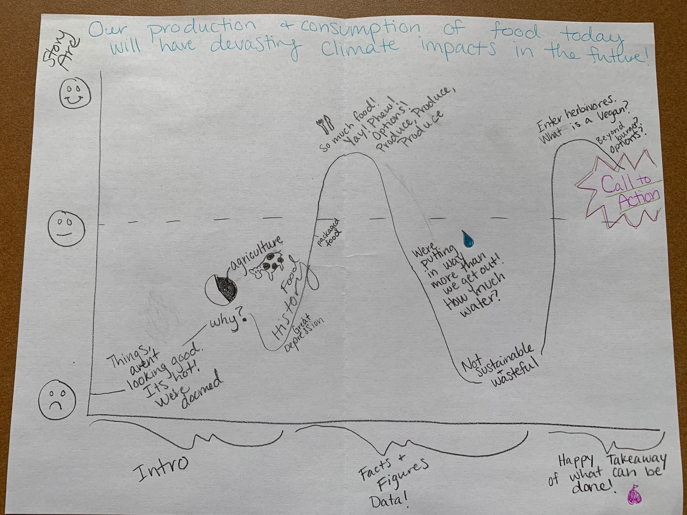

# Final Project Outline

My interest:

After hearing information and data on the impacts of eating meat, specifically beef, I adjusted better serve our planet for the future. I would like to give some of this information to others. We are or will all face devastation and change in regards to climate change but dietary alternations go a long way in conserving resources and reducing emissions. 

What is the aim/target of the story? 

To highlight and explain the impact of our food production and consumption. Paint a picture that will elicit people to reevaluate their choices and consider alternatives to reduce emissions and effects of climate change. At minimum, I would like the story to give people a picture of where we are in regard to the cost of food production and consumption and what that means for the environment and vulnerable populations now and in the future. 

How do you plan to measure the success story?
- Visualizations of the resources (water, energy, land) that are put into meat production
- Explain and visualize environmental impact and consequences
- SHOW success by identifying progress that has been made on an individual level by people 
- Trends of veganism and development of non-meat products

How many sections/chapters do you this you will need?

I think I will need around eight section or chapters. Outlined as follows:
1.	Effects of Climate Change in Future
2.	Lead Contributing Activities (highlighting meat/poultry production)
3.	Brief history of how we have come to eat and produce like we do in US
4.	US’s Contribution and Impact
5.	Rise in Veganism and Vegetarianism 
6.	Larger number of non-meat options existing today making diet change “easier”
7.	Facts and figures of limiting meat consumption on personal level
8.	Call to action: The audience can adopt new diet entirely, participate in “meatless Mondays”, try to consume less at their own pace and choice

Do you have enough time and resources? Anticipated challenges?

I believe so. A lot of information exists regarding the subject. Many reports and papers have been done, it was a little difficult getting access to some raw data but I found some I think will be useful to tell my story. I think it is challenging to narrow things to do with climate change to one area but I hope to keep it centered around the food aspect so the audience comes away with a single concrete thing to do for change. 

# Story Arc

# Data

There are numerous sources I plan to use as information and background sections of my final project to set context and also provide statistics. The sources I will be using the data from to visualize come from: Food and Agricultural Organization of the United Nations (FAO), Our World in Data, Goggle Trends, and a report from ResearchGate. The later two do not have excel spreadsheet I can access directly to create visualizations, but I can take the data from them and organize it myself potentially. 
The FAO is a large source of information that is customizable to country and type of products produced. I plan to use this data to visualize how much meat is produced by the United States, and that we are the leading in cattle production. Similarly, the data from Our World Data provides productivity, yield and energy efficiency data on meat production. I plan to use this to show how we put a lot more in that we get out of producing meat at the rate we do. Additionally, they have data on the impact of production on the environment and land and water use that goes into it. 

The report I found on the importance of reducing consumption for climate change provides data on food sources and contributions to climate change along with visuals on livestock contributions to climate change.  I do not have direct access to the data used in their visualization but figured I could use the numbers to recreate one of my own. Lastly, I see that there are Google Trends tracking interest in vegan and vegetarianism based on searches over time. I think this could be used to support my part of the story concerning the larger shift to meat free diets and that fact that there is a growing interest. 

Data Links

http://www.fao.org/faostat/en/#data   

http://www.fao.org/faostat/en/#data/QL 

https://ourworldindata.org/meat-production

https://ourworldindata.org/environmental-impacts-of-food

https://www.researchgate.net/publication/286920313_The_Importance_of_Reducing_Animal_Product_Consumption_and_Wasted_Food_in_Mitigating_Catastrophic_Climate_Change

https://trends.google.com/trends/explore?date=all&q=%2Fm%2F07_hy,%2Fm%2F07_jd

# Method & Medium 

I plan to complete my final project using Shorthand. I like to scroll features and imagery used in the example projects from past classes. I hope to incorporate a similar technique. I do not know much about Shorthand but after this weeks class I think I will have a clearer idea of my method and exactly what I plan to do on Shorthand and how. 

As of right now, I hope to have no more than 3 or 4 graphs or charts. These will probably used to present the contributions by agriculture and livestock to climate change, the US’s role in production overtime and trends in non-meat diets. I would like to try to visualize the numbers on how much an individual saves in resources through icons and numbers or organize it in an info graphic way verses a line or bar graph. Basically representing areas of data without using an axis. 

I plan to create a timeline to visualize the history of food production in the US. Overall, I would like to use text on top of background imagery. I do have concerns about having such high quality photos as the examples I saw. I think that is an important aspect of the entire story. When completing the project I will go through each of the sections above to add additional text and appropriate visualizations for each section. Once those are compiled I would like to use Shorthand to put them all in sequence and add titles, breaks and images. I have yet to commit to anything because I am confident in this weeks classes providing with an overall vision and execution plan. 

